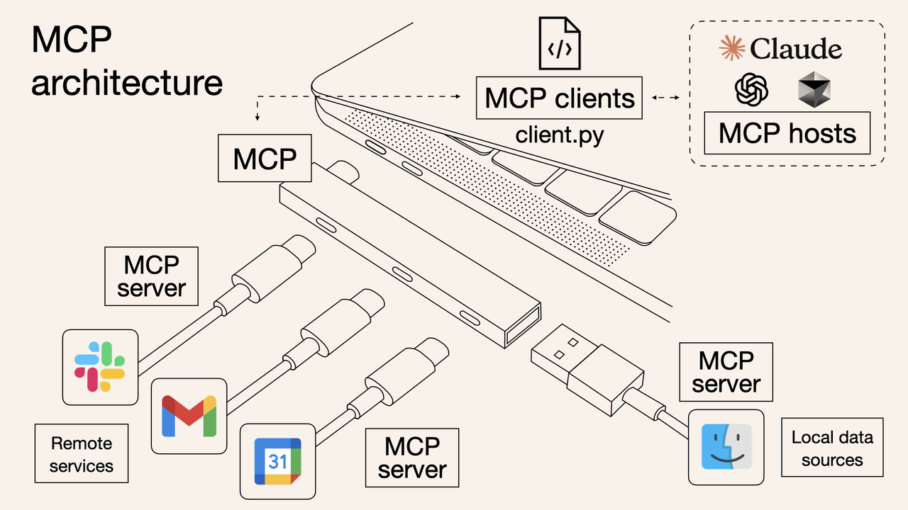
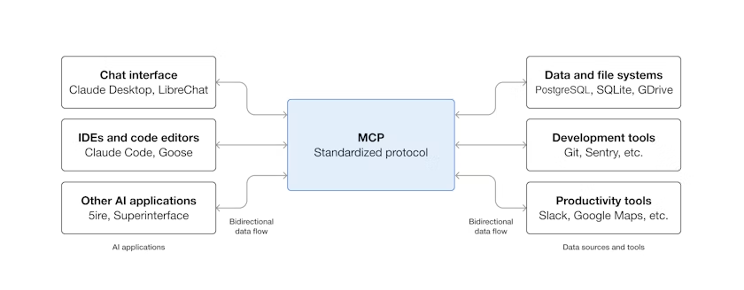
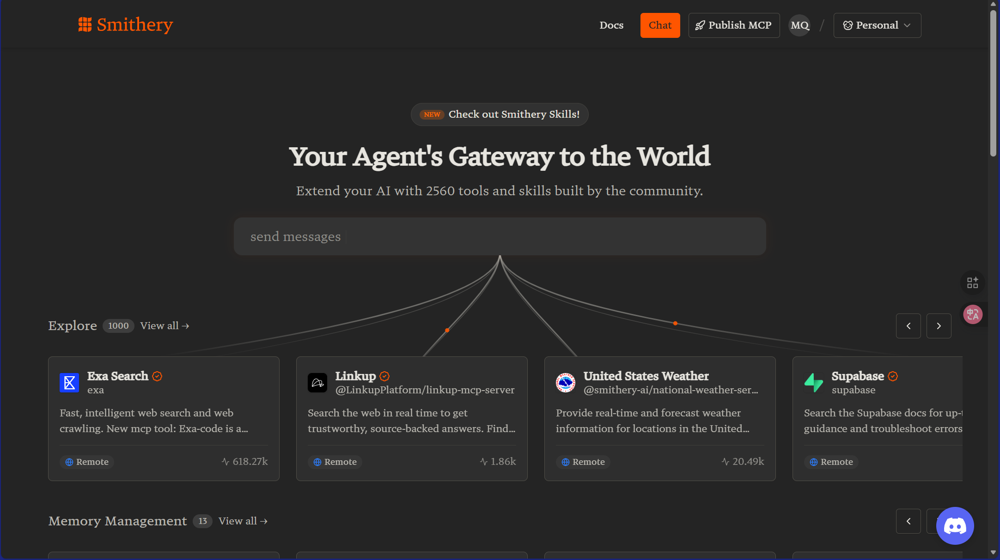
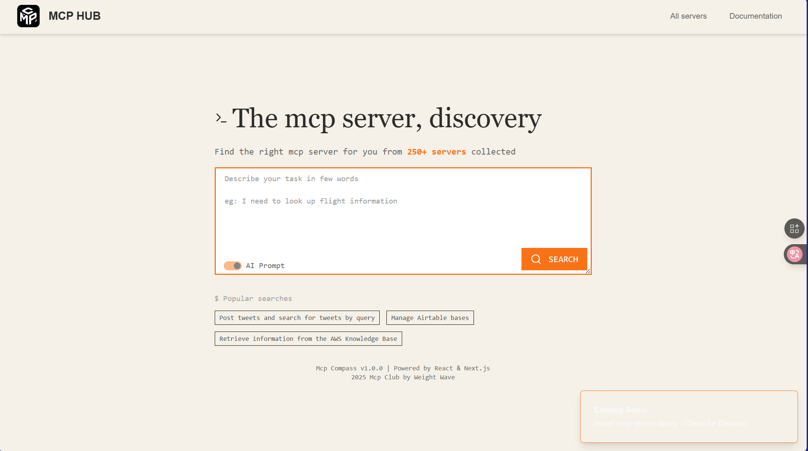
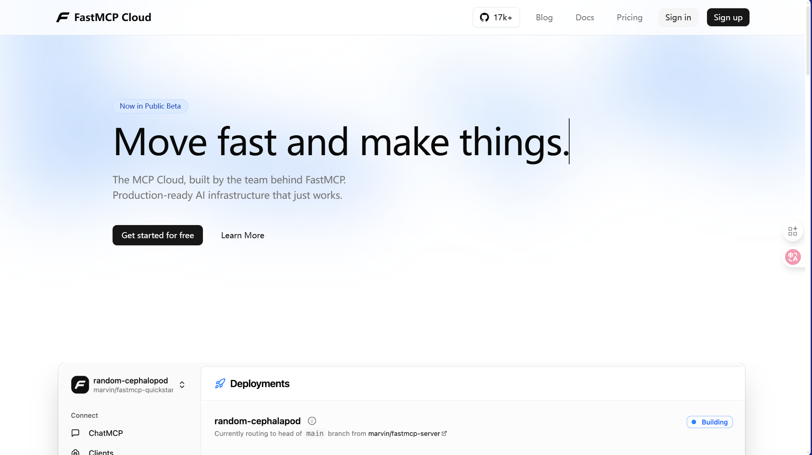
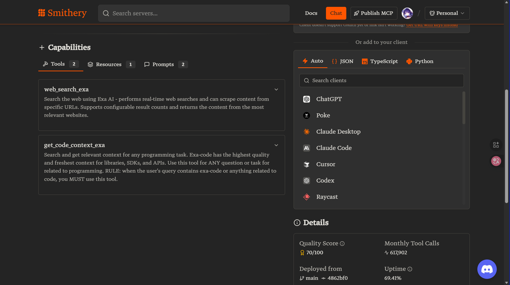

值得一提的是，我们想要讲述的是现在 ai（其实用 ai 并不准确，叫做 LLM（large language model）更对一点）在应用方面的相关内容，所以传统的数据分析，机器学习，深度学习并不在这的讨论范围内，之后会另外授课讨论
关于我们首先要学会使用 AI 和搜索引擎这档事（没错，这是在 AI 给的回答上修改的）

> [C++ 组 &amp;&amp; py 组 联合授课文档 2：AI Agent 初步](https://njupt-sast.feishu.cn/wiki/VaI5wKYnoi2XrnkWbDdcNVi0nKb)（Agent 内容在这上面）

## 一、从 AI 应用说起：现在的 AI 系统在干什么

过去我们用 AI，是「调用一个模型 → 输出一个结果」。

- 图像识别：输入图片输出标签（yolo）
- 语音识别：输入声音输出文本（so-vits-svc）
- 文本生成：输入提示词输出文本(chatgpt)

现在的 AI 应用已经升级成了「多步骤、多工具、具备记忆和决策能力的系统」，
比如：

- Copilot 自动生成并执行代码；
- ChatGPT 可以访问文件、网页、数据库；
- Deepwiki/ Deepwiki-Open 帮你快速阅读代码。

这种“能规划、能执行、能用工具”的系统，就是 Agent（智能体）。

---

## 二、Agent（智能体）是什么

### 1. 定义

Agent 是一个由 LLM 驱动的可感知、可思考、可执行的智能体。
它可以：

- 感知环境（理解输入、上下文）
- 规划目标（思考下一步）
- 调用工具（执行外部操作）
- 学习记忆（改进行为）

### 2. 核心结构

### 实际应用场景

- 代码助理：自动生成、重构并运行测试，必要时调用本地 CLI。
- 企业客服：先规划检索 → 查知识库 → 调用工单系统 → 反馈用户。
- 数据自动化：定时从 API 抓数 → 清洗 → 写入数据库 → 告警。
- 个人助理：管理日程、邮件与文件，跨应用执行动作。

### 四大能力与常用实现

- 感知（Perception）

  - 文本/结构化：Transformers、spaCy、Pydantic（入参/出参校验）
  - 语音/图像：Whisper/Vosk（ASR）、PaddleOCR/Tesseract（OCR）、CLIP/SigLIP（图像语义）
- 规划（Planning）

  - ReAct、CoT（Chain-of-Thought）、ToT（Tree-of-Thoughts）
  - LangGraph（图式工作流/有状态代理）、AutoGen、Semantic Kernel Planner
- 调用工具（Action / Tool Use）

  - MCP Server/Client、OpenAI Function/Tool Calling、LangChain Tools、CLI（subprocess）、gRPC/REST
  - 工具描述与注册：JSON Schema、Pydantic、工具白名单与作用域（scope）
- 学习记忆（Memory）

  - 短期：会话缓冲、摘要窗口（summary buffer）
  - 长期：向量数据库（FAISS/Chroma/Milvus/Weaviate）、RAG、事件/语义/程序性记忆

> 本节要点

- 选择“可观测、可替换”的实现以便排错与演进
- 规划/行动/记忆解耦，避免耦合带来的复杂度

### 真实世界 Agent 案例

- GitHub Copilot Workspace（代码工作台）

  - 感知：解析仓库结构、代码语义与现有测试；读取 Issue/PR 上下文
  - 规划：根据任务拆解为“修改点 → 运行测试 → 修复失败 → 提交 PR”的多步流程
  - 执行：自动编辑多文件、运行本地命令（构建/测试/格式化）
  - 记忆：在同一工作空间内持续跟踪历史更改与失败用例，累积上下文
- Cursor AI（IDE 内置 Agent）

  - 感知：理解光标处于文件级语境、项目依赖与类型信息（LSP）
  - 规划：生成重构计划，逐步应用、验证与回滚
  - 执行：批量修改代码、运行命令、插入注释与测试样例
  - 记忆：会话级记忆保持编辑意图与偏好；项目级记忆持久化重要决策
- Devin（全栈软件 Agent）

  - 感知：综合浏览器、终端、编辑器与外部文档的信息
  - 规划：里程碑/任务/子任务分层规划，动态调整路径
  - 执行：自动编写代码、安装依赖、运行脚本与部署
  - 记忆：长期跟踪项目状态、未完成事项与已验证结论

> 本节要点

- 真实产品普遍具备“感知 → 规划 → 执行 → 记忆”的闭环能力
- 关键差异在于：工具覆盖面、可观测性与对失败的自恢复能力

---

## 三、为什么要有协议

### 面临的问题

Agent 想调用外部系统时，会遇到问题：

- 每个系统接口都不同；
- 工具描述不统一；
- 权限和安全难管控；
- LLM 不知道工具能干什么。

### MCP 之前的混乱状况

在 MCP 协议出现之前，AI Agent 调用外部工具是一个极其混乱的过程：（仅供了解）

#### 1. 接口标准各自为政

每个服务都有自己的一套规则：

- **GitHub API**：RESTful，需要 Bearer Token，返回 JSON
- **Slack Bot**：Webhook + OAuth，事件驱动，特殊的消息格式
- **数据库**：SQL 查询，连接池管理，事务处理
- **文件系统**：本地路径操作，权限检查，异步 I/O
- **浏览器自动化**：Selenium/Playwright，DOM 选择器，页面等待

每接入一个新工具，开发者都要：

```python
# 为每个工具写专门的适配代码
class GitHubTool:
    def __init__(self, token):
        self.headers = {"Authorization": f"Bearer {token}"}
  
    def create_issue(self, repo, title, body):
        # GitHub 特有的 API 调用逻辑
        pass

class SlackTool:
    def __init__(self, webhook_url):
        self.webhook = webhook_url
  
    def send_message(self, channel, text):
        # Slack 特有的消息格式
        pass

# 每个工具都需要不同的错误处理、重试逻辑、参数验证...
```

#### 2. 工具描述混乱不堪

LLM 需要知道"这个工具能做什么"，但每个系统的描述方式都不同：

```python
# 方式1：硬编码在提示词里
system_prompt = """
你可以使用以下工具：
- send_email(to, subject, body) - 发送邮件
- query_database(sql) - 查询数据库，注意SQL注入
- read_file(path) - 读取文件，路径不能包含..
"""

# 方式2：JSON Schema，但每家格式不同
github_schema = {
    "name": "create_issue",
    "description": "Create a GitHub issue",
    "parameters": {
        "type": "object",
        "properties": {
            "repo": {"type": "string"},
            "title": {"type": "string"}
        }
    }
}

# 方式3：OpenAI Function Calling 格式
openai_function = {
    "name": "send_email",
    "description": "Send an email",
    "parameters": {
        "type": "object",
        "properties": {
            "to": {"type": "string", "description": "Recipient email"}
        },
        "required": ["to"]
    }
}
```

#### 3. 权限管理一团糟

没有统一的权限模型，每个工具都要单独处理：

```python
# 每个工具都要自己实现权限检查
def read_file(path):
    # 手动检查路径穿越
    if ".." in path or path.startswith("/"):
        raise SecurityError("Invalid path")
  
    # 手动检查白名单
    if not path.startswith("/safe/workspace/"):
        raise SecurityError("Path not in whitelist")
  
    # 手动检查文件大小
    if os.path.getsize(path) > 10 * 1024 * 1024:
        raise SecurityError("File too large")

def run_sql(query):
    # 手动 SQL 注入检查
    dangerous_keywords = ["DROP", "DELETE", "UPDATE", "INSERT"]
    if any(keyword in query.upper() for keyword in dangerous_keywords):
        raise SecurityError("Dangerous SQL detected")
```

#### 4. 调试和监控困难

每个工具的日志格式、错误处理都不同：

```python
# 工具A：打印到控制台
def tool_a():
    print(f"[{datetime.now()}] Tool A called")

# 工具B：写入文件
def tool_b():
    with open("tool_b.log", "a") as f:
        f.write(f"Tool B executed at {time.time()}\n")

# 工具C：发送到监控系统
def tool_c():
    metrics.increment("tool_c.calls")
```

#### 5. 版本兼容性噩梦

不同版本的工具接口经常变化：

```python
# v1.0
def send_notification(message):
    pass

# v2.0 - 破坏性变更
def send_notification(recipient, message, priority="normal"):
    pass

# v3.0 - 又变了
def send_notification(config: NotificationConfig):
    pass
```

### MCP 横空出世

这里有一张非常经典而形象的图



就像 USB 接口的发展历程一样：

- **USB 1.0/2.0 时代**：各种奇形怪状的接口（Mini-USB、Micro-USB、专用接口）
- **USB-C 时代**：一个接口统一所有设备

MCP 协议就是 AI 工具调用领域的"USB-C"——统一的接口标准。

> 小结：标准化协议消除了"每接一个系统就写一套适配"的重复劳动，让 LLM 聚焦在规划与决策。没有什么是加一层中间层解决不了的，如果有，那就再加一层！

---

## 四、MCP（Model Context Protocol）

### 定义与核心价值

**MCP（Model Context Protocol）** 是一种开放协议，定义了 AI 模型如何与外部工具安全、结构化地通信。它解决的核心问题是"Agent 调用工具的标准化"。

**核心价值：**

- **统一接口**：一套协议适配所有工具，告别"每个系统写一套适配器"
- **安全可控**：内置权限管理、参数验证和作用域隔离
- **跨平台复用**：同一个 MCP Server 可被 Claude、ChatGPT、LangChain 等不同客户端调用
- **自动发现**：工具能力可枚举、可描述，模型自动理解可用功能



### 架构图解

**数据流示例：**

### MCP Server 能力模型

一个 MCP Server 可以暴露三种类型的能力：

#### **Resources（资源）**

只读的数据源，供模型查询和理解上下文

```json
{
  "resources": {
    "calendar_events": {
      "description": "用户的日程事件列表",
      "mimeType": "application/json"
    },
    "project_files": {
      "description": "项目文件树结构",
      "mimeType": "text/plain"
    }
  }
}
```

#### **Tools（工具）**

可执行的操作，模型可以调用来改变外部状态

```json
{
  "tools": {
    "add_event": {
      "description": "在指定日期新增日程",
      "parameters": {
        "type": "object",
        "properties": {
          "date": {"type": "string", "format": "date"},
          "title": {"type": "string"},
          "time": {"type": "string", "pattern": "^\\d{2}:\\d{2}$"}
        },
        "required": ["date", "title"]
      }
    },
    "delete_event": {
      "description": "删除指定的日程事件",
      "parameters": {
        "type": "object",
        "properties": {
          "event_id": {"type": "string"}
        },
        "required": ["event_id"]
      }
    }
  }
}
```

#### **Prompts（提示模板）**

预定义的提示词模板，帮助模型更好地理解任务

```json
{
  "prompts": {
    "schedule_conflict_check": {
      "description": "检查日程冲突的分析模板",
      "template": "分析以下日程是否存在时间冲突：\n{events}\n\n请指出具体的冲突并建议解决方案。"
    }
  }
}
```

**关键优势：**

✅ **标准化**：任何支持 MCP 的客户端（Claude、ChatGPT、LangChain 等）都能调用这个 Server
✅ **类型安全**：JSON Schema 确保参数验证和返回值结构化
✅ **自描述**：模型可以自动理解每个工具的用途和使用方法
✅ **可扩展**：新增工具只需在 Server 端添加，客户端自动发现

> **核心理念**：MCP 让"工具能力"变成了"可发现、可描述、可调用"的标准化服务，就像 Web API 让网络服务标准化一样。

### 一个完整的 MCP Server（FastMCP 版）

#### FastMCP 简介

**FastMCP** 是一个轻量级的 Python 库，让开发者能够快速构建 MCP Server，无需深入了解 JSON-RPC 协议细节。它的设计理念是"约定优于配置"，通过简单的装饰器就能将 Python 函数暴露为 MCP 工具。

#### **FastMCP 的核心优势：**

- **零配置启动**：几行代码即可创建一个完整的 MCP Server
- **装饰器驱动**：使用 `@app.tool` 装饰器自动注册工具函数
- **自动类型推断**：基于函数签名和类型注解自动生成 JSON Schema
- **内置验证**：自动进行参数类型检查和返回值验证
- **文档自动生成**：从函数的 docstring 自动提取工具描述

#### **与原生 MCP SDK 对比****：**

<table>
<tr>
<td>特性<br/></td><td>原生 MCP SDK<br/></td><td>FastMCP<br/></td></tr>
<tr>
<td>代码量<br/></td><td>~50+ 行<br/></td><td>~10 行<br/></td></tr>
<tr>
<td>配置复杂度<br/></td><td>需要手写 JSON Schema<br/></td><td>自动推断<br/></td></tr>
<tr>
<td>学习曲线<br/></td><td>需要了解 JSON-RPC<br/></td><td>只需了解 Python 装饰器<br/></td></tr>
<tr>
<td>适用场景<br/></td><td>复杂的企业级应用<br/></td><td>快速原型和中小型项目<br/></td></tr>
</table>

#### 具体代码

说明：以下示例用 FastMCP 暴露两个工具 add_event 与 list_events，供支持 MCP 的客户端调用。

```python
# uv add fastmcp
from fastmcp import FastMCP

# 创建 MCP 服务器实例
app = FastMCP("calendar")
EVENTS: list[dict] = []

# 使用实例方法装饰器注册工具
@app.tool
def add_event(date: str, title: str) -> dict:
    """在指定日期新增日程"""
    EVENTS.append({"date": date, "title": title})
    return {"status": "ok"}

@app.tool
def list_events() -> list:
    """列出所有日程"""
    return EVENTS

# 运行服务器
if __name__ == "__main__":
    app.run()
```

### 实际 Server 场景

- 文件系统访问（filesystem）

  - 工具：list_dir、read_file、write_file、search_in_files
  - 用途：受控地让模型读取/写入工作区文件，生成或修改配置、修复代码
  - 安全：白名单根目录、只读/只写分权、文件大小限制、路径穿越检查
- 数据库查询（database）

  - 工具：list_tables、get_schema、run_sql（带参数化）、explain_sql
  - 用途：生成 SQL、做数据分析/看板快问快答、数据质量巡检
  - 安全：只读 schema、SQL 白名单/模板、结果集行数上限、敏感列脱敏
- 浏览器自动化（browser/automation）

  - 工具：open_url、click、type、extract、screenshot
  - 用途：抓取资料、表单自动化、E2E 验证与回归检查
  - 安全：域名白名单、速率限制、验证码处理与人机分流

> 本节要点

- MCP Server 将“系统能力”以工具/资源的方式抽象、可枚举、可权限化
- 先做边界再做增强：限制作用域与数据范围，保留审计与回滚手段

### 消息格式示例（JSON-RPC）

请求（调用工具）：

```json
{
  "jsonrpc": "2.0",
  "id": "42",
  "method": "tools/call",
  "params": {
    "name": "add_event",
    "arguments": { "date": "2025-11-12", "title": "周会" }
  }
}
```

响应（成功）：

```json
{
  "jsonrpc": "2.0",
  "id": "42",
  "result": { "ok": true, "data": { "date": "2025-11-12", "title": "周会" } }
}
```

响应（错误）：

```json
{
  "jsonrpc": "2.0",
  "id": "42",
  "error": { "code": -32602, "message": "invalid params: missing date" }
}
```

> 关键概念

- JSON-RPC 基于 id 关联请求/响应；error 与 result 互斥
- 工具名、参数对象与返回结构须遵循 Server 公布的 schema

### 与传统 API / Function Calling 的对比

<table>
<tr>
<td>维度<br/></td><td>传统 API（REST/gRPC）<br/></td><td>Function Calling（函数调用）<br/></td><td>MCP（Model Context Protocol）<br/></td></tr>
<tr>
<td>能力发现<br/></td><td>无统一发现机制，需要读文档<br/></td><td>由模型侧定义函数签名，缺少规范化注册<br/></td><td>标准化工具/资源可枚举与描述，客户端可自动发现<br/></td></tr>
<tr>
<td>通信方式<br/></td><td>HTTP/2、gRPC，请求-响应<br/></td><td>通过模型调用函数，序列化 JSON<br/></td><td>标准 JSON-RPC/流式（由客户端决定），支持资源与行动<br/></td></tr>
<tr>
<td>可移植性<br/></td><td>接口风格不一，复用成本高<br/></td><td>绑定特定模型/厂商，迁移成本中<br/></td><td>跨客户端/模型复用同一 Server，迁移成本低<br/></td></tr>
<tr>
<td>安全与权限<br/></td><td>API Key、OAuth<br/></td><td>依赖宿主环境权限<br/></td><td>支持作用域（scope）、会话隔离与最小权限<br/></td></tr>
<tr>
<td>适用场景<br/></td><td>B2B/服务之间直接通信<br/></td><td>单一模型内的工具调用<br/></td><td>Agent/IDE/桌面客户端统一调用本地/远程工具<br/></td></tr>
</table>

> 适用建议

- 已有成熟后端服务：继续提供 REST/gRPC；对 Agent 开放时可加一层 MCP 以复用
- 仅在单模型内少量工具：Function Calling 足够
- 需要跨客户端/团队复用工具、强调权限与可观测：优先 MCP

### MCP 生态

随着 MCP 生态的快速发展，专门的工具市场和分发平台开始涌现，为开发者提供发现、安装和管理 MCP Server 的便捷方式。这些平台正在成为 MCP 生态的重要基础设施。

#### 主要 MCP 市场平台

**Smithery - MCP 工具市场**

- 一键安装 MCP Server
- 智能工具搜索和推荐
- 社区评分和评论系统
- 安全审核和认证
- 使用统计和分析



**MCP Hub - 官方工具中心**

- 官方认证的高质量 Server
- 完整的文档和示例
- 自动更新和版本管理
- 企业级安全保障



**FastMCP Cloud - 快速部署平台**

- 零配置快速部署
- Docker 容器化支持
- 可视化配置界面
- 实时监控和日志



#### 工具安装与管理

**Smithery 官网提供大部分平台的一键安装支持**



**通过 SmitheryCLI 安装（推荐方式）：**

```bash
# 1. 安装 Smithery CLI
npm install -g @smithery/cli

# 2. 搜索工具
smithery search "database"

# 3. 安装工具
smithery install sqlite-explorer

# 4. 配置到 Claude Desktop
smithery configure claude-desktop
```

**手动配置方式：**

```json
{
  "mcpServers": {
    "sqlite-explorer": {
      "command": "npx",
      "args": ["@smithery/sqlite-explorer"],
      "env": {
        "DATABASE_PATH": "./data"
      }
    },
    "github-integration": {
      "command": "python",
      "args": ["-m", "mcp_github"],
      "env": {
        "GITHUB_TOKEN": "your_token_here"
      }
    }
  }
}
```

---

值得一提的是，不仅仅是完成 MCP 的构建，还后续还需要考虑 MCP 的调试测试的相关任务，此处也有较多说法，可自行查阅

## 五、Agent 实战演练

### 如何自己实现 MCP / Agent

下面进入实践部分：使用 FastMCP 与 LangChain。

#### 完整示例代码

本教程配套了一系列完整的、可运行的示例代码，位于 `examples/` 目录下：

1. **01_calendar_server.py** - MCP Server 基础示例

   - 完整的日历管理服务器实现
   - 5 个实用工具函数（添加、列表、删除、更新、搜索）
   - 详细的代码注释和文档字符串
   - 包含配置说明和使用指南
2. **02_langchain_basic_agent.py** - LangChain Agent 基础示例

   - ReAct 模式的完整实现
   - 工具定义和调用示例
   - 记忆系统的使用演示
   - 4 个实际运行示例
3. **03_code_agent_with_planning.py** - 完整的代码 Agent（具有规划能力）

   - 任务规划系统的完整实现
   - 6 个专业级代码工具
   - 错误处理和日志记录
   - 完整的工作流程演示
4. **04_integrated_mcp_langchain.py** - FastMCP + LangChain 端到端集成

   - FastMCP Server 与 LangChain Agent 的完整集成
   - 智能自然语言理解和日程管理
   - 5 个内部 LangChain 工具
   - 4 个对外 MCP 工具
   - 完整的端到端工作流程

#### 快速参考：示例与概念对应表

<table>
<tr>
<td>核心概念<br/></td><td>文档位置<br/></td><td>示例类型<br/></td><td>可执行文件<br/></td></tr>
<tr>
<td>**MCP 协议基础**<br/></td><td>行 125-159<br/></td><td>📚 理论说明<br/></td><td>-<br/></td></tr>
<tr>
<td>**MCP Server 实现**<br/></td><td>行 162-184<br/></td><td>💡 简化示例<br/></td><td>01_calendar_server.py (完整版)<br/></td></tr>
<tr>
<td>**工具定义扩展**<br/></td><td>行 544-571<br/></td><td>💡 代码片段<br/></td><td>已包含在示例 1 中<br/></td></tr>
<tr>
<td>**Agent 核心能力**<br/></td><td>行 27-106<br/></td><td>📚 理论说明<br/></td><td>-<br/></td></tr>
<tr>
<td>**ReAct 规划模式**<br/></td><td>行 274-287<br/></td><td>📚 概念伪代码<br/></td><td>02_langchain_basic_agent.py (实际实现)<br/></td></tr>
<tr>
<td>**LangChain Agent**<br/></td><td>行 593-658<br/></td><td>💡 代码片段<br/></td><td>02_langchain_basic_agent.py (完整版)<br/></td></tr>
<tr>
<td>**记忆系统 (Memory)**<br/></td><td>行 295-308, 674-691<br/></td><td>📚 理论 + 💡 片段<br/></td><td>示例 2 的示例 4 展示<br/></td></tr>
<tr>
<td>**错误处理增强**<br/></td><td>行 619-658<br/></td><td>💡 代码片段<br/></td><td>03_code_agent_with_planning.py (完整实现)<br/></td></tr>
<tr>
<td>**任务规划 (Planning)**<br/></td><td>行 64-82, 407-441<br/></td><td>📚 理论说明<br/></td><td>03_code_agent_with_planning.py (完整实现)<br/></td></tr>
<tr>
<td>**工具调用流程**<br/></td><td>行 310-322<br/></td><td>📚 概念伪代码<br/></td><td>所有示例中均有实现<br/></td></tr>
<tr>
<td>**向量检索 (RAG)**<br/></td><td>行 295-308<br/></td><td>📚 概念伪代码<br/></td><td>-<br/></td></tr>
<tr>
<td>**端到端集成**<br/></td><td>行 708-731<br/></td><td>💡 简化示例<br/></td><td>04_integrated_mcp_langchain.py (完整版)<br/></td></tr>
</table>

**图例说明：**

- 📚 **理论说明** - 概念讲解，不含可执行代码
- 📚 **概念伪代码** - 用于理解概念的简化代码，不可直接运行
- 💡 **代码片段** - 部分代码示例，需要在完整项目中使用或参考完整版
- ✅ **完整示例** - 可直接运行的完整 Python 文件

#### 快速开始

```bash
# 1. 进入示例目录
cd examples/

# 2. 安装依赖
uv add fastmcp langchain langchain-openai

# 3. 设置 API 密钥（示例 2 和 3 需要）
# Windows (CMD)
set OPENAI_API_KEY=your_key_here
set OPENAI_BASE_URL=https://api.openai.com/v1

# Windows (PowerShell)
$env:OPENAI_API_KEY="your_key_here"
$env:OPENAI_BASE_URL="https://api.openai.com/v1"

# Linux/macOS
export OPENAI_API_KEY=your_key_here
export OPENAI_BASE_URL=https://api.openai.com/v1

# 4. 运行任意示例
uv run 01_calendar_server.py
uv run 02_langchain_basic_agent.py
uv run 03_code_agent_with_planning.py
uv run 04_integrated_mcp_langchain.py
```

#### 学习路径

**初学者：** 建议按顺序学习示例 1 → 2 → 3 → 4

**有经验开发者：** 可以直接查看示例 3 和 4，了解完整的 Agent 实现

**详细说明：** 请查阅 examples/README.md 获取完整的使用指南

---

## 六、问题的解决

### 开发 MCP Server 的最佳实践

- 工具命名规范：动词_名词（如 add_event），避免歧义
- 参数校验：使用 Pydantic/JSON Schema；对日期/邮箱等做格式校验
- 安全性：最小权限原则、作用域（scope）隔离；不把机密直接暴露给模型；必要时审计日志
- 超时与失败策略：为外部调用设置超时、重试、熔断；保证幂等（如使用去重键）
- 可观测性：记录请求/响应摘要、错误码、耗时；避免记录敏感原文
- 文档与自描述：为每个工具写清楚 docstring、示例与边界，便于模型理解

> 本节要点

- “清晰的 schema + 最小权限 + 可观测”是生产可用的三件套
- 同一个工具不要“既做这又做那”，保持单一职责

### Agent 开发常见问题与解决方案

- 工具调用死循环

  - 症状：模型在“思考 → 行动”之间反复横跳
  - 解决：设置 max_iterations/early_stopping；添加反思/reflection 步骤；为工具增加冷却时间与重试上限
- 上下文溢出/对话太长

  - 解决：对历史做摘要（summary）、基于检索的拼接（RAG），限制窗口长度，压缩中间推理链条
- 成本与延迟过高

  - 解决：缓存（prompt/检索/工具调用）；优先使用小模型 + 升级策略；并发/批量化；合理的温度与 top-p
- 工具选择错误

  - 解决：为工具写清楚“何时使用/不该使用”；给出正反例；在提示词加入强约束
- 非确定性导致结果不稳定

  - 解决：Self-Consistency 多样本投票、约束解码、规则校验与回退策略

---

## 七、推荐学习资源

- MCP 官方站点：[modelcontextprotocol.io](https://modelcontextprotocol.io/)
- MCP GitHub 组织：[github.com/modelcontextprotocol](https://github.com/modelcontextprotocol)
- Claude Docs（MCP）：[docs.claude.com/en/docs/mcp](https://docs.claude.com/en/docs/mcp)
- FastMCP 官网与文档：[gofastmcp.com](https://gofastmcp.com/) ；Python SDK：[github.com/modelcontextprotocol/python-sdk](https://github.com/modelcontextprotocol/python-sdk)
- FastMCP 社区实现（Python）：[github.com/jlowin/fastmcp](https://github.com/jlowin/fastmcp)
- LangChain 文档：[docs.langchain.com](https://docs.langchain.com/)
- LangGraph 文档（Python）：[docs.langchain.com/oss/python/langgraph/overview](https://docs.langchain.com/oss/python/langgraph/overview)
- LlamaIndex 文档（Python）：[developers.llamaindex.ai/python/framework/](https://developers.llamaindex.ai/python/framework/)
- ReAct 论文（arXiv）：[arxiv.org/abs/2210.03629](https://arxiv.org/abs/2210.03629)

---

## 八、总结与下一步

- 你已经掌握：Agent 核心能力、MCP 的定位与对比、FastMCP/LangChain 的实践路径
- 推荐下一步：

  1. 本地启动 calendar MCP Server，并在 Claude Desktop 完成接入验证
  2. 将 Memory 接到向量库（如 Chroma/FAISS），试做“跨会话记忆”
  3. 用 LangGraph 将“规划 → 行动 → 反馈”做成可观测的状态机
  4. 为工具加入 Pydantic 校验、超时与重试，跑一轮压力与异常测试

有坑别怕，边做边调，遇到问题我们继续修修补补就好 QAQ
