## 目录

1. 终端简史：从打字机到 AI 助手的奇幻之旅
2. Shell 家族谱系：认识这些"壳"
3. Windows 三剑客：CMD、PowerShell 与终端
4. Linux/Unix 世界的贝壳们
5. 新时代终端：未来已来
6. 终端美化大作战
7. 实用技巧速成班

---

## 1. 终端简史：从打字机到 AI 助手的奇幻之旅

### 史前时代：打孔卡片（1960 年代）

想象一下，你生活在 1960 年代，想要让计算机运行程序。你需要：

- 用打孔机在卡片上打洞（一个洞代表一个二进制位）
- 把一堆卡片交给计算机房的管理员
- 等待几小时甚至几天
- 如果程序有 bug？对不起，重新打卡片吧！

这就像用莫尔斯电码和计算机聊天，还是单向的那种。

### 古典时代：电传打字机（1970 年代）

然后，电传打字机（Teletype，简称 TTY）出现了！这是一个真实的打字机，连接到大型计算机上。你敲键盘，打字机就哒哒哒地打印出结果。

```
用户：ls [回车]
打字机：哒哒哒哒哒（打印文件列表）
file1.txt
file2.txt
program.exe
```

这就是为什么今天我们还在说"TTY"、"终端"这些词——它们真的曾经是物理设备！就像你现在说"拨号"、"挂电话"，但你的手机根本没有转盘和听筒。

**有趣的事实**：当时的终端每秒只能显示 10 个字符，所以 Unix 命令都特别短，比如 `ls`、`cd`、`rm`。程序员们为了少打几个字母可是拼了命的！

### 青铜时代：VT100 与字符界面（1980 年代）

DEC 公司推出了 VT100 终端，这是一个带屏幕的终端（不再是打字机了）。它可以显示 24 行 80 列的字符，还支持一些"高级特效"：

- 能显示粗体字！✨
- 能显示不同颜色！🌈（虽然只有 8 种）
- 光标能随意移动！🎯
- 甚至能画简单的线条和框框！📦

这在当时简直是黑科技！很多现代终端模拟器还在模拟 VT100 的行为，就像现代汽车还保留着"马力"这个单位一样。

```shell
┌─────────────────────────┐
│  欢迎来到Unix系统！      │
│  login: _               │
└─────────────────────────┘
```

### 白银时代：个人电脑革命（1990 年代）

PC 普及了！但是：

- **Windows 用户**：被"开始"按钮和鼠标宠坏了，几乎不知道命令行是啥
- **Unix/Linux 用户**：继续在黑色屏幕上敲命令，觉得自己超酷 😎

这时候出现了一个有趣的现象：

```
Windows用户看Linux用户：你们还在用命令行？这都什么年代了！
Linux用户看Windows用户：你们不会用命令行？图形界面真慢！
```

经典段子：

```bash
# Unix管理员的噩梦
sudo rm -rf /
# 一个命令删除整个系统
# 相当于"请帮我把房子炸了谢谢"
```

### 黄金时代：终端模拟器兴起（2000-2010 年代）

操作系统自带的终端太丑？没关系，终端模拟器来了！

- **iTerm2** (Mac)：苹果用户的最爱
- **GNOME Terminal** (Linux)：简单实用
- **ConEmu** (Windows)：Windows 用户的救星
- **Terminator** (Linux)：能分屏，程序员狂喜

这个时期的特点：

```
程序员：我的终端背景是《黑客帝国》的绿色字符雨！
普通人：......所以你在做什么？
程序员：写Hello World
```

### 钻石时代：现代终端（2020 年代）

微软突然醒悟了："等等，我们的终端太丑了！"于是做了 Windows Terminal。

同时，一堆创业公司想："终端能不能更智能、更好看、更好用？"于是：

- **Warp**：带 AI 助手的终端（2022）

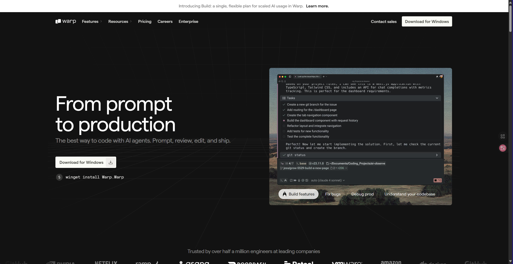

- **Wave**：可视化和协作终端（2023）

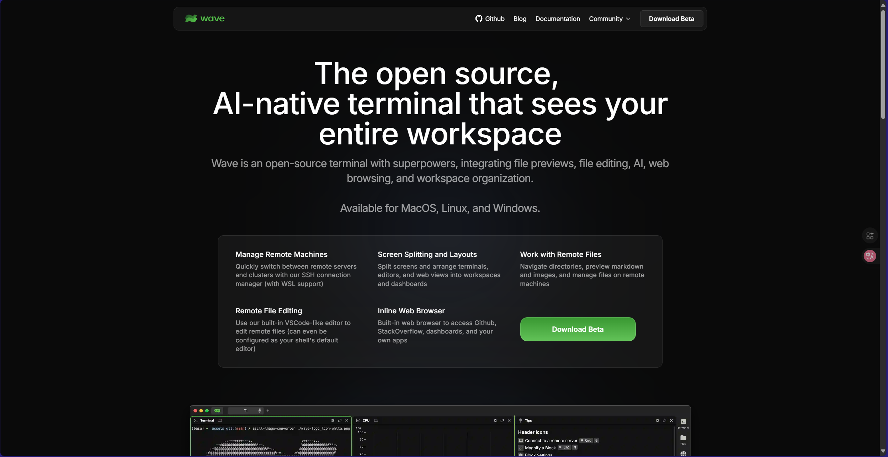

- **Fig**：自动补全增强（后被 AWS 收购）(似了）

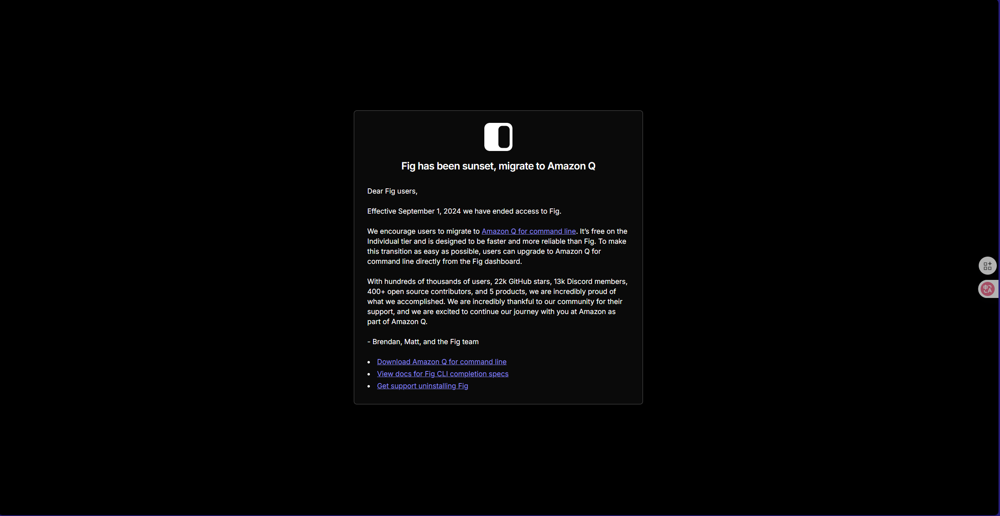

- **H****yper**：用 JavaScript 写的终端（程序员：万物皆可 JavaScript！）

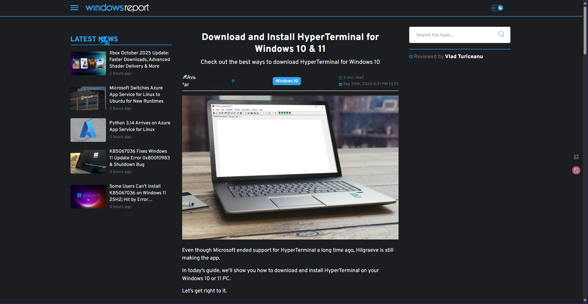

现在的终端甚至可以：

- 用 AI 帮你写命令
- 实时显示命令的解释
- 团队协作
- 显示图片和视频
- 跟你聊天（？）

### 未来展望：AI 原生终端

2025 年的现在，终端正在进化成这样：

```
你：我想找昨天修改的Python文件
AI终端：找到了3个文件，最可能的是 analysis.py
       要查看内容吗？
你：看看前10行
AI终端：[显示代码并高亮重要部分]
       顺便说一句，第5行有个潜在的bug
你：😱
```

有人说未来的终端会是这样：

```
你：（用语音）帮我部署到生产环境
终端AI：检测到你喝醉了，建议明天再部署
你：我没醉！
终端AI：那请在60秒内完成这个验证码
你：......算了
```

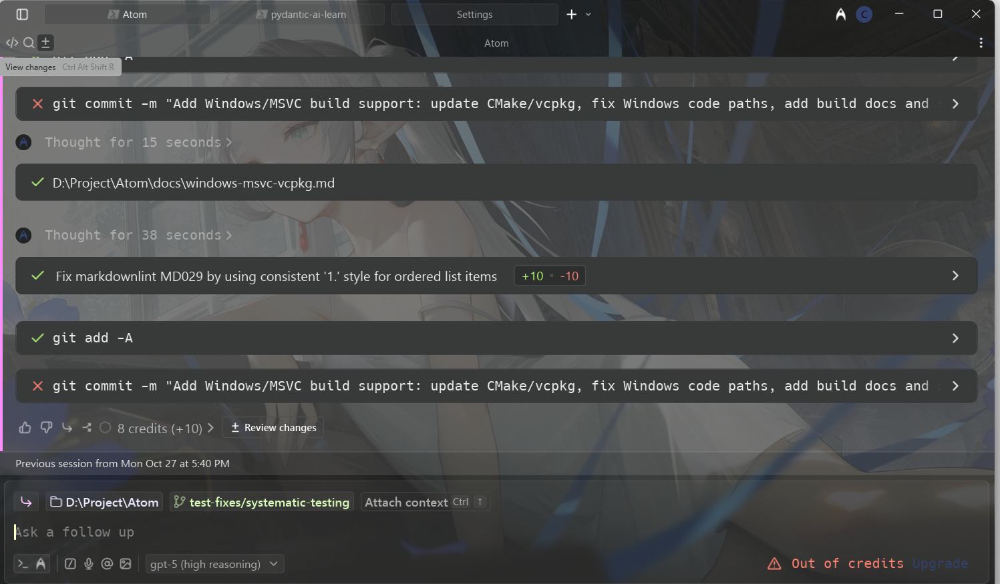

---

## 2. Shell 家族谱系：认识这些"壳"

### 什么是 Shell？用人话说

想象计算机是个胡桃：

- **内核(Kernel)**：中间的果仁，是操作系统的核心，普通人碰不得
- **Shell（壳）**：外面的硬壳，保护内核还能让你跟内核交流

```
你 →→→ Shell →→→ 内核 →→→ 硬件
     ⬆️
   翻译官的角色
```

Shell 就像一个翻译官：

1. 你说"人话"（命令）
2. Shell 翻译成"机器话"
3. 内核执行
4. Shell 把结果翻译回"人话"给你

### Shell 家族树

```
Shell家族
│
├─ Bourne家族（AT&T贝尔实验室血统）
│  ├─ sh（祖爷爷，1977年出生）
│  ├─ bash（孙子，最受欢迎）
│  ├─ zsh（曾孙，年轻人的最爱）
│  └─ dash（轻量级表弟）
│
├─ C家族（伯克利大学血统）
│  ├─ csh（1978年出生，长得像C语言）
│  └─ tcsh（加强版，但人气不高）
│
├─ 现代派
│  ├─ fish（2005年，超级友好）
│  ├─ nushell（2019年，结构化数据）
│  ├─ xonsh（Python和Shell的混血儿）
│  └─ 离经叛道的Python脚本（用Python玩命令行）
│
└─ Windows家族（独立发展）
   ├─ CMD（1987年，老古董）
   └─ PowerShell（2006年，扛把子）
```

### 各种 Shell 的性格特点

#### Bash - 居家好男人

```bash
# 优点：稳定、可靠、到处都有
# 缺点：有点老土
# 适合：99%的场景

echo "我是默认选择，就像默认的家庭套餐"
```

#### Zsh - 时尚潮人

```bash
# 优点：功能强大、可定制、插件多
# 缺点：配置复杂
# 适合：追求效率的程序员

echo "我是macOS的默认Shell，我骄傲！"
```

#### Fish - 贴心小棉袄

```
# 优点：自动补全超强、语法高亮、对新手友好
# 缺点：语法与bash不兼容
# 适合：想要开箱即用的人

echo "我的自动补全会读心术！"
```

#### PowerShell - 全能战士

```powershell
# 优点：面向对象、功能强大、跨平台
# 缺点：语法冗长
# 适合：Windows系统管理

Write-Host "我可以管理整个Windows帝国！"
```

#### CMD - 古董收藏

```
REM 优点：简单、所有Windows都有
REM 缺点：功能弱、老旧
REM 适合：运行老脚本

echo 我还活着只是因为向后兼容
```

---

## 3. Windows 三剑客：CMD、PowerShell 与终端

### CMD - 远古遗物但不能少

**诞生故事**：1987 年，Windows 说："我们也要有命令行！"于是抄了 DOS 的作业，做出了 CMD。

```
C:\> dir
看，这就是我全部的魅力了
```

**什么时候用 CMD？**

- 运行超级老的批处理脚本
- 快速查个 IP 地址（`ipconfig`）
- 清理 DNS 缓存（`ipconfig /flushdns`）
- 假装自己是黑客（开玩笑的）

**CMD 的经典用法**：

```
REM 彩蛋：修改命令提示符
prompt 🚀 $P$G
REM 现在你的提示符变成了：🚀 C:\>

REM 最简单的批处理脚本
@echo off
echo 你好，萌新！
echo 按任意键退出...
pause > nul

REM 循环打印（小心无限循环！）
:loop
echo 我是一个循环~
timeout /t 1 > nul
goto loop
```

### PowerShell - 微软的野心之作

**诞生故事**：2006 年，微软请来大神 Jeffrey Snover，说："我们要做一个超越所有 Shell 的 Shell！"

**PowerShell 的野心**：

- 不只是 Shell，还是编程语言
- 不只管文件，还能管注册表、服务、网络...
- 不只在 Windows，还能跨平台

**PowerShell 的哲学：一切皆对象**

```powershell
# 传统Shell的方式（文本处理）
Get-Process | Select-String "chrome"

# PowerShell的方式（对象处理）
Get-Process | Where-Object {$_.Name -like "*chrome*"} |
    Select-Object Name, CPU, Memory

# 看，我们在处理对象，不是文本！
```

**PowerShell 快速入门**：

```powershell
# 📁 文件操作（跟Linux很像）
ls              # 列出文件（其实是Get-ChildItem的别名）
cd Desktop      # 切换目录
mkdir 新文件夹   # 创建目录
rm 文件.txt     # 删除文件

# 🔍 查找东西
Get-ChildItem -Recurse -Filter "*.txt"  # 找所有txt文件
Get-Process | Where Name -like "*chrome*"  # 找Chrome进程

# 💾 数据处理
Get-Process | Export-Csv processes.csv  # 导出到CSV
Import-Csv data.csv | Where Age -gt 18  # 从CSV筛选数据

# 🎨 好玩的命令
Write-Host "彩虹文字" -ForegroundColor Cyan
Get-Random -Minimum 1 -Maximum 100  # 随机数
Get-Date  # 当前时间
(Get-Date).AddDays(100)  # 100天后是几号？
```

**PowerShell 趣味小技巧**：

```powershell
# 🎭 自定义提示符
function prompt {
    $time = Get-Date -Format "HH:mm:ss"
    "[$time] PS> "
}

# 🎲 做个决定帮手
function Should-I {
    $answer = Get-Random -InputObject @("做！", "不做！", "再想想", "明天再说")
    Write-Host $answer -ForegroundColor Yellow
}
# 使用：Should-I

# 🔊 让电脑说话（Windows）
Add-Type -AssemblyName System.Speech
$speak = New-Object System.Speech.Synthesis.SpeechSynthesizer
$speak.Speak("你好，我是你的电脑")

# 📊 快速统计文件
Get-ChildItem -Recurse |
    Group-Object Extension |
    Sort-Object Count -Descending |
    Select-Object Name, Count

# 🌡️ 系统温度检测（需要管理员权限）
Get-WmiObject MSAcpi_ThermalZoneTemperature -Namespace root/wmi |
    Select-Object -Property CurrentTemperature
```

**甚至还可以写界面：**

```powershell
_# 加载必要的程序集_
Add-Type -AssemblyName System.Windows.Forms
Add-Type -AssemblyName System.Drawing

_# 创建主窗体_
$form = New-Object System.Windows.Forms.Form
$form.Text = "PowerShell 现代化界面"
$form.Size = New-Object System.Drawing.Size(500, 400)
$form.StartPosition = "CenterScreen"
$form.BackColor = [System.Drawing.Color]::FromArgb(240, 240, 245)
$form.FormBorderStyle = 'FixedDialog'
$form.MaximizeBox = $false

_# 创建标题面板_
$titlePanel = New-Object System.Windows.Forms.Panel
$titlePanel.Location = New-Object System.Drawing.Point(0, 0)
$titlePanel.Size = New-Object System.Drawing.Size(500, 80)
$titlePanel.BackColor = [System.Drawing.Color]::FromArgb(70, 130, 180)
$form.Controls.Add($titlePanel)

_# 创建标题标签_
$titleLabel = New-Object System.Windows.Forms.Label
$titleLabel.Location = New-Object System.Drawing.Point(20, 15)
$titleLabel.Size = New-Object System.Drawing.Size(450, 30)
$titleLabel.Text = "欢迎使用 PowerShell GUI"
$titleLabel.Font = New-Object System.Drawing.Font("微软雅黑", 18, [System.Drawing.FontStyle]::Bold)
$titleLabel.ForeColor = [System.Drawing.Color]::White
$titlePanel.Controls.Add($titleLabel)

_# 创建副标题_
$subtitleLabel = New-Object System.Windows.Forms.Label
$subtitleLabel.Location = New-Object System.Drawing.Point(20, 50)
$subtitleLabel.Size = New-Object System.Drawing.Size(450, 20)
$subtitleLabel.Text = "一个简单而优雅的图形界面示例"
$subtitleLabel.Font = New-Object System.Drawing.Font("微软雅黑", 10)
$subtitleLabel.ForeColor = [System.Drawing.Color]::FromArgb(230, 230, 230)
$titlePanel.Controls.Add($subtitleLabel)

_# 创建内容面板_
$contentPanel = New-Object System.Windows.Forms.Panel
$contentPanel.Location = New-Object System.Drawing.Point(30, 100)
$contentPanel.Size = New-Object System.Drawing.Size(440, 240)
$contentPanel.BackColor = [System.Drawing.Color]::White
$contentPanel.BorderStyle = 'None'
$form.Controls.Add($contentPanel)

_# 添加阴影效果（通过边框模拟）_
$shadowPanel = New-Object System.Windows.Forms.Panel
$shadowPanel.Location = New-Object System.Drawing.Point(33, 103)
$shadowPanel.Size = New-Object System.Drawing.Size(440, 240)
$shadowPanel.BackColor = [System.Drawing.Color]::FromArgb(200, 200, 200)
$form.Controls.Add($shadowPanel)
$contentPanel.BringToFront()

_# 输入提示标签_
$label = New-Object System.Windows.Forms.Label
$label.Location = New-Object System.Drawing.Point(30, 30)
$label.Size = New-Object System.Drawing.Size(380, 25)
$label.Text = "请输入您的姓名"
$label.Font = New-Object System.Drawing.Font("微软雅黑", 11, [System.Drawing.FontStyle]::Bold)
$label.ForeColor = [System.Drawing.Color]::FromArgb(60, 60, 60)
$contentPanel.Controls.Add($label)

_# 美化文本框_
$textBox = New-Object System.Windows.Forms.TextBox
$textBox.Location = New-Object System.Drawing.Point(30, 60)
$textBox.Size = New-Object System.Drawing.Size(380, 30)
$textBox.Font = New-Object System.Drawing.Font("微软雅黑", 11)
$textBox.BorderStyle = 'FixedSingle'
$textBox.BackColor = [System.Drawing.Color]::FromArgb(250, 250, 250)
$contentPanel.Controls.Add($textBox)

_# 创建按钮容器_
$buttonPanel = New-Object System.Windows.Forms.Panel
$buttonPanel.Location = New-Object System.Drawing.Point(30, 110)
$buttonPanel.Size = New-Object System.Drawing.Size(380, 50)
$buttonPanel.BackColor = [System.Drawing.Color]::Transparent
$contentPanel.Controls.Add($buttonPanel)

_# 美化问候按钮_
$button = New-Object System.Windows.Forms.Button
$button.Location = New-Object System.Drawing.Point(0, 0)
$button.Size = New-Object System.Drawing.Size(120, 40)
$button.Text = "问候"
$button.Font = New-Object System.Drawing.Font("微软雅黑", 10, [System.Drawing.FontStyle]::Bold)
$button.FlatStyle = 'Flat'
$button.FlatAppearance.BorderSize = 0
$button.BackColor = [System.Drawing.Color]::FromArgb(70, 130, 180)
$button.ForeColor = [System.Drawing.Color]::White
$button.Cursor = [System.Windows.Forms.Cursors]::Hand
$button.Add_MouseEnter({
        $button.BackColor = [System.Drawing.Color]::FromArgb(90, 150, 200)
    })
$button.Add_MouseLeave({
        $button.BackColor = [System.Drawing.Color]::FromArgb(70, 130, 180)
    })
$button.Add_Click({
        _if_ ($textBox.Text -ne "") {
            $resultLabel.Text = "你好，$($textBox.Text)！"
            $resultLabel.Text += "`n欢迎使用 PowerShell 现代化界面 ✨"
            $resultLabel.ForeColor = [System.Drawing.Color]::FromArgb(70, 130, 180)
        }
        _else_ {
            $resultLabel.Text = "⚠ 请先输入姓名"
            $resultLabel.ForeColor = [System.Drawing.Color]::FromArgb(220, 90, 90)
        }
    })
$buttonPanel.Controls.Add($button)

_# 美化清除按钮_
$clearButton = New-Object System.Windows.Forms.Button
$clearButton.Location = New-Object System.Drawing.Point(130, 0)
$clearButton.Size = New-Object System.Drawing.Size(120, 40)
$clearButton.Text = "清除"
$clearButton.Font = New-Object System.Drawing.Font("微软雅黑", 10, [System.Drawing.FontStyle]::Bold)
$clearButton.FlatStyle = 'Flat'
$clearButton.FlatAppearance.BorderSize = 0
$clearButton.BackColor = [System.Drawing.Color]::FromArgb(150, 150, 150)
$clearButton.ForeColor = [System.Drawing.Color]::White
$clearButton.Cursor = [System.Windows.Forms.Cursors]::Hand
$clearButton.Add_MouseEnter({
        $clearButton.BackColor = [System.Drawing.Color]::FromArgb(170, 170, 170)
    })
$clearButton.Add_MouseLeave({
        $clearButton.BackColor = [System.Drawing.Color]::FromArgb(150, 150, 150)
    })
$clearButton.Add_Click({
        $textBox.Text = ""
        $resultLabel.Text = ""
    })
$buttonPanel.Controls.Add($clearButton)

_# 美化退出按钮_
$exitButton = New-Object System.Windows.Forms.Button
$exitButton.Location = New-Object System.Drawing.Point(260, 0)
$exitButton.Size = New-Object System.Drawing.Size(120, 40)
$exitButton.Text = "退出"
$exitButton.Font = New-Object System.Drawing.Font("微软雅黑", 10, [System.Drawing.FontStyle]::Bold)
$exitButton.FlatStyle = 'Flat'
$exitButton.FlatAppearance.BorderSize = 0
$exitButton.BackColor = [System.Drawing.Color]::FromArgb(220, 90, 90)
$exitButton.ForeColor = [System.Drawing.Color]::White
$exitButton.Cursor = [System.Windows.Forms.Cursors]::Hand
$exitButton.Add_MouseEnter({
        $exitButton.BackColor = [System.Drawing.Color]::FromArgb(240, 110, 110)
    })
$exitButton.Add_MouseLeave({
        $exitButton.BackColor = [System.Drawing.Color]::FromArgb(220, 90, 90)
    })
$exitButton.Add_Click({
        $form.Close()
    })
$buttonPanel.Controls.Add($exitButton)

_# 美化结果显示区域_
$resultLabel = New-Object System.Windows.Forms.Label
$resultLabel.Location = New-Object System.Drawing.Point(30, 170)
$resultLabel.Size = New-Object System.Drawing.Size(380, 60)
$resultLabel.Font = New-Object System.Drawing.Font("微软雅黑", 12, [System.Drawing.FontStyle]::Bold)
$resultLabel.TextAlign = 'MiddleCenter'
$resultLabel.BackColor = [System.Drawing.Color]::FromArgb(245, 245, 250)
$contentPanel.Controls.Add($resultLabel)

_# 显示窗体_
$form.Add_Shown({ $form.Activate() })
[void]$form.ShowDialog()
```

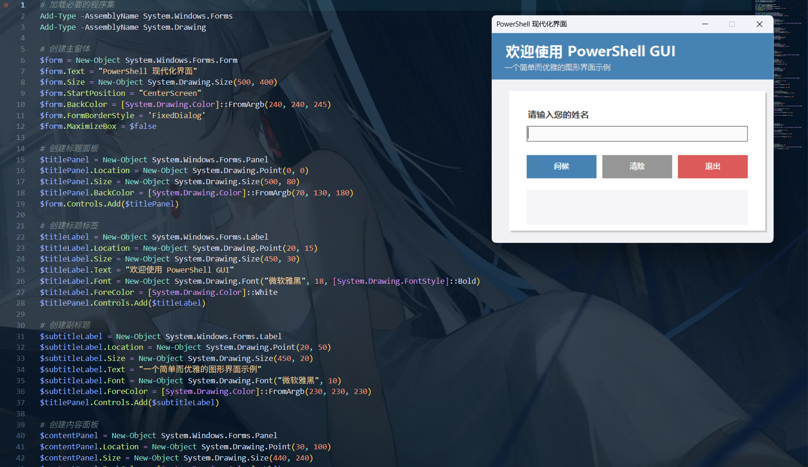

### Windows Terminal - 颜值即正义

**诞生故事**：2019 年，微软新 CEO 上任后说："我们的终端太丑了，重做！"于是有了 Windows Terminal。

**为什么要用 Windows Terminal？**

对比一下：

```
老CMD：
- 黑色背景，白色文字
- 不能分屏
- 不能多标签
- 不支持Unicode（中文经常乱码）
- 像素风格（不是褒义）

Windows Terminal：
- 透明背景、亚克力效果 ✨
- 支持分屏
- 多标签（像浏览器一样）
- 完美支持中文、emoji 😄
- GPU加速，丝般顺滑
- 可以自定义一切！
```

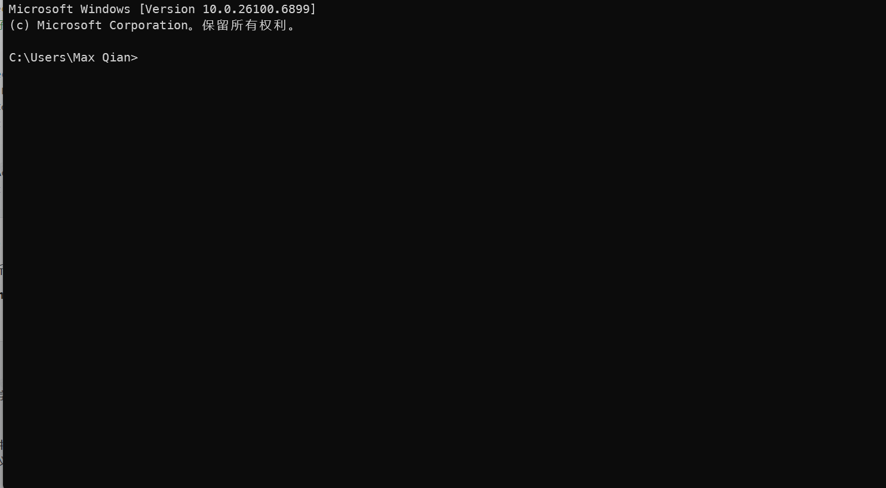

**Windows Terminal 快速上手**：

**安装**：Microsoft Store 搜索"Windows Terminal" (Win11 内置)

**基础快捷键**：

```
Ctrl + Shift + T    新标签页
Ctrl + Shift + W    关闭标签页
Ctrl + Tab          切换标签页
Alt + Shift + +     垂直分屏
Alt + Shift + -     水平分屏
Alt + 方向键         在分屏间切换
Ctrl + Shift + F    搜索
```

**配置文件位置**：

```
按 Ctrl + ,  打开设置
或者直接编辑JSON配置文件
```

**美化配置示例**：

```json
{
    "profiles": {
        "defaults": {
            "font": {
                "face": "Cascadia Code",
                "size": 12
            },
            "opacity": 85,
            "useAcrylic": true,
            "backgroundImage": "C:/Images/background.jpg",
            "backgroundImageOpacity": 0.3,
            "colorScheme": "One Half Dark"
        }
    },
    "schemes": [
        {
            "name": "One Half Dark",
            "background": "#282C34",
            "foreground": "#DCDFE4"
        }
    ]
}
```

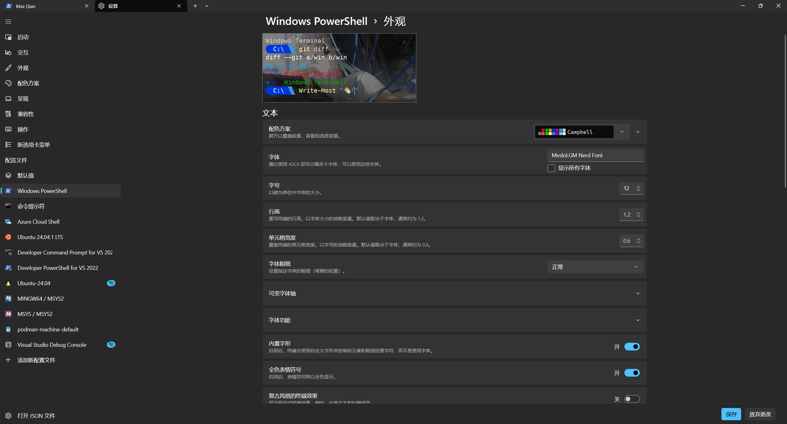

**Windows Terminal 趣味玩法**：

```json
// 1. 设置动态背景（每次打开不同）
"backgroundImage": "desktopWallpaper",

// 2. 复古CRT效果
"experimental.retroTerminalEffect": true,

// 3. 自定义标签图标
"icon": "C:/Icons/powershell.png",

// 4. 启动时运行特定命令
"commandline": "powershell.exe -NoExit -Command \"Write-Host '欢迎回来！' -ForegroundColor Cyan\"",

// 5. 不同配置切换
{
    "name": "开发环境",
    "commandline": "wsl ~",
    "startingDirectory": "//wsl$/Ubuntu/home/user/projects"
}
```

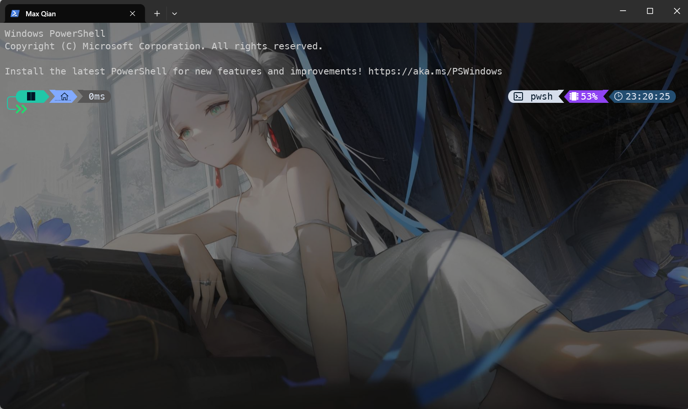

---

## 4. Linux/Unix 世界的贝壳们

### Bash - 开源世界的通用语言

**为什么叫 Bash？**

- **Bourne Again Shell**（又是 Bourne Shell）
- 这是个双关语：**Born Again**（重生）

```bash
# Bash的禅宗
echo "简单的才是最好的"
```

**Bash 生存技能包**：

```bash
# 导航忍术
cd ~          # 回家
cd -          # 回到上一个目录（时光倒流！）
pushd /tmp    # 去/tmp但记住现在的位置
popd          # 回到之前记住的位置

# 历史命令魔法
!!            # 重复上一条命令
!$            # 上一条命令的最后一个参数
!^            # 上一条命令的第一个参数
!*            # 上一条命令的所有参数
Ctrl+R        # 搜索历史命令（超级有用！）

# 通配符魔术
ls *.txt      # 所有txt文件
ls file?.txt  # file1.txt, file2.txt等
ls file[0-9].txt  # file0.txt到file9.txt
ls {file1,file2}.txt  # file1.txt和file2.txt

# 快捷键闪电侠
Ctrl+A        # 跳到行首
Ctrl+E        # 跳到行尾
Ctrl+U        # 删除光标前所有内容
Ctrl+K        # 删除光标后所有内容
Ctrl+W        # 删除前一个单词
Ctrl+L        # 清屏（等于clear命令）
Ctrl+C        # 终止当前命令
Ctrl+Z        # 暂停当前命令（bg恢复后台运行）
```

**Bash 脚本入门**：

```bash
#!/bin/bash
# 我的第一个Bash脚本

# 打印彩色文字
echo -e "\033[1;32m绿色文字\033[0m"
echo -e "\033[1;31m红色警告！\033[0m"
echo -e "\033[1;34m蓝色信息\033[0m"

# 获取用户输入
read -p "你叫什么名字？ " name
echo "你好，$name！"

# 条件判断
if [ -f "文件.txt" ]; then
    echo "文件存在"
else
    echo "文件不存在，创建一个"
    touch 文件.txt
fi

# 循环
for i in {1..5}; do
    echo "第 $i 次循环"
    sleep 1
done

# 函数
greet() {
    local name=$1
    echo "Hello, $name!"
}

greet "世界"
```

**Bash 实用脚本例子**：

```bash
# 🎬 批量重命名
for file in *.jpg; do
    mv "$file" "${file%.jpg}_backup.jpg"
done

# 📊 统计代码行数
find . -name "*.py" | xargs wc -l | sort -n

# 🔍 查找大文件
find / -type f -size +100M 2>/dev/null

# 🧹 清理日志
find /var/log -name "*.log" -mtime +30 -delete

# 📦 备份脚本
backup_dir="/backup/$(date +%Y%m%d)"
mkdir -p "$backup_dir"
tar -czf "$backup_dir/data.tar.gz" /important/data

# 🌐 批量ping
for ip in 192.168.1.{1..254}; do
    ping -c 1 -W 1 $ip >/dev/null && echo "$ip is up"
done &
```

### Zsh - Bash 的酷炫表弟

**为什么用 Zsh？**

- 更强大的自动补全
- 更好的配置系统
- 更多的插件
- macOS 的默认 Shell

```bash
# Zsh的超能力

# 🎯 智能补全
cd /u/l/b<TAB>
# 自动补全成：cd /usr/local/bin

# 📁 目录导航
.. ../../etc
# 等于：cd ../../etc

# 🔄 全局别名
alias -g G='| grep'
ps aux G python
# 等于：ps aux | grep python

# 🎨 主题系统（用Oh My Zsh后）
ZSH_THEME="agnoster"
```

**Oh My Zsh - Zsh 的化妆品店**：

```bash
# 安装Oh My Zsh
sh -c "$(curl -fsSL https://raw.githubusercontent.com/ohmyzsh/ohmyzsh/master/tools/install.sh)"

# ~/.zshrc配置文件
ZSH_THEME="robbyrussell"  # 主题

# 推荐插件
plugins=(
    git                    # Git别名和补全
    docker                 # Docker补全
    kubectl                # Kubernetes补全
    autojump               # 智能跳转
    zsh-autosuggestions    # 命令建议
    zsh-syntax-highlighting # 语法高亮
)

# 自定义别名
alias ll='ls -lah'
alias gs='git status'
alias gp='git push'
alias cls='clear'
alias update='sudo apt update && sudo apt upgrade'
```

**Zsh 趣味插件**：

```bash
# 🐱 thefuck - 自动纠正命令
sudo apt install thefuck

# 配置：eval $(thefuck --alias)
# 用法：
$ git push
# fatal: The current branch has no upstream branch.
$ fuck
# git push --set-upstream origin master [enter/↑/↓/ctrl+c]

# 🦘 autojump - 智能目录跳转
sudo apt install autojump
# 用法：
j project   # 跳转到任何包含"project"的目录

# 🎨 powerlevel10k - 超级主题
git clone --depth=1 https://github.com/romkatv/powerlevel10k.git ${ZSH_CUSTOM:-$HOME/.oh-my-zsh/custom}/themes/powerlevel10k
# 运行配置向导
p10k configure
```

### Fish - 对新手最友好的 Shell

**Fish 的哲学**：开箱即用，不需要配置就很好用

```
# Fish的特色

# 🔮 自动建议（根据历史）
$ git com
# 自动显示：git commit（灰色）
# 按→接受建议

# 🎨 语法高亮（实时）
$ ls /uss/bin
# "uss"显示红色（因为不存在）
$ ls /usr/bin
# 变成绿色（存在）

# 📊 人性化语法
if test -f file.txt
    echo "文件存在"
end

# 列表
set fruits apple banana orange
for fruit in $fruits
    echo $fruit
end
```

**Fish 快速配置**：

```
# 安装Fish
sudo apt install fish

# 设为默认Shell
chsh -s $(which fish)

# 配置文件位置：~/.config/fish/config.fish

# 设置别名
alias ll='ls -lah'
alias g='git'

# 自定义函数
function mkcd
    mkdir -p $argv
    cd $argv
end

# 主题安装（Oh My Fish）（但是这个项目有点似了）
curl https://raw.githubusercontent.com/oh-my-fish/oh-my-fish/master/bin/install | fish
omf install bobthefish  # 流行主题
```

---

## 5. 新时代终端：未来已来

### Warp - AI 驱动的终端

**官网**：[warp.dev](https://warp.dev)

**Warp 是什么？**

想象一下：

- 终端 + IDE 的舒适度
- 终端 + AI 助手
- 终端 + 团队协作工具

```
传统终端：你敲命令，它执行
Warp：你说想法，AI帮你写命令
```

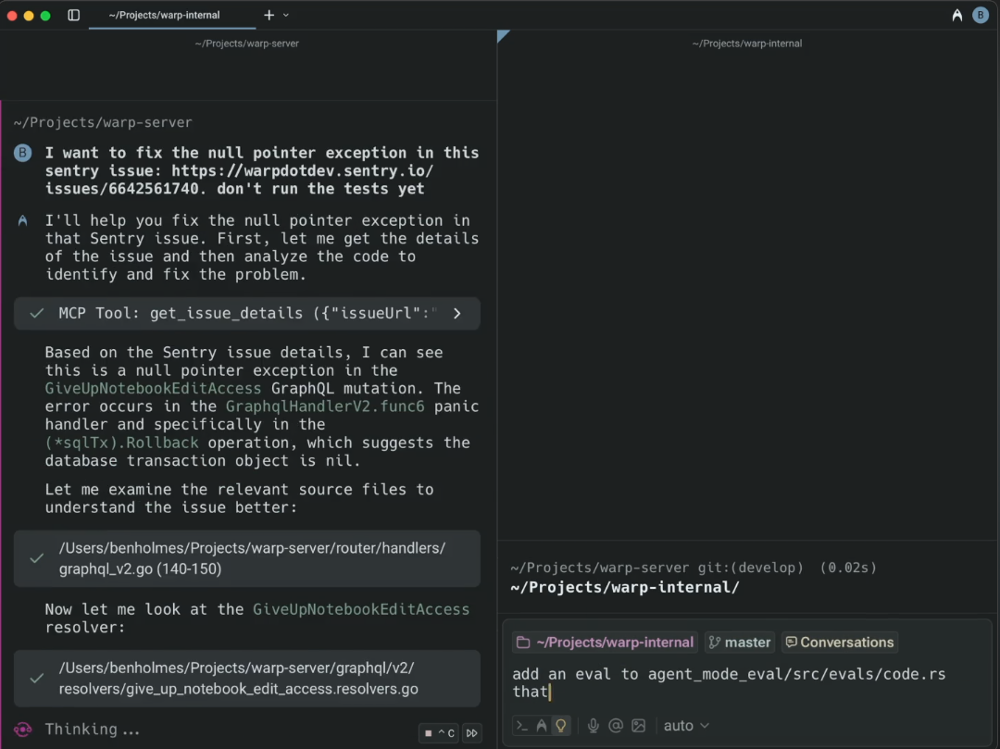

**Warp 的黑科技**：

#### 块编辑模式

```
不再是一行一行的命令
而是一个个"块"（Block）

[Block 1]
输入：find . -name "*.log"
输出：./app.log
     ./error.log

[Block 2]
输入：cat error.log
输出：[错误内容]

每个块可以：
- 独立编辑
- 分享给队友
- 添加注释
- 保存为workflow
```

#### AI 命令生成

```
你：Ctrl+` (打开AI面板)
输入：find all Python files modified in last 7 days

Warp AI：
find . -name "*.py" -mtime -7

要执行这个命令吗？[Enter]
需要解释吗？
需要修改吗？
```

#### 智能补全

```
$ git
[Warp自动显示]
  commit    - 提交更改
  push      - 推送到远程
  pull      - 拉取更新
  status    - 查看状态

还会显示你最常用的命令！
```

#### Workflows（工作流）

```
保存常用命令序列：

Workflow: "部署到生产环境"
1. git pull
2. npm run build
3. docker build -t app .
4. kubectl apply -f deployment.yaml

一键执行！
```

#### 团队协作

```
分享你的终端块：
[分享按钮] → 生成链接

队友打开链接后：
- 看到你执行的命令
- 看到输出
- 可以直接在他们的终端运行
```

**Warp 使用体验**：

```bash
# 普通场景
你在Warp输入：git st
Warp：检测到可能是 git status，自动补全

# AI助手场景
你：怎么找出最大的10个文件？
Warp AI：
du -ah . | sort -rh | head -10
解释：
- du -ah：显示所有文件大小
- sort -rh：按人类可读格式逆序排序
- head -10：取前10个

# 错误修复
$ gti status
Warp：检测到拼写错误，要执行 git status 吗？

# Notebook模式
像Jupyter Notebook一样使用终端：
- Markdown说明
- 代码块
- 输出结果
都整整齐齐排列
```

**Warp 的限制**：

- 需要注册账号（免费）
- 某些功能需要联网
- AI 功能需要收费

### Wave Terminal - 可视化终端革命

**官网**：[waveterm.dev](https://waveterm.dev)

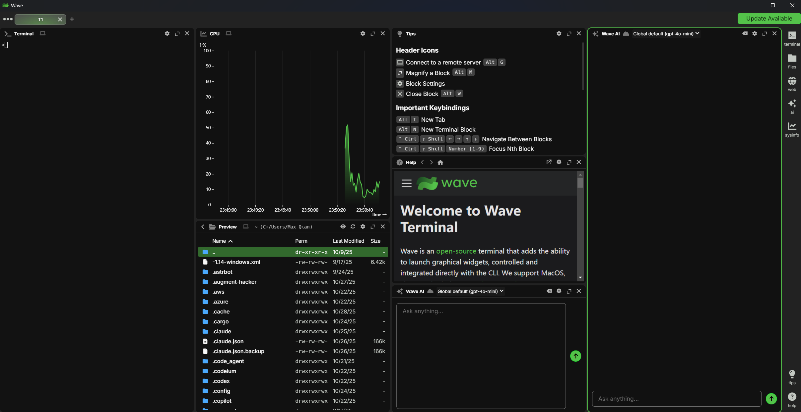

**Wave 的野心**：把终端变成真正的"工作空间"

```
Wave = 终端 + 文件管理器 + 编辑器 + 协作工具 + 可视化面板
```

**Wave 的独特功能**：

#### 可视化 Widgets

```
不只是文本！
- 图片预览
- PDF查看
- Markdown渲染
- 图表展示
- 甚至视频播放！

$ ls
file1.txt
image.png      [显示缩略图] 👈
report.pdf     [显示首页]
video.mp4      [显示预览]
```

#### 分屏管理

```
┌─────────────┬─────────────┐
│ 终端1       │ 终端2       │
│ npm run dev │ tail -f log │
├─────────────┼─────────────┤
│ 文件浏览器  │ 代码编辑器  │
│             │             │
└─────────────┴─────────────┘
```

#### 持久化会话

```
Wave的特色：
- 关闭窗口，会话不丢失
- 重启电脑，历史还在
- 所有输出都保存
- 可以随时回看
```

#### 内置编辑器

```
不用切换到其他编辑器：
$ wave edit config.json
[在Wave内直接编辑]
保存后立即生效
```

**Wave 使用场景**：

```bash
# 场景1：监控多个服务
[终端1] docker logs -f app
[终端2] tail -f /var/log/nginx/access.log
[终端3] htop
[面板4] 显示系统资源图表

# 场景2：开发调试
[终端1] npm run dev
[终端2] npm test -- --watch
[编辑器] 直接修改代码
[预览] 实时查看效果

# 场景3：数据分析
$ cat data.csv
[Wave自动渲染成表格]
[可以排序、筛选、导出]
```

**Wave 的优势**：

- 完全开源
- 跨平台（Windows、macOS、Linux）
- 不需要注册账号
- 本地优先，隐私安全
- 可以自定义插件

---

## 6. 终端美化大作战

### 为什么要美化终端？

```
程序员：我每天盯着终端8小时
也是程序员：终端丑点无所谓

真相：
- 好看的终端让你心情愉悦 😊
- 清晰的配色减少眼睛疲劳 👀
- 个性化的提示符提高效率 ⚡
- 炫酷的终端让你看起来很专业 😎
```

### 配色方案推荐

#### 经典配色

**Solarized**

[https://github.com/altercation/solarized](https://github.com/altercation/solarized)

```bash
# 特点：护眼、对比度适中
# 适合：长时间编程
# 有深色和浅色两个版本

# 安装（以iTerm2为例）
# Preferences → Profiles → Colors → Color Presets → Solarized Dark
```

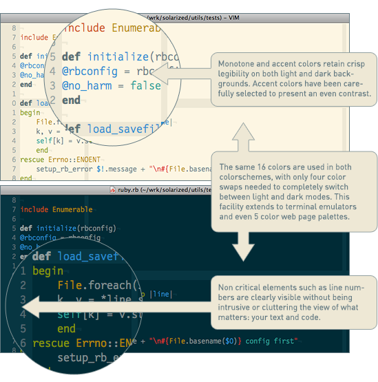

**Dracula**

```bash
# 特点：紫色主题、高对比度
# 适合：夜间编程
# 支持几乎所有终端和编辑器

# 官网：draculatheme.com
```


**One Dark / One Light**

```bash
# 特点：来自Atom编辑器
# 适合：喜欢Atom风格的人
# 配色和谐、不刺眼
```

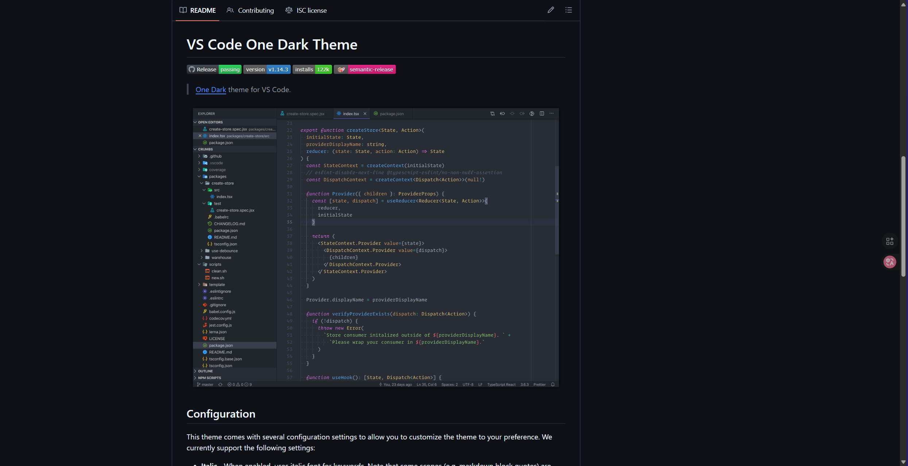

**Nord**

```bash
# 特点：冷色调、北欧风
# 适合：喜欢简约风格
# 蓝灰色系，非常优雅
```

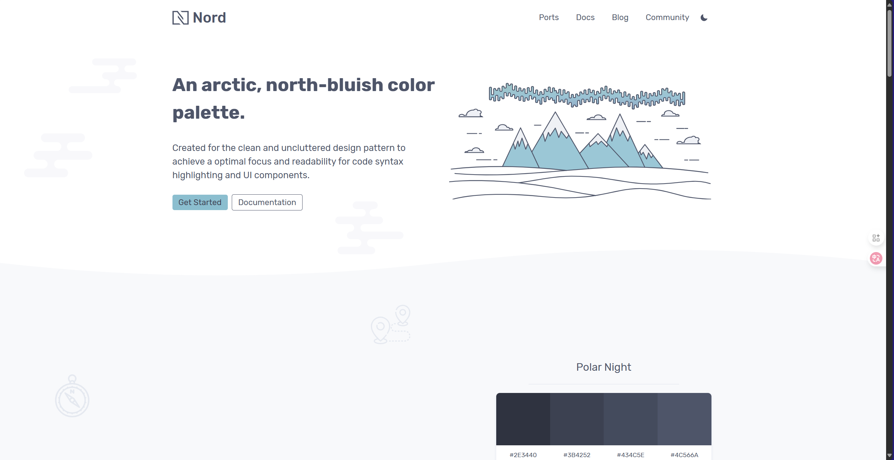

#### 如何选择配色？

```
考虑因素：
1. 使用时间：白天用浅色，晚上用深色
2. 环境光线：强光下用高对比度
3. 个人喜好：最重要的是你喜欢
4. 一致性：终端和编辑器配色统一

测试方法：
- 写一段代码看看
- 看看日志输出
- 用一天试试感觉
```

### 字体选择

#### 编程字体推荐

**Cascadia Code**（微软出品）

```bash
# 特点：
- 免费开源
- 支持连字（ligatures）
- Windows Terminal默认字体
- 清晰易读

# 下载：github.com/microsoft/cascadia-code
```

**Fira Code**

```bash
# 特点：
- 最流行的编程字体之一
- 连字效果丰富
- != 显示为 ≠
- => 显示为 ⇒

# 下载：github.com/tonsky/FiraCode
```

**JetBrains Mono**

```bash
# 特点：
- JetBrains公司出品
- 专为编程设计
- 字符区分度高（0 O l 1 很容易区分）

# 下载：jetbrains.com/lp/mono
```

**Nerd Fonts**

```bash
# 特点：
- 包含大量图标和符号
- 支持各种主题的图标显示
- 必备！很多主题需要

# 安装：
brew tap homebrew/cask-fonts
brew install font-hack-nerd-font
```

#### 字体配置示例

**Windows Terminal**

```json
{
    "profiles": {
        "defaults": {
            "font": {
                "face": "Cascadia Code",
                "size": 11,
                "weight": "normal"
            }
        }
    }
}
```

**iTerm2 (macOS)**

```
Preferences → Profiles → Text
→ Font: Fira Code
→ Size: 13
→ Use ligatures: ✓
```

### 提示符美化

#### Starship - 跨 Shell 的提示符

```bash
# 安装Starship
curl -sS https://starship.rs/install.sh | sh

# Bash配置
echo 'eval "$(starship init bash)"' >> ~/.bashrc

# Zsh配置
echo 'eval "$(starship init zsh)"' >> ~/.zshrc

# PowerShell配置
Invoke-Expression (&starship init powershell)

# Fish配置
starship init fish | source
```

**Starship 配置示例**（`~/.config/starship.toml`）：

```
# 简洁模式
format = """
[┌───────────────────>](bold green)
[│](bold green)$directory$git_branch$git_status
[└─>](bold green) """

# 显示命令执行时间
[cmd_duration]
min_time = 500
format = "took [$duration](bold yellow)"

# Git状态
[git_status]
conflicted = "🏳"
ahead = "🏎💨"
behind = "😰"
diverged = "😵"
untracked = "🤷"
stashed = "📦"
modified = "📝"
staged = "✅"
renamed = "👅"
deleted = "🗑"

# 目录显示
[directory]
truncation_length = 3
truncate_to_repo = true
format = "[$path]($style)[$read_only]($read_only_style) "

# 编程语言图标
[nodejs]
symbol = " "

[python]
symbol = " "

[rust]
symbol = " "
```

#### Powerlevel10k - Zsh 专用超级主题

```bash
# 安装
git clone --depth=1 https://github.com/romkatv/powerlevel10k.git ${ZSH_CUSTOM:-$HOME/.oh-my-zsh/custom}/themes/powerlevel10k

# 在 ~/.zshrc 中设置
ZSH_THEME="powerlevel10k/powerlevel10k"

# 运行配置向导
p10k configure

# 配置向导会问你：
# - 喜欢什么样的图标？
# - 提示符在左边还是右边？
# - 要显示哪些信息？
# - 要不要显示时间？
# - 等等...
```

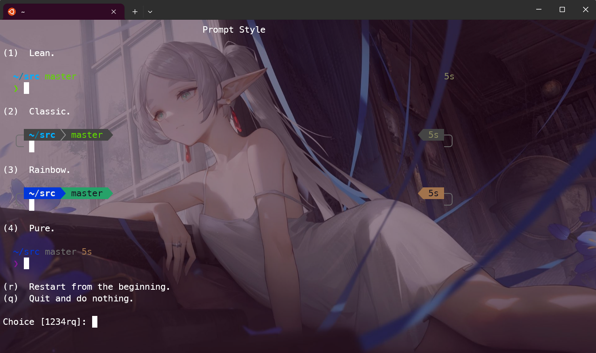

**Powerlevel10k 特色**：

```
提示符可以显示：
✓ Git状态（分支、修改、冲突）
✓ 命令执行时间
✓ 退出代码
✓ 后台任务数量
✓ Python虚拟环境
✓ Node.js版本
✓ 当前时间
✓ 电池电量
✓ 还有更多...

而且速度超快！⚡
```

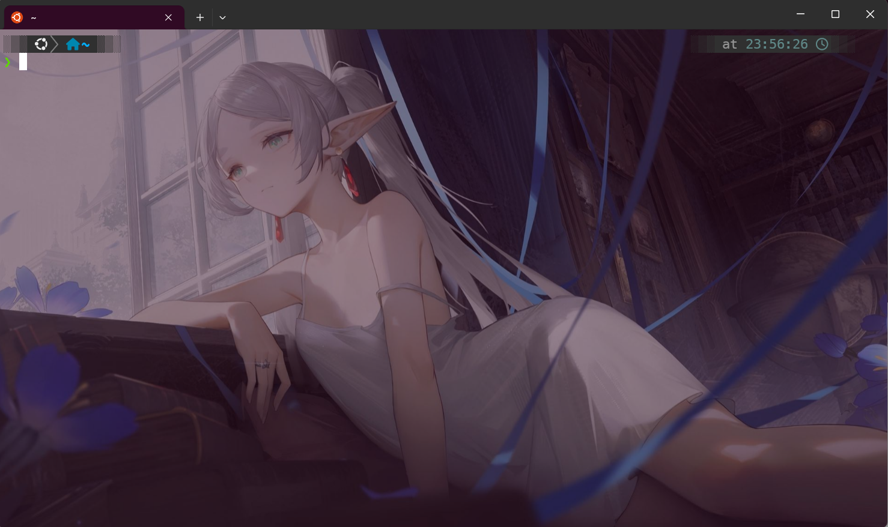

### 终端透明度和背景

#### Windows Terminal

```json
{
    "profiles": {
        "defaults": {
            // 透明度（0-100）
            "opacity": 85,

            // 亚克力效果
            "useAcrylic": true,

            // 背景图片
            "backgroundImage": "C:/Images/wallpaper.jpg",
            "backgroundImageOpacity": 0.2,
            "backgroundImageStretchMode": "uniformToFill",

            // 背景图片对齐
            "backgroundImageAlignment": "center"
        }
    }
}
```

#### iTerm2

```
Preferences → Profiles → Window
→ Transparency: 15%
→ Blur: 10

Preferences → Profiles → Window → Background Image
→ Image: 选择图片
→ Blending: 0.3
```

### 终端分屏和标签

#### Tmux - 终端复用器

```bash
# 安装
sudo apt install tmux  # Linux
brew install tmux      # macOS

# 基础使用
tmux                   # 启动新会话
tmux new -s work       # 创建名为work的会话
tmux attach -t work    # 连接到work会话
tmux ls                # 列出所有会话

# 快捷键（默认前缀：Ctrl+b）
Ctrl+b %               # 垂直分屏
Ctrl+b "               # 水平分屏
Ctrl+b 方向键          # 切换面板
Ctrl+b c               # 新建窗口
Ctrl+b n               # 下一个窗口
Ctrl+b p               # 上一个窗口
Ctrl+b d               # 断开会话（后台运行）
```

**Tmux 配置示例**（`~/.tmux.conf`）：

```bash
# 修改前缀键为 Ctrl+a
unbind C-b
set -g prefix C-a
bind C-a send-prefix

# 鼠标支持
set -g mouse on

# 从1开始编号（而不是0）
set -g base-index 1
setw -g pane-base-index 1

# 更好的分屏快捷键
bind | split-window -h
bind - split-window -v

# 快速重载配置
bind r source-file ~/.tmux.conf \; display "配置已重载！"

# 状态栏美化
set -g status-bg colour235
set -g status-fg colour136
set -g status-left '#[fg=green]#S '
set -g status-right '#[fg=yellow]%Y-%m-%d %H:%M'
```

#### Oh My Tmux - Tmux 美化

```bash
# 安装
cd ~
git clone https://github.com/gpakosz/.tmux.git
ln -s -f .tmux/.tmux.conf
cp .tmux/.tmux.conf.local .

# 特点：
- 开箱即用的美化配置
- 电池电量显示
- 更好的状态栏
- 更多的快捷键
```

### 终端录制和分享

#### Asciinema - 录制终端会话

```bash
# 安装
pip install asciinema

# 录制
asciinema rec demo.cast

# 播放
asciinema play demo.cast

# 上传分享
asciinema upload demo.cast
# 会得到一个链接，可以分享给别人
```

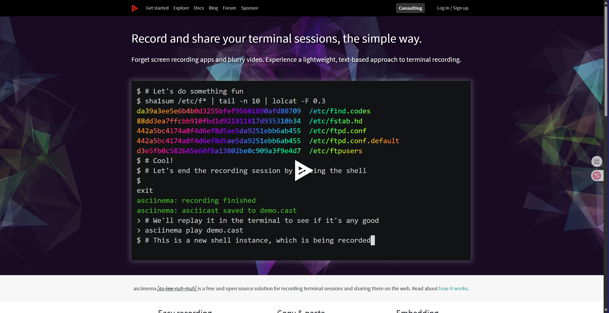

#### terminalizer - 生成 GIF 动画

```bash
# 安装
npm install -g terminalizer

# 录制
terminalizer record demo

# 播放
terminalizer play demo

# 生成GIF
terminalizer render demo
```

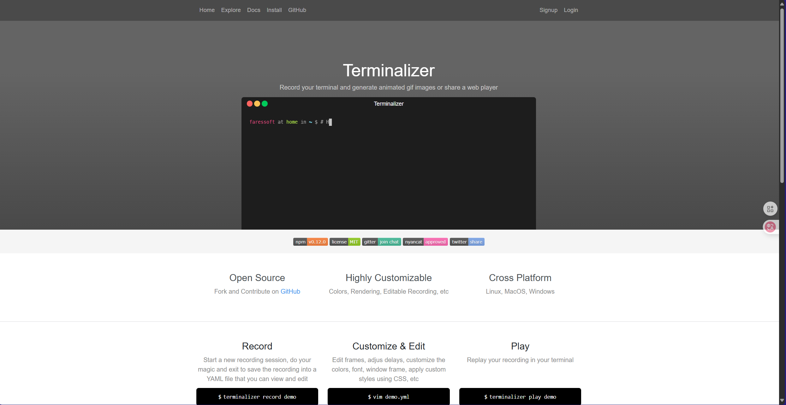

### 完整美化方案示例

#### macOS + iTerm2 + Zsh + Oh My Zsh

```bash
# 1. 安装iTerm2
brew install --cask iterm2

# 2. 安装Oh My Zsh
sh -c "$(curl -fsSL https://raw.githubusercontent.com/ohmyzsh/ohmyzsh/master/tools/install.sh)"

# 3. 安装Powerlevel10k主题
git clone --depth=1 https://github.com/romkatv/powerlevel10k.git ${ZSH_CUSTOM:-$HOME/.oh-my-zsh/custom}/themes/powerlevel10k

# 4. 安装Nerd Font
brew tap homebrew/cask-fonts
brew install font-meslo-lg-nerd-font

# 5. 配置iTerm2
# - 字体：MesloLGS NF
# - 配色：Dracula
# - 透明度：15%

# 6. 安装插件
git clone https://github.com/zsh-users/zsh-autosuggestions ${ZSH_CUSTOM:-~/.oh-my-zsh/custom}/plugins/zsh-autosuggestions
git clone https://github.com/zsh-users/zsh-syntax-highlighting.git ${ZSH_CUSTOM:-~/.oh-my-zsh/custom}/plugins/zsh-syntax-highlighting

# 7. 编辑 ~/.zshrc
ZSH_THEME="powerlevel10k/powerlevel10k"
plugins=(
    git
    zsh-autosuggestions
    zsh-syntax-highlighting
    docker
    kubectl
)

# 8. 运行配置向导
p10k configure
```

#### Windows + Windows Terminal + PowerShell

```powershell
# 1. 安装Windows Terminal（Microsoft Store）

# 2. 安装Oh My Posh
winget install JanDeDobbeleer.OhMyPosh

# 3. 安装Nerd Font
oh-my-posh font install

# 4. 配置PowerShell配置文件
notepad $PROFILE

# 添加以下内容：

oh-my-posh init pwsh --config "$env:POSH_THEMES_PATH\jandedobbeleer.omp.json" | Invoke-Expression

# 5. 配置Windows Terminal (settings.json)
{
    "profiles": {
        "defaults": {
            "font": {
                "face": "MesloLGM Nerd Font",
                "size": 11
            },
            "opacity": 85,
            "useAcrylic": true,
            "colorScheme": "Dracula"
        }
    }
}

# 6. 安装PSReadLine（更好的命令行编辑）
Install-Module -Name PSReadLine -Force

# 7. 在 $PROFILE 中添加
Set-PSReadLineOption -PredictionSource History
Set-PSReadLineOption -PredictionViewStyle ListView
```

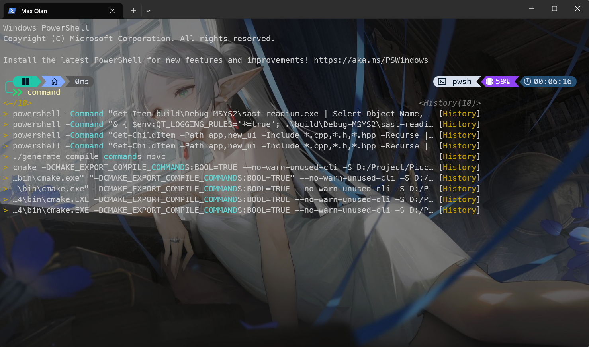

---

## 7. 实用技巧速成班

### 文件和目录操作

#### 快速导航

```bash
# 回到上一个目录
cd -

# 回到家目录
cd ~
cd

# 创建多层目录
mkdir -p project/src/components

# 创建目录并进入
mkdir myproject && cd myproject

# 或者定义函数（Bash/Zsh）
mkcd() {
    mkdir -p "$1" && cd "$1"
}
```

#### 文件查找

```bash
# 按名称查找
find . -name "*.txt"

# 按类型查找
find . -type f          # 文件
find . -type d          # 目录

# 按大小查找
find . -size +100M      # 大于100MB
find . -size -1k        # 小于1KB

# 按时间查找
find . -mtime -7        # 最近7天修改的
find . -mtime +30       # 30天前修改的

# 查找并执行
find . -name "*.log" -delete
find . -name "*.jpg" -exec cp {} /backup \;

# 更快的查找（需要安装fd）
fd "*.txt"              # 查找txt文件
fd -e py                # 查找Python文件
fd -t d project         # 查找名为project的目录
```

#### 文件内容搜索

```bash
# grep基础
grep "error" log.txt
grep -i "error" log.txt          # 忽略大小写
grep -r "TODO" .                 # 递归搜索
grep -n "error" log.txt          # 显示行号
grep -v "debug" log.txt          # 反向匹配（不包含）

# 多文件搜索
grep "error" *.log

# 正则表达式
grep -E "[0-9]{3}-[0-9]{4}" contacts.txt

# 更好的grep（需要安装ripgrep）
rg "error"                       # 自动递归、彩色输出
rg -i "error"                    # 忽略大小写
rg "error" -t py                 # 只搜索Python文件
rg "error" -g "*.log"            # 只搜索log文件
```

### 进程管理

#### 查看进程

```bash
# 查看所有进程
ps aux

# 查看特定进程
ps aux | grep python

# 实时监控（更好用的top）
htop

# 查看进程树
pstree

# 查看端口占用
lsof -i :8080
netstat -tulpn | grep 8080

# Windows
netstat -ano | findstr :8080
```

#### 管理进程

```bash
# 后台运行
command &

# 查看后台任务
jobs

# 将任务放到后台
Ctrl+Z                  # 暂停
bg                      # 后台继续运行

# 将任务调到前台
fg

# 杀死进程
kill PID
kill -9 PID             # 强制杀死
killall process_name    # 按名称杀死

# 保持进程运行（即使退出终端）
nohup command &
```

### 文本处理

#### 查看文件

```bash
# 查看整个文件
cat file.txt

# 分页查看
less file.txt
more file.txt

# 查看前几行
head file.txt
head -n 20 file.txt     # 前20行

# 查看后几行
tail file.txt
tail -n 20 file.txt     # 后20行
tail -f log.txt         # 实时查看（日志）

# 查看文件统计
wc file.txt             # 行数、词数、字节数
wc -l file.txt          # 只看行数
```

#### 文本编辑

```bash
# sed - 流编辑器
sed 's/old/new/' file.txt              # 替换（每行第一个）
sed 's/old/new/g' file.txt             # 替换（所有）
sed -i 's/old/new/g' file.txt          # 直接修改文件
sed -n '10,20p' file.txt               # 打印10-20行
sed '/pattern/d' file.txt              # 删除匹配的行

# awk - 文本分析
awk '{print $1}' file.txt              # 打印第一列
awk '{print $1, $3}' file.txt          # 打印第1和第3列
awk -F: '{print $1}' /etc/passwd       # 指定分隔符
awk '$3 > 100' data.txt                # 条件过滤

# cut - 剪切文本
cut -d: -f1 /etc/passwd                # 按:分割，取第1字段
cut -c1-10 file.txt                    # 取每行的1-10字符

# sort - 排序
sort file.txt
sort -r file.txt                       # 逆序
sort -n file.txt                       # 数字排序
sort -u file.txt                       # 去重

# uniq - 去重（需要先排序）
sort file.txt | uniq
sort file.txt | uniq -c                # 统计重复次数
```

### 管道和重定向

#### 重定向

```bash
# 输出重定向
command > file.txt                     # 覆盖
command >> file.txt                    # 追加

# 错误重定向
command 2> error.log                   # 只重定向错误
command > output.txt 2>&1              # 输出和错误都重定向
command &> all.log                     # 简写（Bash）

# 输入重定向
command < input.txt

# Here Document
cat << EOF > file.txt
第一行
第二行
EOF
```

#### 管道

```bash
# 基础管道
ls -l | grep ".txt"

# 多级管道
ps aux | grep python | awk '{print $2}'

# tee - 同时输出到文件和屏幕
command | tee output.txt
command | tee -a output.txt            # 追加模式

# xargs - 将输入转为参数
find . -name "*.txt" | xargs rm
echo "file1 file2 file3" | xargs touch
```

### 网络操作

#### 下载文件

```bash
# wget
wget https://example.com/file.zip
wget -O custom_name.zip https://example.com/file.zip
wget -c https://example.com/file.zip   # 断点续传

# curl
curl -O https://example.com/file.zip
curl -o custom_name.zip https://example.com/file.zip
curl -L https://example.com/redirect   # 跟随重定向
```

#### 网络测试

```bash
# ping
ping google.com
ping -c 4 google.com                   # 只ping 4次

# traceroute
traceroute google.com

# 查看IP
ip addr                                # Linux
ifconfig                               # macOS/旧版Linux
ipconfig                               # Windows

# 测试端口
telnet example.com 80
nc -zv example.com 80                  # netcat

# DNS查询
nslookup google.com
dig google.com

# 查看网络连接
netstat -an
ss -tulpn                              # 更现代的替代品
```

### 压缩和解压

```bash
# tar
tar -czf archive.tar.gz folder/        # 压缩
tar -xzf archive.tar.gz                # 解压
tar -tzf archive.tar.gz                # 查看内容

# zip
zip -r archive.zip folder/             # 压缩
unzip archive.zip                      # 解压
unzip -l archive.zip                   # 查看内容

# 7z
7z a archive.7z folder/                # 压缩
7z x archive.7z                        # 解压
```

### 系统信息

```bash
# 系统信息
uname -a                               # 系统信息
lsb_release -a                         # Linux发行版信息（Linux）

# CPU信息
lscpu                                  # Linux
sysctl -n machdep.cpu.brand_string     # macOS

# 内存信息
free -h                                # Linux
vm_stat                                # macOS

# 磁盘信息
df -h                                  # 磁盘使用情况
du -sh *                               # 当前目录各文件/文件夹大小
du -sh folder/                         # 特定文件夹大小

# 系统监控
top                                    # 基础监控
htop                                   # 更好的监控（需安装）
glances                                # 全面的监控（需安装）
```

### 快捷技巧

#### 命令行编辑

```bash
# 光标移动
Ctrl+A                                 # 行首
Ctrl+E                                 # 行尾
Alt+B                                  # 后退一个单词
Alt+F                                  # 前进一个单词

# 删除
Ctrl+U                                 # 删除到行首
Ctrl+K                                 # 删除到行尾
Ctrl+W                                 # 删除前一个单词
Alt+D                                  # 删除后一个单词

# 其他
Ctrl+L                                 # 清屏
Ctrl+R                                 # 搜索历史
Ctrl+C                                 # 取消当前命令
Ctrl+D                                 # 退出（EOF）
Ctrl+Z                                 # 暂停进程
```

#### 历史命令

```bash
# 查看历史
history

# 执行历史命令
!100                                   # 执行第100条命令
!!                                     # 执行上一条命令
!$                                     # 上一条命令的最后一个参数
!^                                     # 上一条命令的第一个参数
!*                                     # 上一条命令的所有参数

# 搜索历史
Ctrl+R                                 # 反向搜索
Ctrl+S                                 # 正向搜索（可能需要stty -ixon）

# 清除历史
history -c                             # 清除当前会话历史
rm ~/.bash_history                     # 删除历史文件
```

#### 别名

```bash
# 定义别名
alias ll='ls -lah'
alias gs='git status'
alias ..='cd ..'
alias ...='cd ../..'

# 查看所有别名
alias

# 删除别名
unalias ll

# 永久保存（添加到 ~/.bashrc 或 ~/.zshrc）
echo "alias ll='ls -lah'" >> ~/.bashrc
```

#### 函数

```bash
# 定义函数（Bash/Zsh）
mkcd() {
    mkdir -p "$1" && cd "$1"
}

# 带参数的函数
extract() {
    if [ -f "$1" ]; then
        case "$1" in
            *.tar.gz)  tar -xzf "$1"   ;;
            *.zip)     unzip "$1"      ;;
            *.7z)      7z x "$1"       ;;
            *)         echo "不支持的格式" ;;
        esac
    else
        echo "文件不存在"
    fi
}

# 保存到配置文件
# 添加到 ~/.bashrc 或 ~/.zshrc
```

### 实用脚本示例

#### 批量处理

```bash
#!/bin/bash
# 批量重命名图片

counter=1
for file in *.jpg; do
    new_name=$(printf "photo_%03d.jpg" $counter)
    mv "$file" "$new_name"
    echo "重命名: $file -> $new_name"
    ((counter++))
done
```

#### 系统备份

```bash
#!/bin/bash
# 简单备份脚本

backup_dir="/backup/$(date +%Y%m%d_%H%M%S)"
source_dir="/important/data"

echo "开始备份..."
mkdir -p "$backup_dir"
tar -czf "$backup_dir/backup.tar.gz" "$source_dir"

if [ $? -eq 0 ]; then
    echo "备份成功: $backup_dir/backup.tar.gz"
else
    echo "备份失败！"
    exit 1
fi

# 删除7天前的备份
find /backup -name "*.tar.gz" -mtime +7 -delete
echo "清理完成"
```

#### 日志分析

```bash
#!/bin/bash
# 分析Nginx访问日志

log_file="/var/log/nginx/access.log"

echo "=== 访问最多的IP ==="
awk '{print $1}' "$log_file" | sort | uniq -c | sort -rn | head -10

echo -e "\n=== 访问最多的URL ==="
awk '{print $7}' "$log_file" | sort | uniq -c | sort -rn | head -10

echo -e "\n=== HTTP状态码统计 ==="
awk '{print $9}' "$log_file" | sort | uniq -c | sort -rn

echo -e "\n=== 每小时访问量 ==="
awk '{print $4}' "$log_file" | cut -d: -f2 | sort | uniq -c
```

---

## 总结

恭喜你完成了这个终端教程！🎉

现在你已经学会了：

- ✅ 终端的历史和演变
- ✅ 各种 Shell 的特点和使用
- ✅ Windows 和 Linux/Unix 的终端工具
- ✅ 现代 AI 驱动的终端
- ✅ 终端美化技巧
- ✅ 实用的命令行技巧

**下一步建议**：

1. **选择一个 Shell**：根据你的系统和喜好选择（Bash、Zsh、PowerShell、Fish）
2. **美化你的终端**：选择喜欢的配色和字体
3. **学习快捷键**：提高效率的关键
4. **写一些脚本**：自动化重复任务
5. **探索新工具**：尝试 Warp、Wave 等现代终端

**记住**：

> 终端不只是黑色窗口，它是程序员最强大的工具之一。
> 熟练使用终端，你会发现很多事情变得简单高效。

**最后的建议**：

```bash
# 不要害怕终端
# 不要害怕犯错（除了 rm -rf /）
# 多练习，多尝试
# 遇到问题就搜索
# 享受命令行的乐趣！

echo "Happy Coding! 🚀"
```

---

**参考资源**：

- [Bash 官方文档](https://www.gnu.org/software/bash/manual/)
- [Zsh 官方文档](https://zsh.sourceforge.io/Doc/)
- [PowerShell 文档](https://docs.microsoft.com/powershell/)
- [Fish 文档](https://fishshell.com/docs/current/)
- [Oh My Zsh](https://ohmyz.sh/)
- [Starship](https://starship.rs/)
- [Warp](https://www.warp.dev/)
- [Wave Terminal](https://www.waveterm.dev/)

**社区**：

- [r/commandline](https://reddit.com/r/commandline)
- [r/bash](https://reddit.com/r/bash)
- [Stack Overflow](https://stackoverflow.com/questions/tagged/terminal)

祝你在终端的世界里玩得开心！✨
