# Visual Studio 2022 C/C++ 开发环境配置指南

尽管 Visual Studio（简称 VS）以功能全面著称，但其默认安装包含大量非必要组件，容易造成“臃肿”印象。实际上，**通过精简安装与合理配置，VS2022 可以成为一个高效、稳定、开箱即用的 C/C++ 开发平台** ，尤其适合大型项目、Windows 原生开发或需要深度调试的场景。

---

## 1.下载与安装 Visual Studio 2022

### 1.1 下载安装程序

1. 访问 [Visual Studio 官网](https://visualstudio.microsoft.com/zh-hans/)

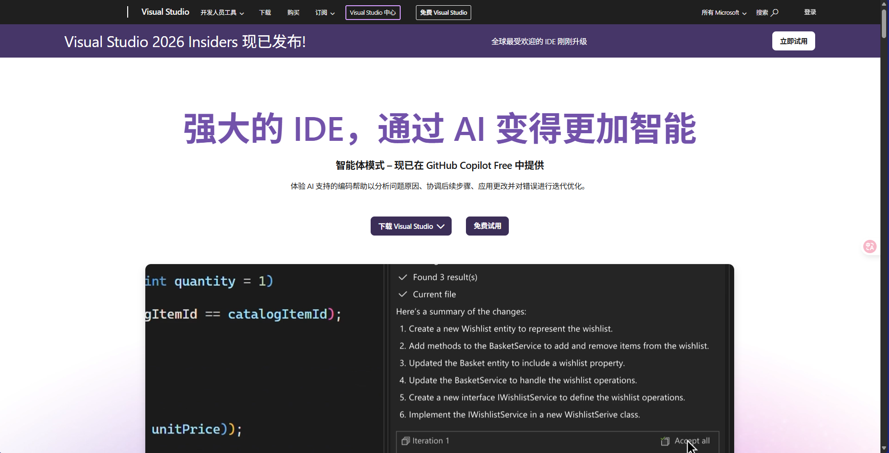

1. 点击 **“下载 Visual Studio”** → 选择 **Community（社区版，免费）**

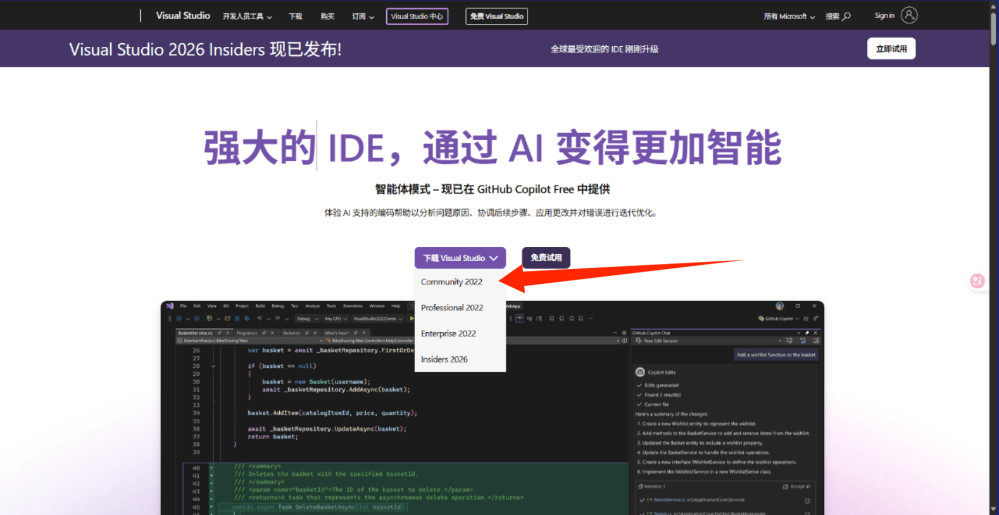

1. 运行下载的 `vs_community.exe`（约 1.5 MB，为引导安装器）

> Community 版对个人开发者、开源项目、小型团队完全免费，功能与 Professional 版几乎一致。

1. 直接安装即可，一路 Next

---

## 2. 精简安装：只选 C++ 开发所需组件

VS 安装器采用“工作负载（Workloads）”模式，避免全量安装是关键。

### 2.1 必选工作负载

在安装界面中，勾选以下一项即可满足绝大多数 C/C++ 开发需求：

- **使用 C++ 的桌面开发**（Desktop development with C++）

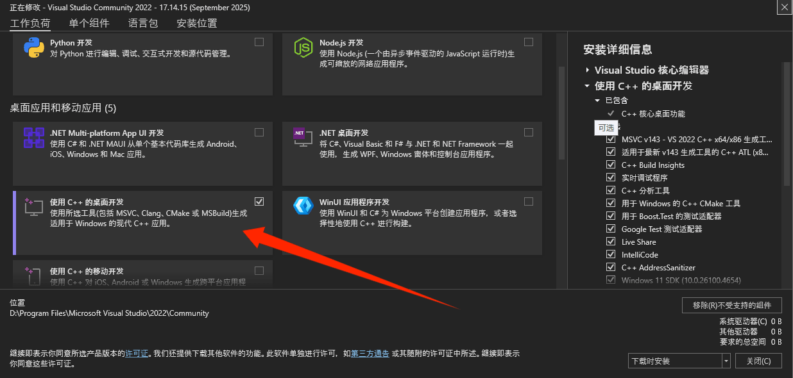

该工作负载自动包含：

- MSVC v143（Visual Studio 2022）编译器工具集
- Windows SDK（含头文件与库）
- CMake 支持
- 调试器（包括远程调试）
- 性能分析工具
- 标准库（STL）与运行时

> 旁边几乎不用选择，只要默认的就好

### 2.2 可选增强组件（按需勾选）

在右侧“安装详细信息”面板中，可进一步精简或增强：

<table>
<tr>
<td>组件<br/></td><td>建议<br/></td><td>说明<br/></td></tr>
<tr>
<td>**CMake 工具**<br/></td><td>推荐<br/></td><td>支持 CMake 项目无缝集成<br/></td></tr>
<tr>
<td>**用于 Windows 的 Clang 工具 （ClangCL）**<br/></td><td>可选<br/></td><td>若需使用 Clang 编译器<br/></td></tr>
<tr>
<td>**测试工具（如 Google Test）**<br/></td><td>按需<br/></td><td>单元测试支持<br/></td></tr>
<tr>
<td>**Linux 开发支持**<br/></td><td>按需<br/></td><td>跨平台开发<br/></td></tr>
<tr>
<td>**游戏开发（如 DirectX）**<br/></td><td>按需<br/></td><td>图形/游戏项目<br/></td></tr>
</table>

> **避免勾选** ：。NET、Python、Web 开发、Azure 等无关工作负载，以节省磁盘空间（完整安装可达 30–50 GB，精简后约 8–12 GB）。

### 2.3 更改安装目录

#### 方法一：简单粗暴

将所有 `C:` 改成 `D:` 就可以了，最不容易出问题

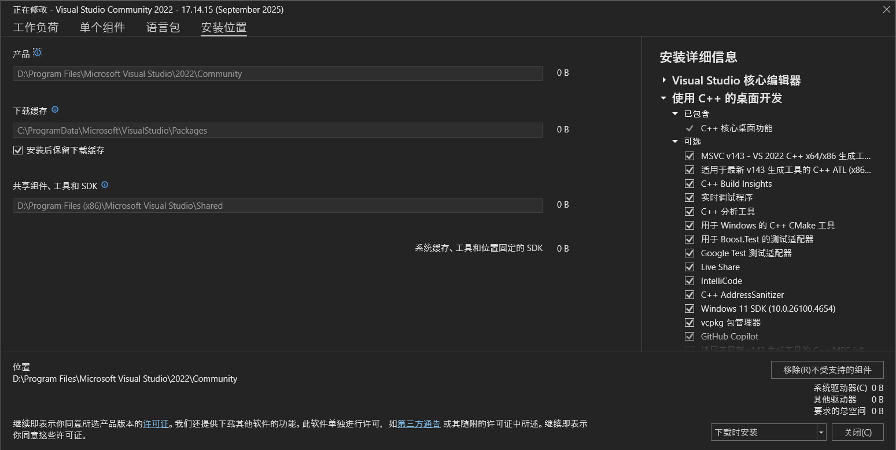

#### 方法 2：更改 下载缓存目录（推荐）

安装过程中或安装后，可将安装包缓存移至其他盘，节省 C 盘空间。

##### 操作步骤：

1. 打开 Visual Studio Installer
2. 点击右上角 “⋮” → “设置”
3. 在 “安装位置” 选项卡中，修改：

   - 下载缓存：例如改为 `D:\VS2022\Cache`
4. 点击 “应用”

> 此操作仅影响安装包缓存（约 5–10 GB），不影响已安装的 IDE 本体。

---

#### 方法 3：使用 符号链接（Symbolic Link） 重定向

若 C 盘空间极度紧张，可将已安装的 VS2022 目录整体迁移到其他盘，再用符号链接“伪装”回原路径。

##### 操作步骤（需管理员权限）：

1. 卸载 VS2022（保留项目和设置）
2. 在 D 盘创建目标目录，如 `D:\VS2022\`
3. 重新安装 VS2022 到默认路径（C 盘）
4. 安装完成后，关闭所有 VS 进程
5. 将 `C:\Program Files\Microsoft Visual Studio\2022` 剪切到 `D:\VS2022\`
6. 以管理员身份打开 CMD，执行：

```yaml
mklink /J "C:\Program Files\Microsoft Visual Studio\2022" "D:\VS2022\2022"
```

> `/J` 创建目录联接（Junction），兼容性优于 `/D`（符号链接）

1. 验证：启动 VS2022 是否正常

> 风险提示：
>
> - 更新或修复安装时可能失败
> - 某些扩展或工具链可能依赖绝对路径
> - 仅建议高级用户在充分备份后尝试

---

> - 普通用户：接受默认安装路径，仅更改缓存目录即可节省数 GB 空间。
> - C 盘空间不足：建议扩容 C 盘或使用符号链接（谨慎操作）。
> - 多用户/企业环境：使用标准部署流程，不要强行修改路径。

---

### 2.4 完成安装

点击右下角 **“安装”** ，等待下载与配置完成（时间取决于网络与磁盘速度）。

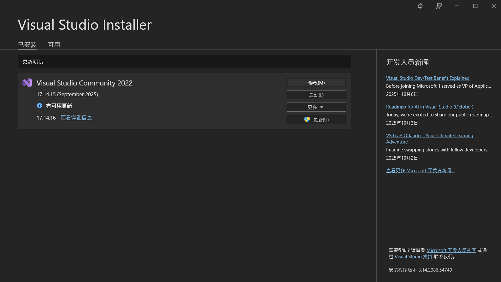

后续如果 VS 有更新也可以在这个页面更新。

---

## 3. 首次启动与基础配置

### 3.1 选择开发设置（Development Settings）

首次启动 Visual Studio 时，系统会弹出“选择您的开发设置”界面。这一步非常重要，因为它将决定 IDE 的默认行为、界面布局和快捷键方案。

> 推荐选择：Visual C++

选择 “Visual C++” 作为默认开发设置后，Visual Studio 会自动为您完成以下配置：

- 键盘快捷键方案：
  采用 C++ 开发者常用的快捷键组合，例如：

  - F5：启动调试（运行并附加调试器）
  - Ctrl+F5：不调试直接运行
  - Ctrl+K， Ctrl+F：格式化选中的代码（或整个文件）
  - Ctrl+Shift+B：编译整个解决方案
  - F9：在当前行设置/取消断点
- 默认窗口布局：
  自动打开对 C++ 开发至关重要的工具窗口，包括：

  - 解决方案资源管理器（Solution Explorer）：用于管理项目文件和依赖项
  - 输出窗口（Output）：显示编译、调试和构建日志
  - 错误列表（Error List）：集中展示编译错误与警告
  - 属性窗口（Properties）：查看或修改项目/文件属性

> 提示：即使后续您想更改设置（例如切换为 C# 或通用开发环境），也可以通过 工具（Tools）→ 导入和导出设置（Import and Export Settings） 进行调整。

### 3.2 登录（可选）

在完成开发设置后，Visual Studio 会提示您登录 Microsoft 账户。此步骤非强制，但登录后可解锁以下实用功能：

- 设置同步（Settings Sync）：
  自动将您的 IDE 配置（如主题、快捷键、代码片段、窗口布局等）同步到云端，方便在多台设备上保持一致的开发体验。
- GitHub 集成：
  无缝连接 GitHub 账户，支持直接在 IDE 内克隆仓库、创建 Pull Request、管理 Issues 等操作。
- 扩展市场权限：
  某些高级扩展（如企业级工具或付费插件）可能需要账户验证才能安装或激活。

> 建议：
>
> - 如果您是个人学习或本地开发，且不打算使用云服务，可以点击“以后再说”跳过登录。
> - 如果您计划参与团队协作、使用 GitHub 或希望在多台电脑上开发，强烈建议登录账户。

### 3.3 初始化项目

登录（或跳过）后，您将进入 Visual Studio 的起始页（Start Window）。该页面提供多种项目创建和打开方式，如下图所示：

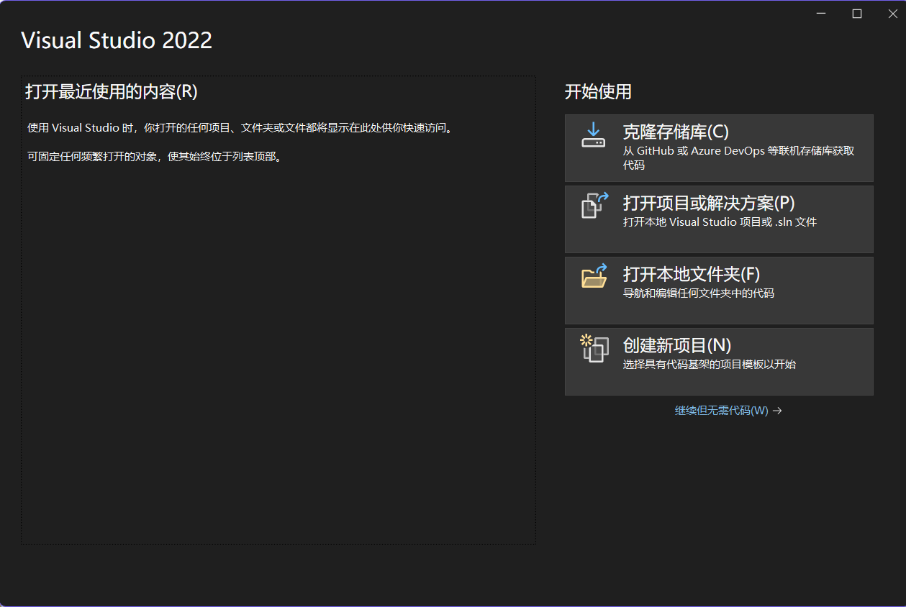

根据您的实际需求，选择以下任一选项：

<table>
<tr>
<td>克隆或签出代码（Clone or check out code）<br/></td><td>如果您已有 GitHub、Azure DevOps 或其他 Git 仓库中的项目，可在此直接克隆到本地。<br/></td></tr>
<tr>
<td>打开本地文件夹（Open a local folder）<br/></td><td>适用于已有 C++ 源代码但未使用 VS 项目结构（如纯 CMake 项目或简单源码目录）。VS 会以“文件夹模式”加载项目。<br/></td></tr>
<tr>
<td>打开项目或解决方案（Open a project or solution）<br/></td><td>如果您已有`.sln`（解决方案）或`.vcxproj`（项目）文件，可直接打开继续开发。<br/></td></tr>
<tr>
<td>创建新项目（Create a new project）<br/></td><td>适用于全新项目开发，推荐初学者从此入口开始。<br/></td></tr>
</table>

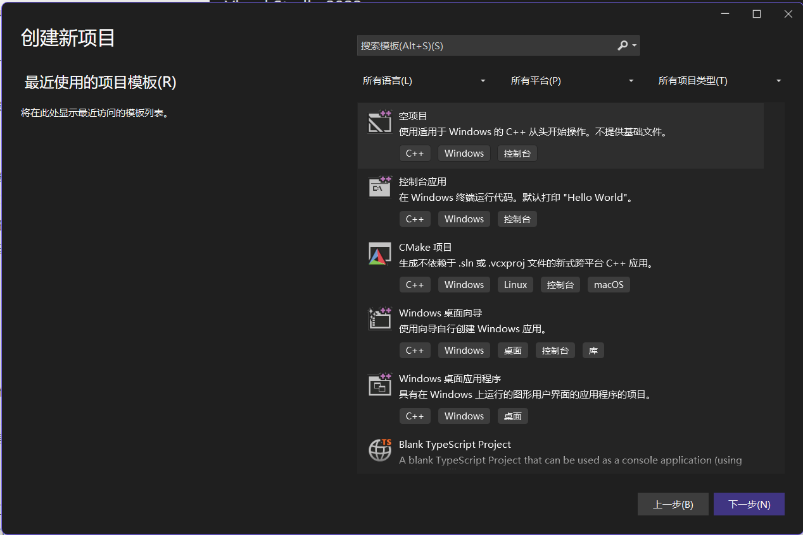

### 3.4 创建新项目流程

1. 点击“创建新项目”
   系统将打开项目模板选择界面。
2. 选择项目模板
   在搜索框中输入 “C++”，筛选出 C++ 相关模板。对于学习或简单程序，推荐以下两种：

   - 空项目（Empty Project）：不包含任何预生成代码，适合从零开始构建，完全掌控项目结构。
   - 控制台应用（Console App）：自动生成一个包含 `main()` 函数的简单控制台程序，适合快速测试代码。

> 1. 建议初学者选择“控制台应用”，便于立即编写和运行第一个 “Hello， World！” 程序。

1. 配置项目信息

> 1. 【图示：项目配置对话框，包含项目名称、位置、解决方案名称等字段】
>    - 项目名称（Project name）：输入项目名称（如 `MyFirstCppApp`），避免使用中文或特殊字符。
>    - 位置（Location）：选择项目保存的本地路径（建议使用英文路径，避免编译问题）。
>    - 解决方案名称（Solution name）：通常与项目名一致，可保持默认。
>    - 勾选“将解决方案和项目放在同一目录中”（可选）：简化目录结构，适合小型项目。

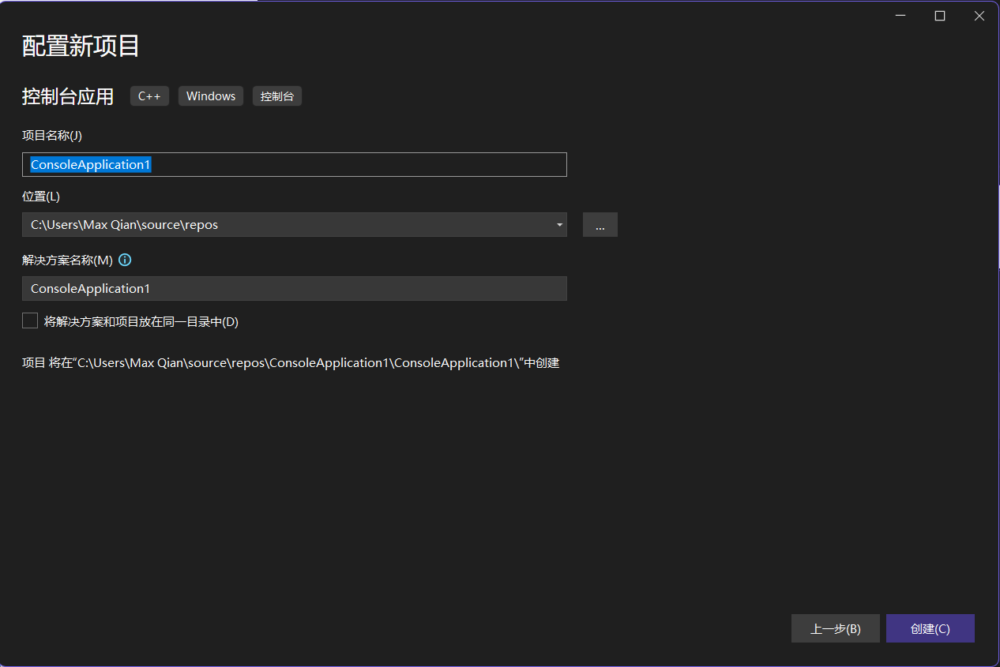

### 3.5 Visual Studio 将生成项目文件并自动打开开发环境。此时您已成功完成首次配置，可以开始编写 C++ 代码！

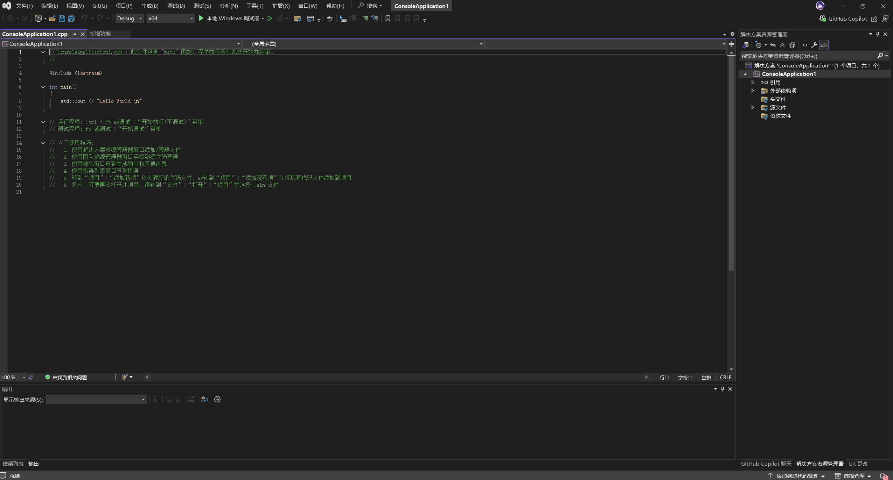

> 下一步提示：在 `main.cpp` 文件中输入代码，按 Ctrl+F5 运行程序，观察控制台输出。
> 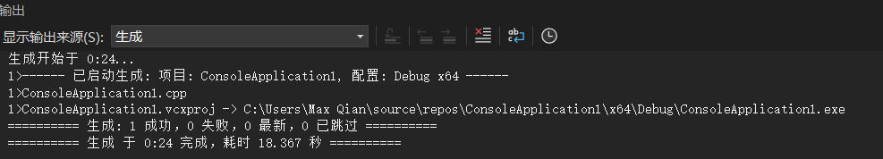
> 理论上会有类似下面的窗口：
> 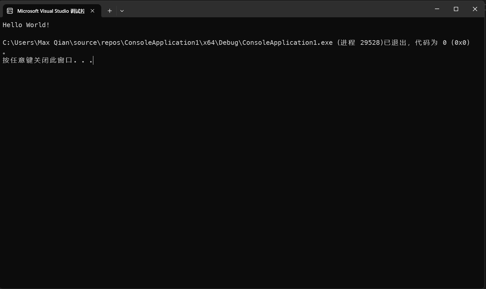

---

## 4. 配置代码风格与格式化

VS2022 内置强大的代码格式化引擎，支持 `.editorconfig` 和自定义规则。

### 4.1 启用自动格式化

1. 打开 **工具 > 选项 > 文本编辑器 > C/C++ > 代码样式 > 格式设置**
2. 勾选：

   - **在键入时自动格式化代码**
   - **在粘贴时自动格式化**
3. 点击 **“生成 。editorconfig 文件”** （推荐），将风格固化到项目中
   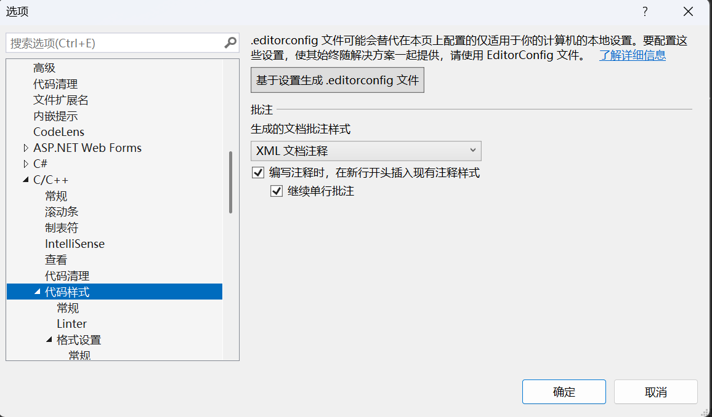

### 4.2 自定义缩进与括号风格

在 **选项 > C/C++ > 代码样式 > 命名和格式设置** 中，可调整：

- 缩进：空格 or 制表符，宽度 2/4
- 大括号位置：Allman（换行） or K&R（同行）
- 指针对齐：类型侧 or 变量侧
  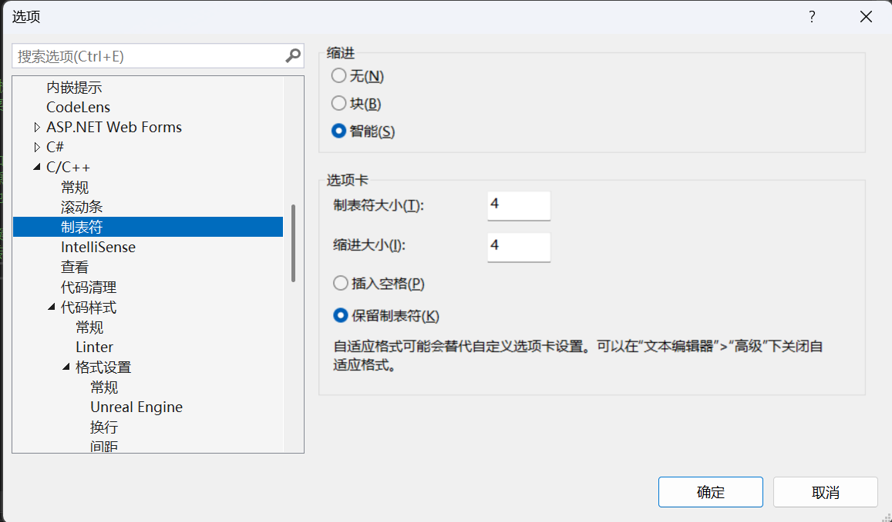

> 提示：团队项目建议统一使用 `.editorconfig`，避免风格冲突。

---

## 5. 启用现代 C++ 标准（C++17/20/23）

Visual Studio 创建的默认 C++ 项目通常使用较旧的 C++ 标准（如 C++14 或更早）。虽然在学习初期编写简单程序时这并无大碍，但随着项目复杂度提升，您会逐渐需要现代 C++ 提供的强大特性——例如结构化绑定（structured bindings）、`std::format`、范围（Ranges）、协程（Coroutines）、模块（Modules）等。这些特性不仅能显著提升代码的可读性和安全性，还能减少样板代码、提高开发效率。

因此，建议在新项目中尽早启用现代 C++ 标准，尤其是 C++20，它在功能丰富性与编译器支持之间取得了良好平衡。

---

### 5.1 项目级设置（推荐方式）

为当前项目启用现代 C++ 标准，请按以下步骤操作：

1. 在“解决方案资源管理器”中右键点击项目名称，选择 “属性”（Properties）。

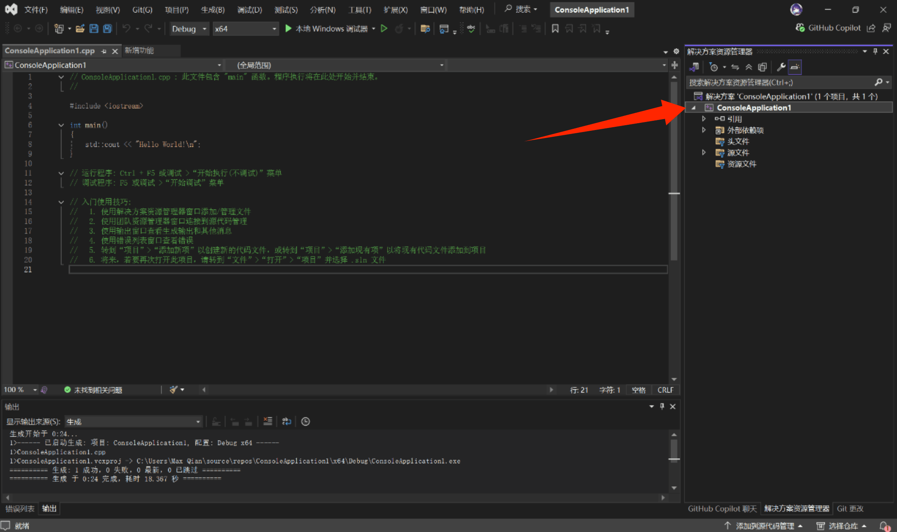

1. 在弹出的“属性页”对话框中，依次展开：

配置属性 → C/C++ → 语言

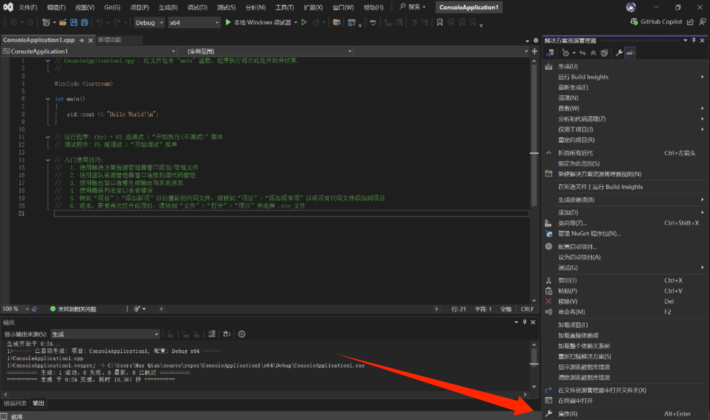

1. 找到 “C++ 语言标准”（C++ Language Standard）选项，点击右侧下拉菜单，选择以下之一：

- ISO C++17 标准 （/std:c++17）：功能稳定，兼容性好，适合需要广泛支持的项目。
- ISO C++20 标准 （/std:c++20）：推荐选项，包含大量实用新特性（如 Concepts、Ranges、三向比较运算符 `<=>` 等），主流编译器已良好支持。
- 预览 - 最新 C++ 工作草案中的功能 （/std:c++latest）：启用 C++23 及未来特性的实验性支持。谨慎使用：该选项可能随编译器更新而变动，不适合生产环境或长期维护项目。

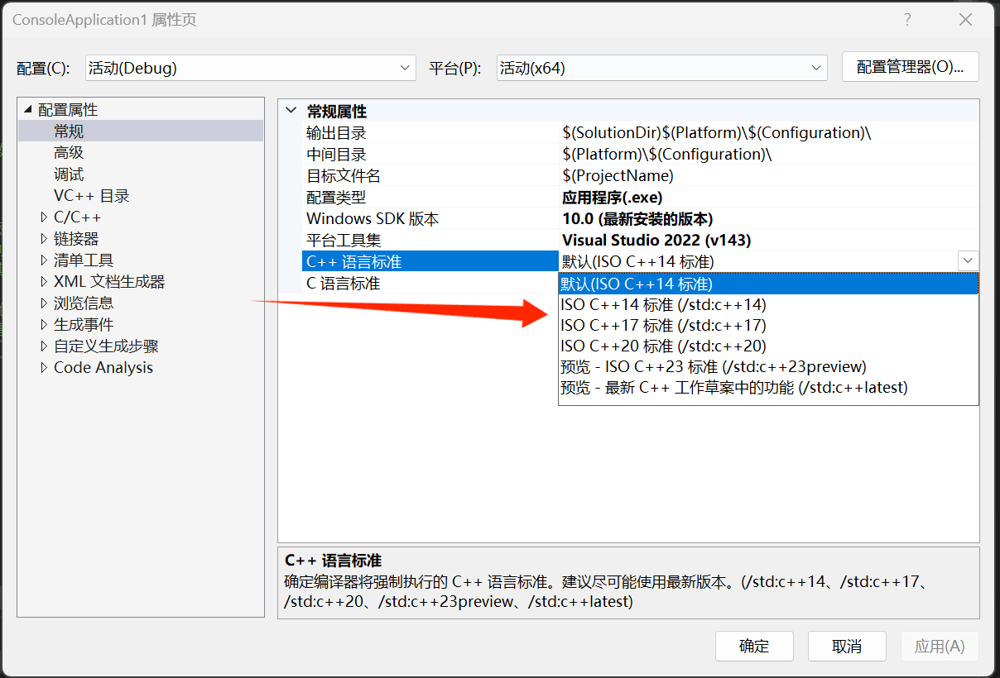

1. 点击 “确定” 或 “应用” 保存设置。

> 重要提示：
> 在属性页顶部的 “配置”（Configuration）下拉框中，请确保选择的是 “所有配置”（All Configurations），这样设置会同时应用于 Debug 和 Release 模式，避免调试时正常、发布时出错的问题。

### 5.2 设置全局默认模板（可选，适用于高级用户）

如果希望今后所有新建的 C++ 项目默认使用 C++20，而无需每次手动配置，可以通过以下两种方式实现：

#### 方式一：导出为项目模板（需要有一个已经设置好的项目）

1. 在 Visual Studio 中，点击顶部菜单：项目（Project）→ 导出模板（Export Template...) .
2. 选择 “项目模板”，点击 下一步。

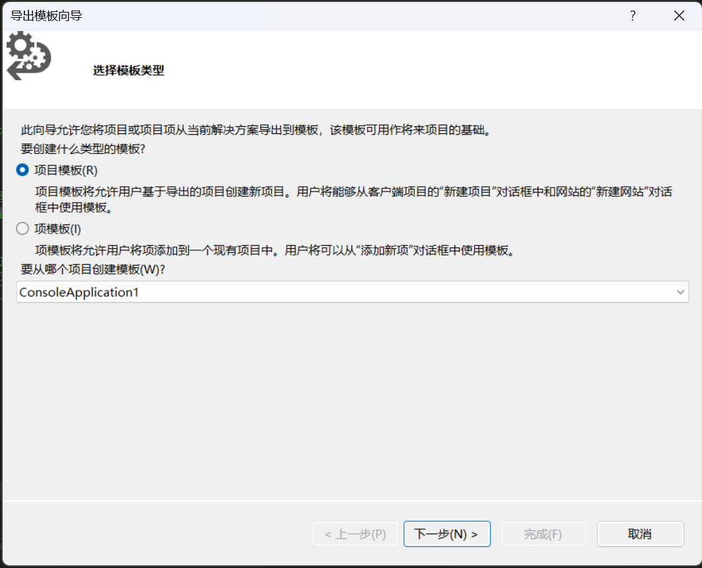

1. 填写模板名称（如 “C++20 Console App”）、描述、图标等信息。

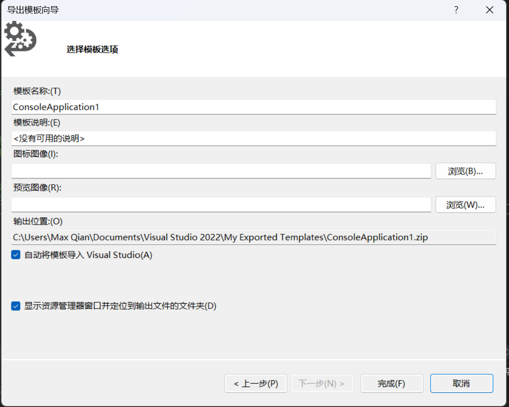

1. 勾选 “自动导入到 Visual Studio”（通常默认勾选）。
2. 点击 完成。

> 完成后，该模板会出现在 “创建新项目” 对话框中，且默认已启用 C++20。

#### 方法二：修改 Visual Studio 项目模板（不推荐新手）

Visual Studio 的项目模板文件通常位于安装目录下，例如：

`D:\Program Files\Microsoft Visual Studio\2022\Community\Common7\IDE\ProjectTemplates\VC\WindowsDesktop\`

您可以找到对应模板（如“空项目”或“控制台应用”）的 `.vstemplate` 文件，用文本编辑器打开进行修改

> 注意事项：
>
> - 修改系统模板会影响所有用户新建的项目；
> - Visual Studio 更新时可能会覆盖这些文件；
> - 操作前请务必备份原始模板。

#### 方式三：使用 CMake 项目（强烈推荐）

对于现代 C++ 开发，CMake 是更优选择。它天然支持跨平台构建，并能通过简单配置指定 C++ 标准。

只需在您的 `CMakeLists.txt` 文件中加入以下内容：

```
cmake_minimum_required(VERSION 3.20)
project(MyProject)

set(CMAKE_CXX_STANDARD 20)
set(CMAKE_CXX_STANDARD_REQUIRED ON)  # 强制要求编译器支持 C++20
set(CMAKE_CXX_EXTENSIONS OFF)        # 禁用编译器扩展，确保标准兼容性

add_executable(MyApp main.cpp)
```

然后在 Visual Studio 中选择 “文件 → 打开 → CMake...”，加载该 `CMakeLists.txt` 文件，IDE 会自动配置为 C++20 模式。

> 优势：
>
> - 配置一次，多平台通用（Windows / Linux / macOS）；
> - 不依赖 Visual Studio 特定设置；
> - 更适合团队协作与开源项目。

---

## 6. 集成 Clang-Format（可选但推荐）

Visual Studio 自带的代码格式化功能（如 Ctrl+K， Ctrl+F）虽然便捷，但其格式规则较为固定，且与主流开源社区（如 LLVM、Google、Chromium 等）的代码风格存在差异。相比之下，Clang-Format 是由 LLVM 项目维护的开源代码格式化工具，具有以下显著优势：

- 高度可配置：通过 `.clang-format` 文件精确控制缩进、对齐、换行、空格等细节；
- 社区标准统一：被 GitHub 上大量 C/C++ 项目采用，确保团队协作时代码风格一致；
- 跨平台 & 跨编辑器兼容：不仅支持 Visual Studio，还可在 VS Code、CLion、Vim、Emacs 等环境中使用；
- 与 Git 预提交钩子（pre-commit hook）集成：可自动在提交前格式化代码，避免风格污染。

因此，即使是初学者，也强烈建议集成 Clang-Format，以养成良好的代码规范习惯。

---

### 6.1 配置步骤详解

#### 步骤 1：安装 ClangFormat 扩展

1. 打开 Visual Studio；
2. 进入顶部菜单：扩展（Extensions）→ 管理扩展（Manage Extensions）；
3. 在左侧选择 “联机”（Online），搜索 “Clang Power Tools” 或 “ClangFormat”；

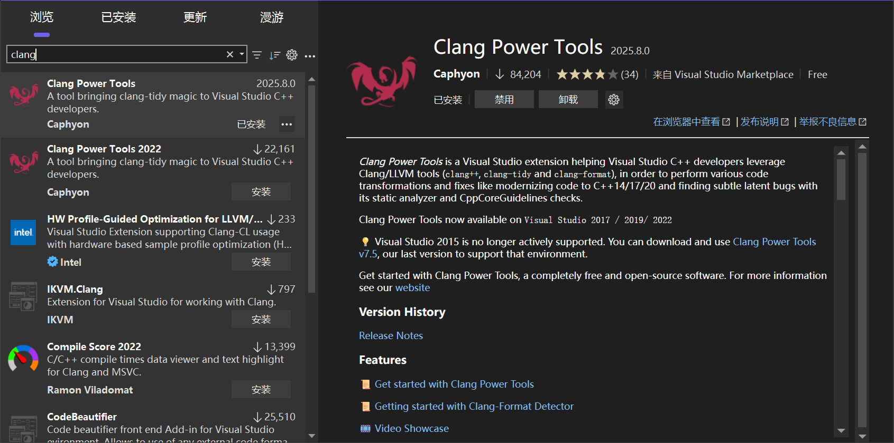

> 1. 推荐安装官方或高评分扩展，例如：
>    - Clang Power Tools（功能全面，支持格式化、静态分析等）
>    - Format with Clang-Format（轻量级，专注格式化）

1. 点击 “下载”，安装完成后重启 Visual Studio。

> 注意：部分 Visual Studio 版本（如 2022 17.5+）已内置 Clang-Format 支持，无需额外安装扩展。您可先尝试步骤 3，若右键菜单已有 “Format Document （ClangFormat）”，则说明已就绪。 或者上面有这一排按钮可用。

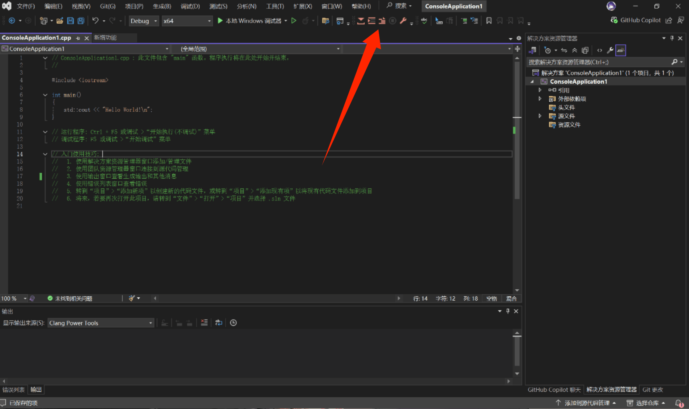

初次使用可能会出现错误，那么就是需要配置预设，参考下面。

---

#### 步骤 2：创建 `.clang-format` 配置文件

`.clang-format` 是 Clang-Format 的核心配置文件，需放置在项目根目录（与 `.sln` 或 `CMakeLists.txt` 同级），这样 VS 才能自动识别并应用规则。

##### 方法一：从官方预设生成（推荐初学者）

访问 Clang 官方在线配置器：
👉 <u>https://zed0.co.uk/clang-format-configurator/</u>
或使用 LLVM 官方文档中的预设样式：

- Google: `BasedOnStyle: Google`
- LLVM: `BasedOnStyle: LLVM`
- Mozilla: `BasedOnStyle: Mozilla`
- Chromium: `BasedOnStyle: Chromium`
- Microsoft: `BasedOnStyle: Microsoft`

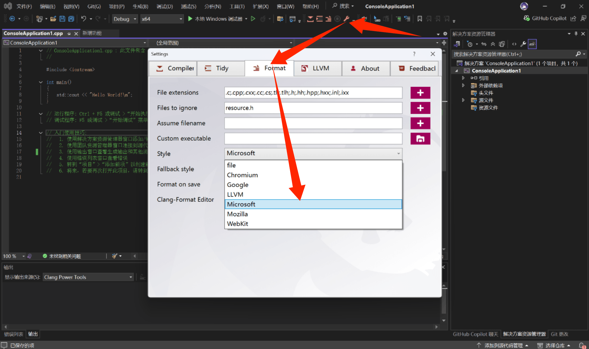

例如，创建一个基于 Google 风格并启用 C++20 支持的配置文件：

```yaml
# .clang-format
BasedOnStyle: Google
IndentWidth: 4
ColumnLimit: 100
Cpp11BracedListStyle: true
AllowShortFunctionsOnASingleLine: Inline
FixNamespaceComments: true
SortIncludes: true
```

##### 方法二：从现有项目复制

许多知名开源项目（如 TensorFlow、OpenCV）都公开了 `.clang-format` 文件，可直接参考或复用。

> 提示：文件名必须为 `.clang-format`（注意开头的点），且为纯文本格式。Windows 资源管理器可能隐藏扩展名，请确保未保存为 `.clang-format.txt`。

---

#### 步骤 3：在 Visual Studio 中使用 Clang-Format

配置完成后，即可在编辑器中格式化代码：

1. 打开任意 C++ 源文件（`.cpp` 或 `.h`）；
2. 右键点击代码编辑区 → 选择 “格式化文档 （ClangFormat）” 或 “Format Document （ClangFormat）”；
3. 代码将立即按照 `.clang-format` 规则重新排版。

#### 自动格式化（可选但推荐）

可以将 Clang-Format 绑定到 保存时自动格式化（需借助扩展如 “Clang Power Tools” 的 “Format on Save” 功能）。

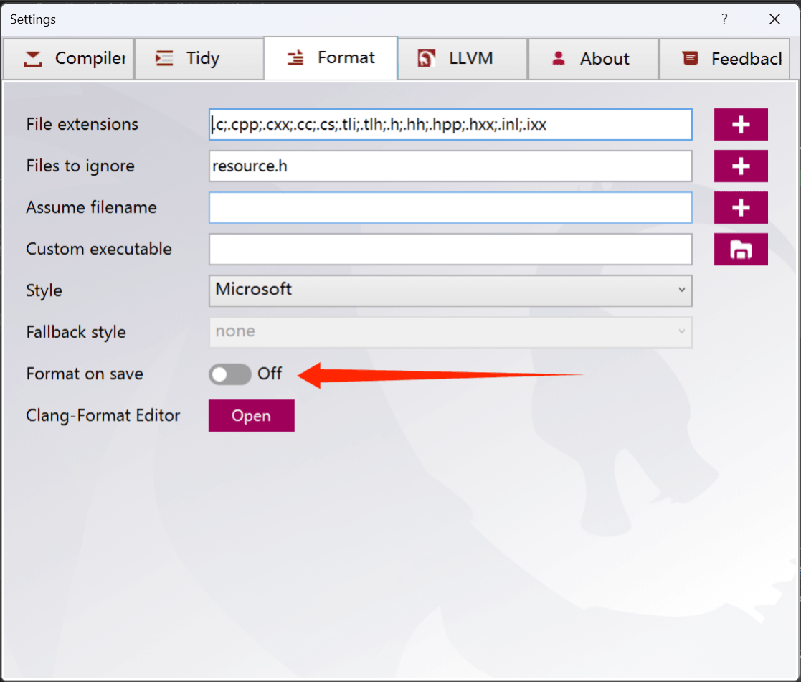

---

## 7. 调试与性能分析

Visual Studio 2022 内置的调试器（Debugger）被广泛认为是业界最强大、最直观的 C++ 调试工具之一。它不仅支持基础的代码执行控制，还集成了高级诊断与性能分析能力，帮助开发者快速定位逻辑错误、内存泄漏、性能瓶颈等问题。作为初学者，掌握这些功能都将极大提升学习效率。

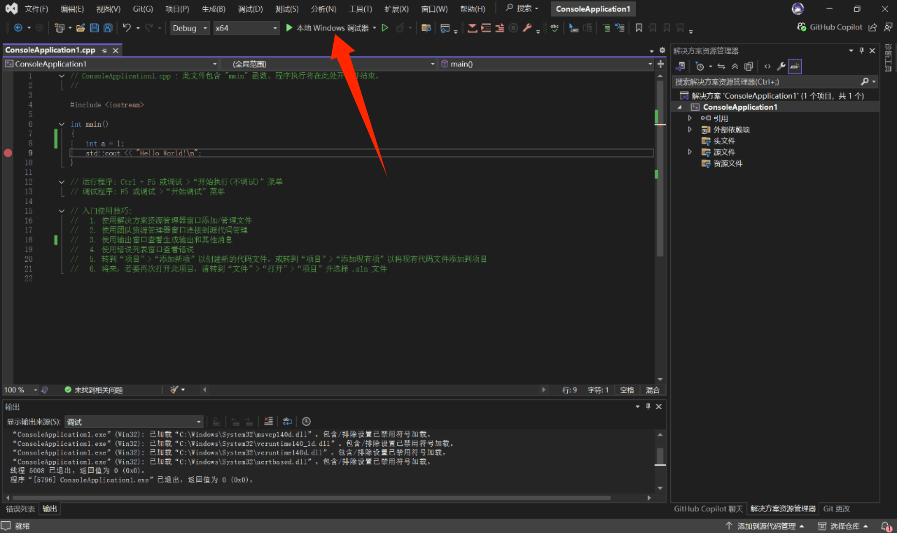

---

### 7.1 核心调试功能详解

#### 1. 断点（Breakpoints）

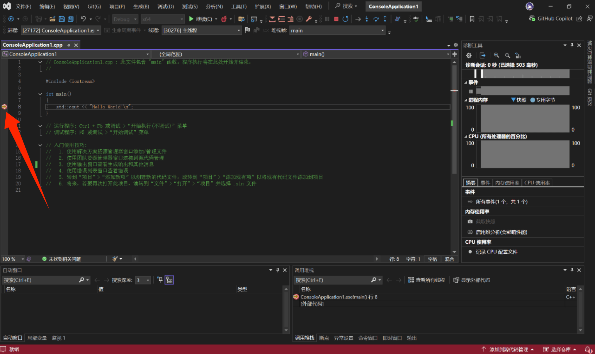

- 普通断点：在代码行左侧灰色区域单击，或按 F9，程序运行到该行时暂停。
- 条件断点：右键断点 → “条件...”，可设置仅当某变量满足特定条件时才中断（例如 `i > 100`）。
- 命中次数断点：设置断点在第 N 次执行时才触发，适用于循环中定位特定迭代。
- 数据断点（仅限本地调试）：当某个内存地址或变量值被修改时自动中断（适用于排查“谁改了我的变量？”) .

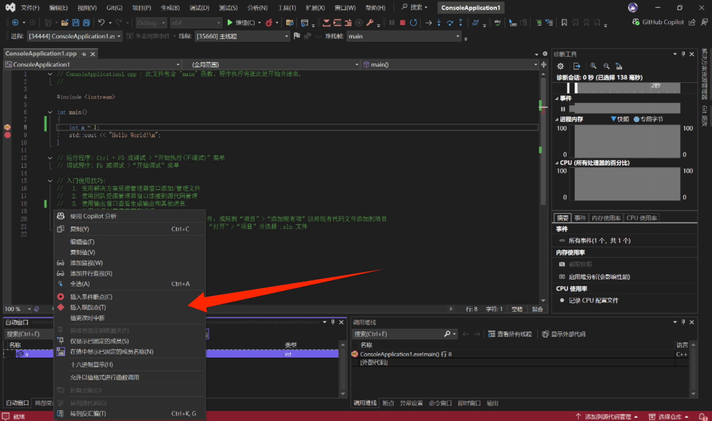

> - 使用方法：在“局部变量”或“监视”窗口中右键变量 → “当值更改时中断”。

#### 2. 内存与调用上下文

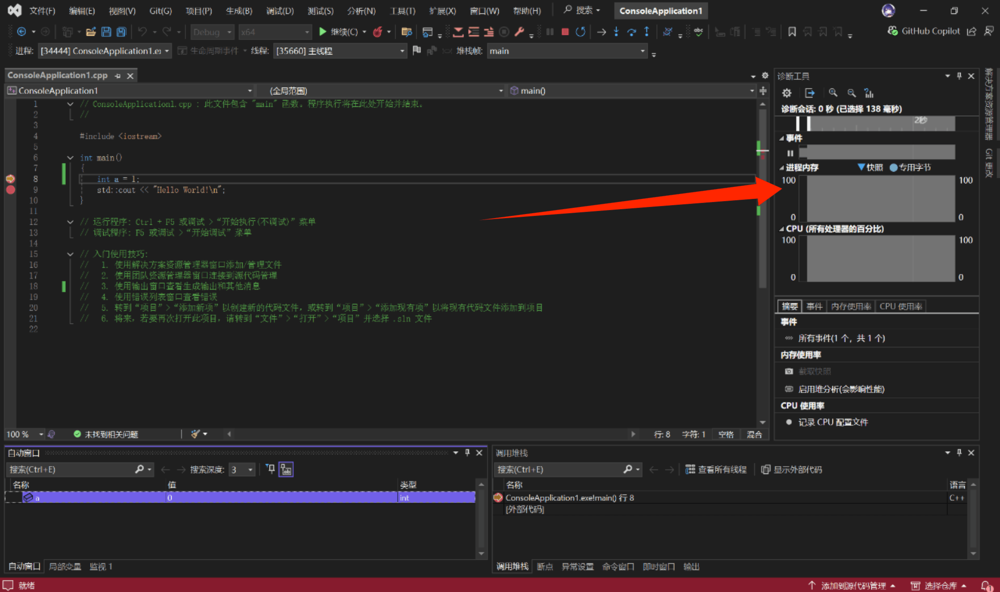

- 内存窗口（Memory Window）：
  通过 调试 → 窗口 → 内存 → 内存 1～4，可直接查看指定地址的原始内存内容（支持十六进制、ASCII、浮点数等格式）。

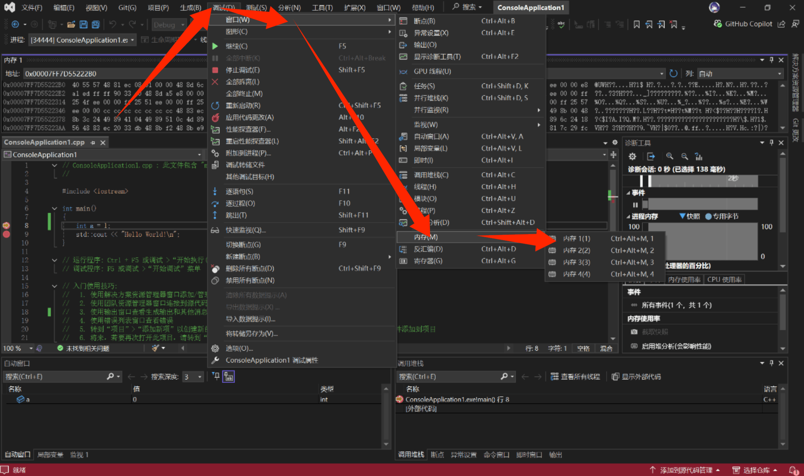

- 调用堆栈（Call Stack）：
  显示当前函数的完整调用链，双击任意帧可跳转到对应代码位置，快速回溯执行路径。

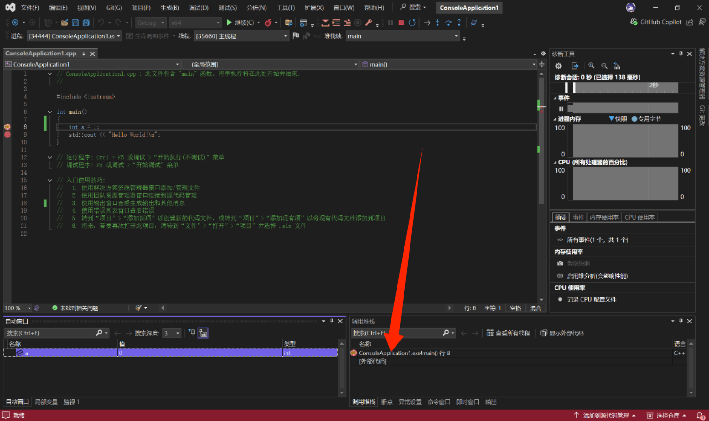

- 并行堆栈（Parallel Stacks）：
  在多线程程序中，调试 → 窗口 → 并行堆栈 以图形化方式展示所有线程的调用关系，轻松识别死锁或竞态条件。

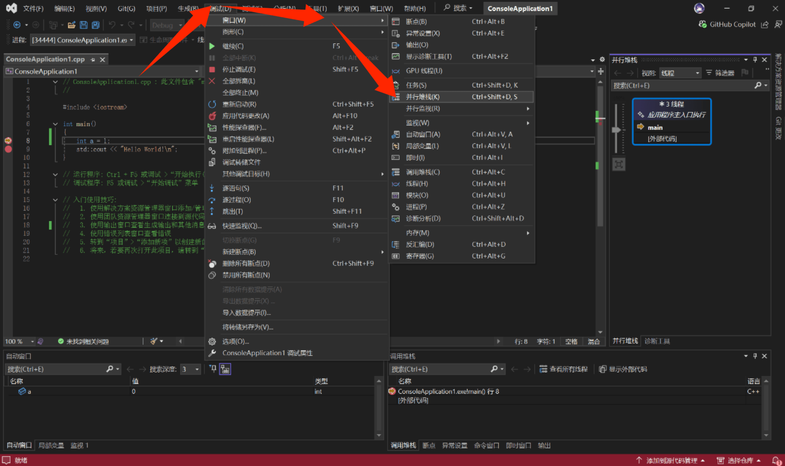

#### 3. 实时变量观察

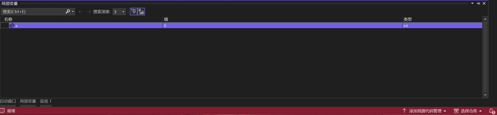

- 悬停查看：调试暂停时，将鼠标悬停在变量上，即可显示其当前值（支持展开结构体/类）。
- 数据提示（DataTips）：悬停时点击小图钉 📌，可将变量“钉”在代码上方，持续跟踪其变化。
- 快速监视（QuickWatch）：选中变量 → 右键 → “快速监视”（或按 Shift+F9），可对表达式求值、修改值或添加到监视窗口。
- 自动/局部/监视窗口：

  - 自动窗口：显示当前行及附近可能相关的变量；
  - 局部窗口：显示当前函数所有局部变量；
  - 监视窗口：手动添加任意表达式（如 `vec.size()`、`p->name`）进行持续监控。

> 技巧：在监视窗口中可调用简单函数（如 `strlen(str)`），但避免调用有副作用的函数。

---

### 7.2 性能分析（Profiling）

除了调试逻辑错误，VS 2022 还提供强大的性能探查器（Performance Profiler），帮助您优化程序速度与资源使用。

#### 启用诊断工具

- 自动启用：启动调试（F5）时，顶部会自动弹出 “诊断工具”（Diagnostic Tools）窗口，实时显示：

  - CPU 使用率
  - 内存分配（。NET 和本机堆）
  - I/O 活动
  - 事件日志（如异常抛出）
- 手动启动：
  无需调试，直接通过 调试 → 性能探查器（Performance Profiler） 启动独立分析会话，适用于 Release 模式性能测试。

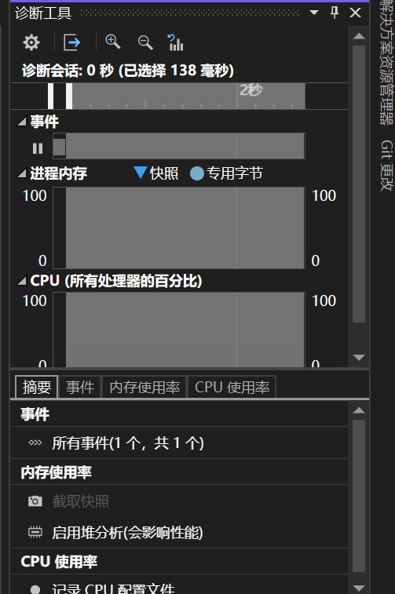
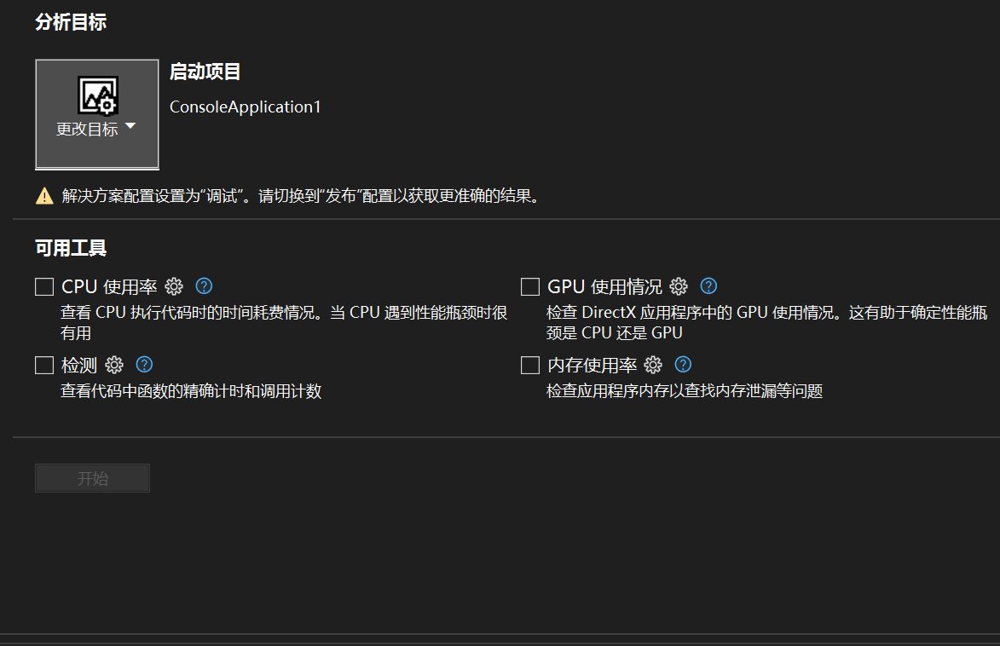

#### 使用示例：分析 CPU 瓶颈

1. 点击 调试 → 性能探查器；
2. 勾选 “CPU 使用率”，点击 “启动”；
3. 程序运行一段时间后，点击 “停止收集”；
4. 查看报告：

   - “热路径”（Hot Path）：显示最耗时的调用链；
   - “函数”（Functions）：按独占时间排序，快速定位性能瓶颈；
   - 支持双击函数跳转到源代码。

> 建议：在 Release 模式 + 启用调试信息（项目属性 → C/C++ → 调试信息格式：程序数据库 （/Zi））下进行性能分析，结果更接近真实运行环境。

---

### 7.3 调试技巧与最佳实践

- 使用“仅我的代码”（Just My Code）：
  默认启用，可跳过系统库和第三方代码，聚焦于自己的逻辑（可在 工具 → 选项 → 调试 → 常规 中配置）。

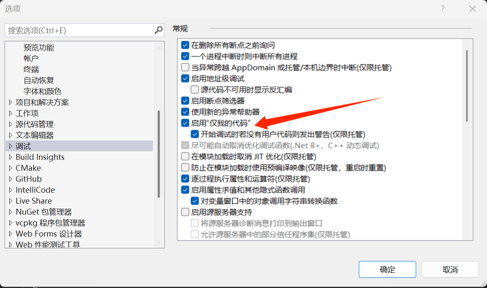

- 调试 Release 版本：
  虽然 Release 有优化，但只要在项目属性中启用调试信息（/Zi）并关闭“全程序优化”（/GL），仍可有效调试。

---

## 8. 界面优化：告别“臃肿感”

Visual Studio 功能强大，但默认界面包含大量工具栏、面板和智能辅助功能，对新手友好，却可能让追求简洁与性能的开发者感到“臃肿”或分心。通过合理配置，您可以将 VS 2022 打造成一个轻量、专注、响应迅速的现代化 IDE。

---

### 8.1 精简用户界面（UI）

#### 1. 隐藏冗余工具栏

默认状态下，VS 顶部可能显示“标准”“调试”“文本编辑器”等多个工具栏，占用宝贵屏幕空间。

操作方法：

- 在顶部工具栏区域 右键单击；
- 在弹出菜单中，取消勾选您不需要的工具栏（如“生成”“诊断”等）；
- 保留常用项（如“标准”），或全部关闭，改用快捷键操作（如 Ctrl+Shift+B 编译、F5 调试）。

> 小技巧：熟练使用快捷键后，可完全隐藏工具栏，最大化代码编辑区域。

#### 2. 启用深色主题（推荐）

深色主题不仅减轻视觉疲劳，还能让代码结构更清晰，是多数开发者的首选。

设置路径：

- 工具（Tools）→ 选项（Options）→ 环境（Environment）→ 常规（General）
- 在 “颜色主题” 下拉菜单中选择：深色（Dark）
- 点击 “确定”，界面立即切换。

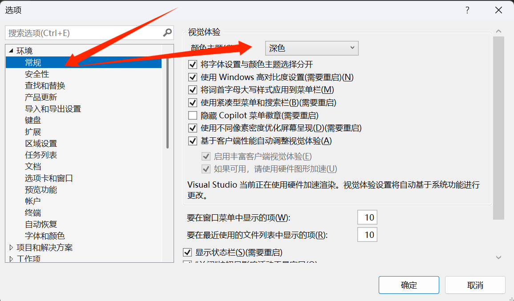

> 进阶：还可以通过扩展（如 “Color Theme Editor”）自定义主题颜色，或使用社区流行的 “One Dark Pro”、“Dracula” 等主题。

#### 3. 禁用起始页，直接进入编码环境

每次启动 VS 都显示起始页（Start Window），对于频繁开发的用户略显冗余。

设置方法：

- 工具 → 选项 → 环境 → 常规
- 将 “在启动时，打开” 改为：打开空环境（Open empty environment）
- 下次启动 VS 时，将直接进入空白 IDE，无任何干扰。

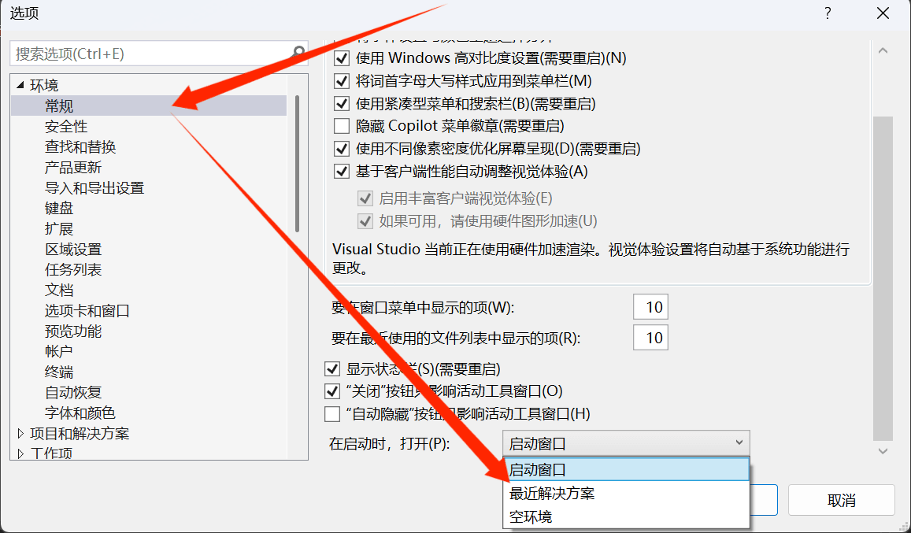

> 补充：仍可通过 文件 → 打开项目/创建项目 快速开始工作。

---

### 8.2 优化字体显示

清晰、舒适的字体是高效编码的基础。VS 2022 默认使用 新宋体（一坨），可根据个人偏好调整。

设置路径：

- 工具 → 选项 → 环境 → 字体和颜色
- 在 “显示以下对象的设置” 中选择：文本编辑器（Text Editor）
- 推荐配置：

  - 字体：`Cascadia Code`（支持连字）、`Consolas`（经典稳定）、`JetBrains Mono`（专为编程设计）
  - 大小：`12`（1080p 屏幕推荐），高分屏可设为 `14`
  - （可选）安装 Fira Code 或 Cascadia Code PL 以启用编程连字（如 `!=` 显示为 ≠）

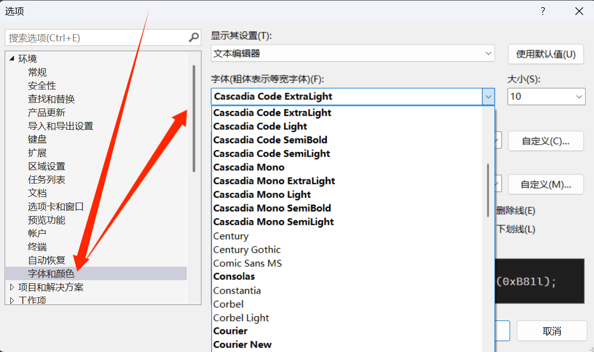

> 提示：连字功能无需额外设置，只要字体支持（如 Cascadia Code），VS 2022 会自动启用。

---

## 在 Visual Studio 中高效使用 Git

Visual Studio 2022 深度集成了 Git 版本控制系统，无需切换到命令行或第三方工具，即可完成仓库初始化、提交、分支管理、合并、推送/拉取、冲突解决等全流程操作。对于 C++ 项目开发者，合理使用 Git 不仅能保障代码安全，还能极大提升团队协作效率。

---

### 9.1 初始化或关联 Git 仓库

#### 情况一：全新项目，创建本地 Git 仓库

1. 创建或打开一个项目后，点击顶部菜单：文件 → 添加到源代码管理（Add to Source Control）；

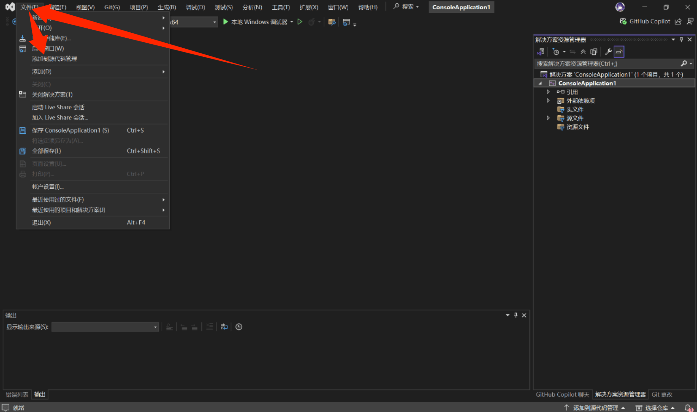

1. 然后会出现下面的弹窗，需要对仓库进行设置，这里我们选择仅限本地

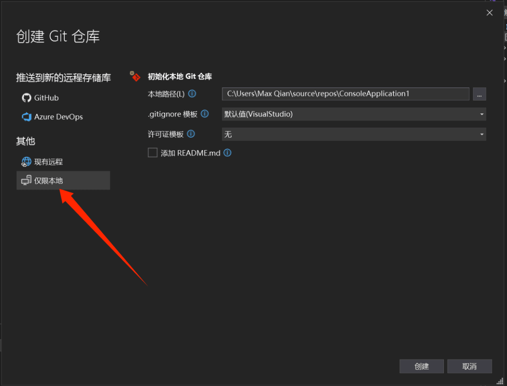

1. 初始化本地 Git 仓库（右侧上半部分）

这是核心配置区，决定本地仓库的基础结构：

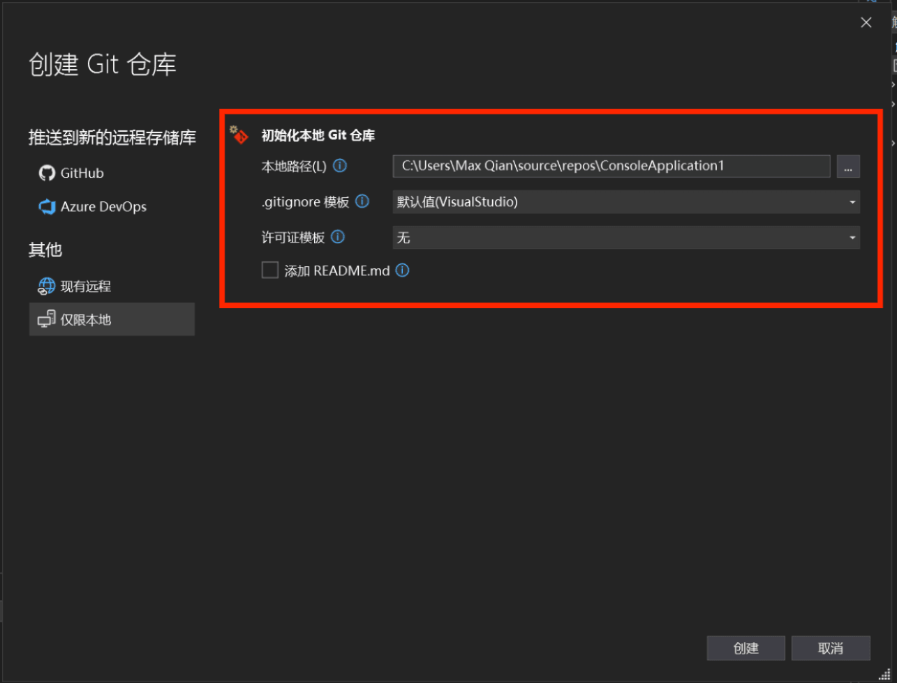

> `.gitignore` 和 `README.md` 是标准 Git 项目必备文件，VS 会自动生成内容，无需手动编写。

1. 点击 **创建** 就初始化好了

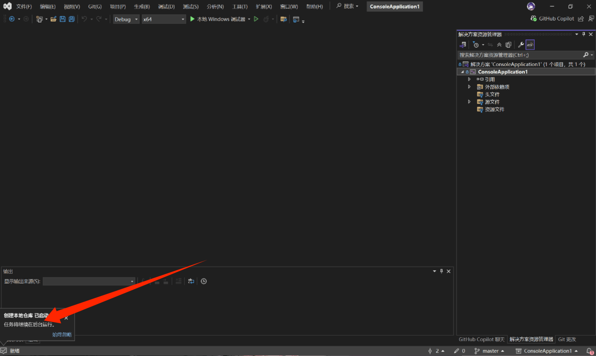

#### 情况二：创建本地项目，并且推送到 Github

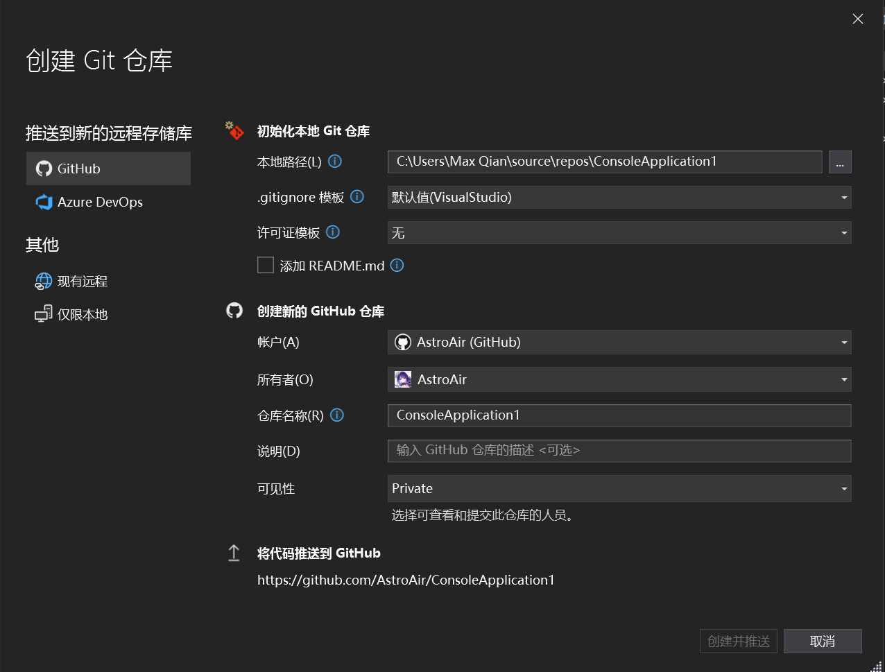

1. 配置本地仓库设置（左侧区域）推送到新的远程存储库

- 默认选中的是 GitHub（您也可以选择 Azure DevOps）。
- 如果您想仅本地使用 Git，可点击下方 “仅限本地”（推荐初学者先熟悉本地操作再推送到远程）。

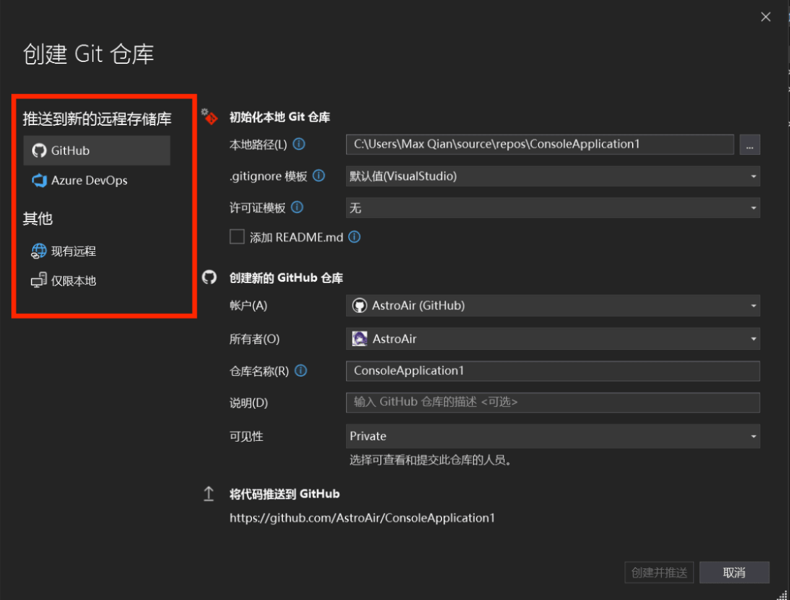

> 建议：首次使用时，建议选择 “仅限本地” 先练习提交、分支、回退等操作；熟练后再连接 GitHub。

1. 创建新的 GitHub 仓库（右侧下半部分）

如果您希望直接将代码推送到 GitHub，请在此处配置远程仓库信息：

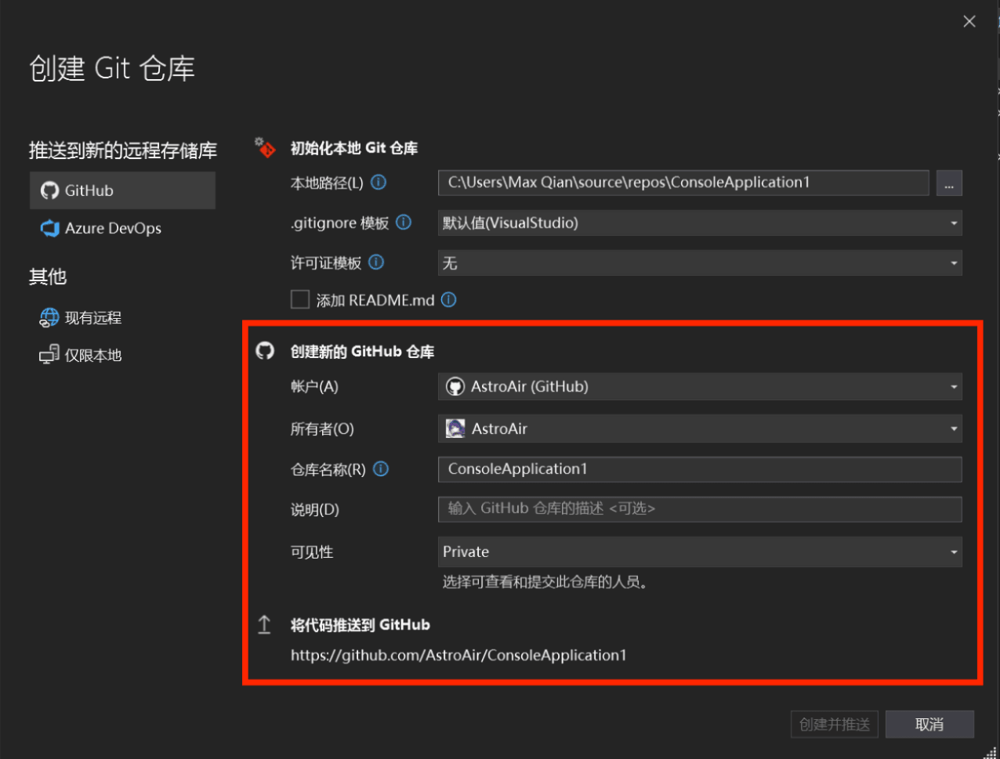

帐户 （A）

- 下拉菜单显示您已登录的 GitHub 账号（如图中的 `AstroAir (GitHub)`）
- 若未登录，请点击“登录”按钮，用浏览器授权 VS 访问您的 GitHub 账户。

所有者 （O）

- 通常默认为您自己的用户名（如 `AstroAir`）
- 如果您属于某个组织（Organization），也可选择组织名作为仓库所有者。

仓库名称 （R）

- 默认与项目名一致（如 `ConsoleApplication1`）
- 可修改为更具描述性的名称，如 `MyFirstCppProject`

说明 （D）

- 输入仓库简短描述（可选），例如：

```
A simple C++ console application for learning.
```

可见性

- Private（私有）：仅您和被邀请的人可见（适合个人项目或商业代码）
- Public（公开）：所有人都可查看（适合开源项目、作品集展示）

> 建议：学习阶段可设为 Private，避免暴露代码；完成后可改为 Public 展示成果。

1. 推送代码到 GitHub

在配置完成后，底部会显示预览链接：

[https://github.com/AstroAir/ConsoleApplication1](https://github.com/AstroAir/ConsoleApplication1)

点击右下角的 “创建并推送”（Create and Push）按钮：

VS 将执行以下操作：

- 在本地初始化 `.git` 目录；
- 生成 `.gitignore` 和 `README.md`（如勾选）；
- 创建第一个提交（commit）；
- 在 GitHub 上创建同名远程仓库；
- 将本地代码推送到远程仓库（`origin/main`）。

1. 成功后，状态栏将显示：

> “已成功推送到 <u>[https://github.com/AstroAir/ConsoleApplication1](https://github.com/AstroAir/ConsoleApplication1)” </u>

1. 右下角状态栏将显示当前分支（如 `main`）和未提交更改数量。

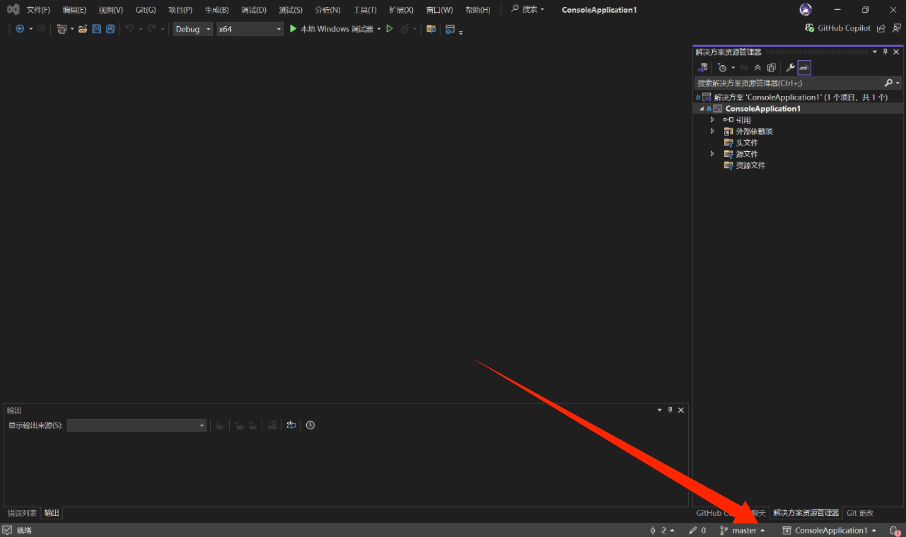

#### 情况三：已有远程仓库（如 GitHub），克隆到本地

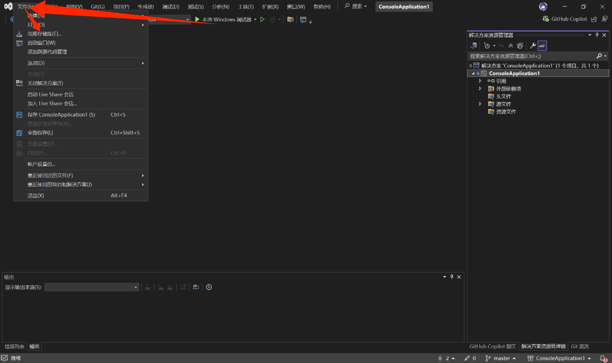

1. 启动 VS，点击起始页的 “克隆存储库”；
2. 输入远程仓库 URL（如 `https://github.com/yourname/MyCppProject.git`），或者是打开 Github 仓库，都可以；

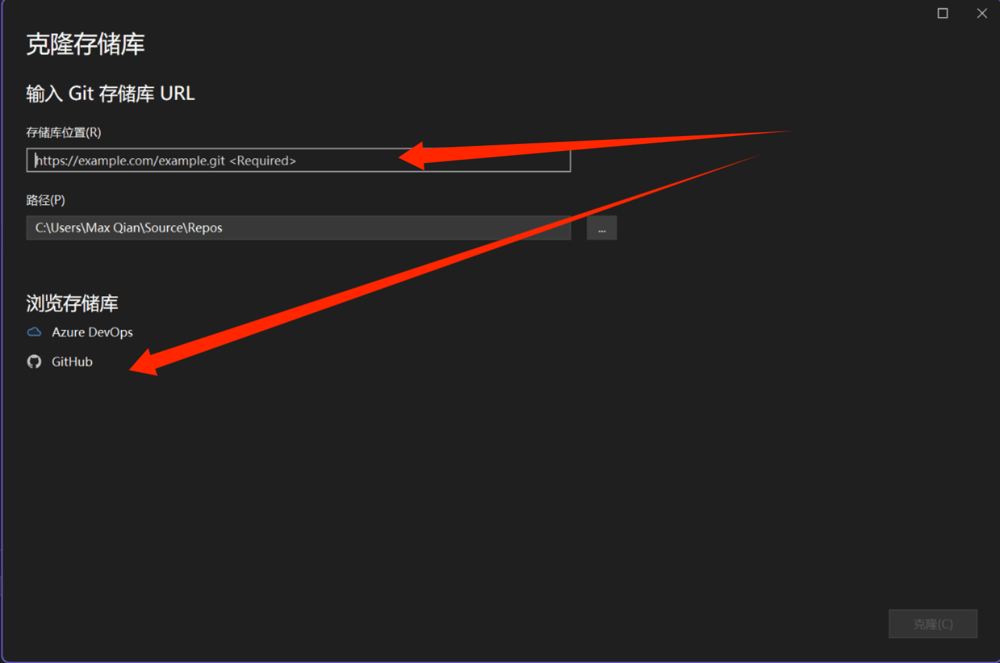

1. 选择本地保存路径，点击 “克隆”；
2. VS 自动拉取代码并打开解决方案（如有 `.sln` 文件）。

---

### 9.2 日常 Git 操作（通过“Git 更改”窗口）

VS 2022 提供了直观的 “Git 更改”（Git Changes）面板，日常提交代码的核心入口。

- 顶部菜单：视图 → Git → Git 更改
- 或直接点击右下角状态栏的分支名称（如 `main`）

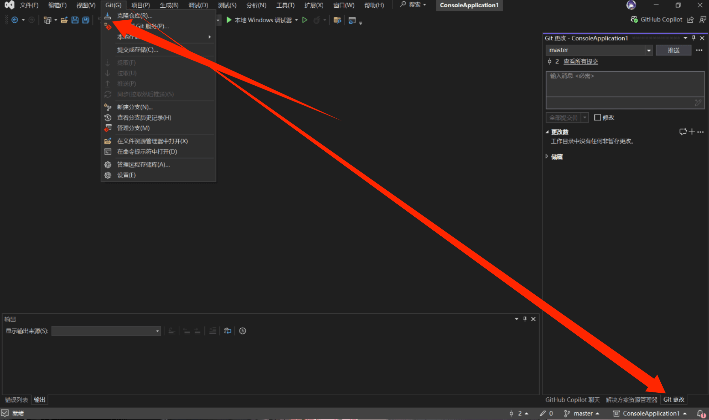

> 最佳实践：
>
> - 每次提交应聚焦单一功能或修复；
> - 提交信息以动词开头，如 `feat: add matrix multiplication`、`fix: resolve null pointer in parser`。

### 9.3 分支管理与协作

#### 创建与切换分支

- 在 “Git 存储库”（Git Repository）窗口（视图 → Git → Git 存储库）中：
  - 点击当前分支名 → “新建分支”；
  - 输入分支名（如 `feature/login`），选择基于哪个分支创建；
  - 创建后自动切换到新分支。

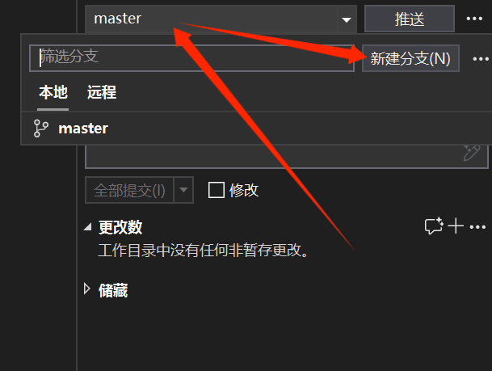
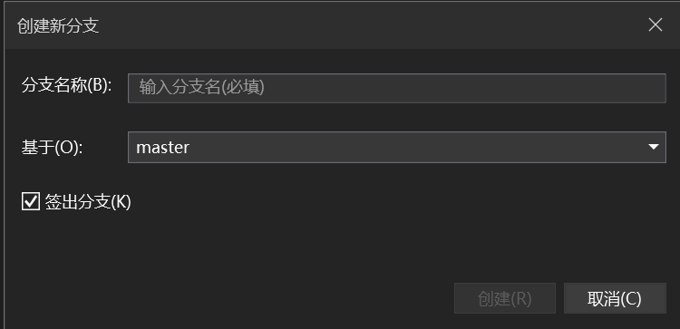

#### 推送（Push）与拉取（Pull）

- 首次推送本地分支到远程：
  提交后，点击 “推送” 按钮，VS 会提示将本地分支推送到远程（如 `origin/feature/login`）。
- 同步远程更新：
  点击右下角状态栏的 “同步”（Sync）按钮，或使用：

  - “拉取”（Pull）：获取远程最新提交并合并到当前分支；
  - “获取”（Fetch）：仅下载远程变更，不自动合并（适合查看他人代码）。

> 注意：“同步” = 拉取 + 推送，适用于已建立追踪关系的分支。

---

### 9.4 解决合并冲突

当多人修改同一文件时，Git 可能无法自动合并，此时需手动解决冲突。

#### VS 中的冲突解决流程：

1. 执行 拉取（Pull） 或 合并（Merge） 后，若出现冲突，VS 会弹出 “合并编辑器”；
2. 在 “Git 更改” 窗口中，冲突文件会标记为 “冲突”；
3. 双击该文件，进入三窗格合并视图：

   - 左侧：当前分支（Your Changes）
   - 右侧：传入更改（Their Changes）
   - 中间：合并结果（Result）
4. 逐段选择保留哪一侧内容，或手动编辑中间区域；
5. 解决完毕后，点击 “接受合并”，文件状态变为“已暂存”；
6. 提交合并结果。

> 提示：复杂冲突建议配合 “比较文件”（Compare Files）功能，或临时使用命令行 `git mergetool`。

---

## 附 1：智能编码助手：GitHub Copilot

GitHub Copilot 是由 GitHub 与 OpenAI 联合开发的 AI 编程助手，能够根据您编写的代码上下文，实时生成函数、注释、测试用例甚至完整算法。在 Visual Studio 2022 中，Copilot 以扩展形式深度集成，显著提升 C++ 开发效率，尤其适合：

- 快速生成样板代码（如类构造函数、getter/setter）
- 编写复杂算法（排序、树遍历、文件读写等）
- 为遗留代码添加注释或单元测试
- 学习新 API 的使用方式（如 Windows API、STL 容器）

> 注意：Copilot 是辅助工具，生成的代码需人工审核，不可盲目信任。

---

### 10.1 启用 GitHub Copilot

#### 步骤 1：VS2022 已经自带 Copilot

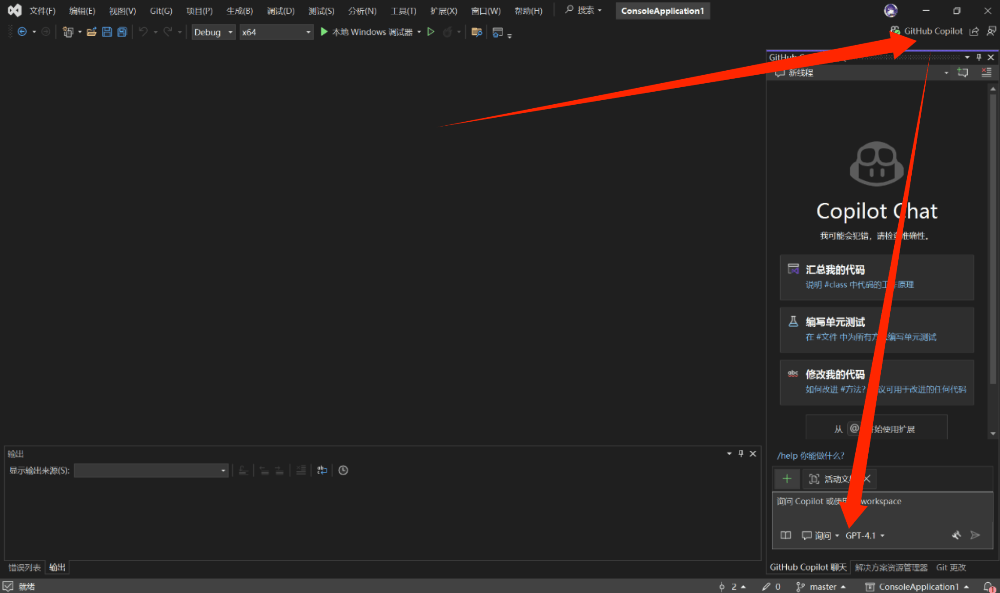

#### 步骤 2：登录 GitHub 账户

1. 安装完成后，VS 会自动弹出登录窗口；
2. 使用 GitHub 账号 登录（需已订阅 Copilot 服务）；

   - 免费试用：学生（你邮是可以的）或热门开源项目维护者可申请免费使用；
   - 付费订阅：个人版约 $10/月（支持信用卡或 GitHub 账单）；
3. 登录成功后，状态栏右下角将显示 “Copilot: 已启用”。

---

### 10.2 常用快捷键与操作

> 提示：若未看到灰色建议，请检查 工具 → 选项 → GitHub → Copilot → 启用下一个编辑建议 是否勾选。
> 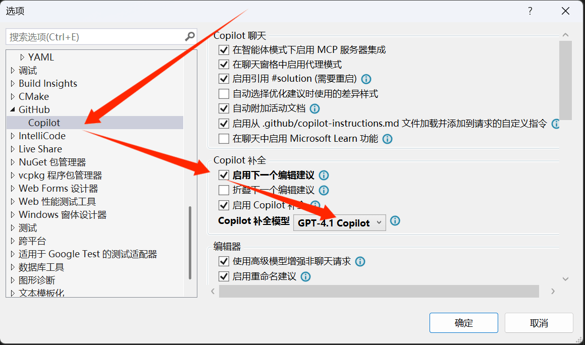

---

### 10.3 配置与隐私设置

#### 调整 Copilot 行为

- 工具 → 选项 → GitHub → Copilot
  - 启用/禁用内联建议
  - 设置建议延迟时间（避免频繁打断）
  - 选择语言偏好（影响注释语言）

#### 隐私与安全

- 访问 <u>GitHub Copilot 设置页面 </u>可：
  - 关闭代码片段用于模型训练；
  - 查看 Copilot 使用日志；
  - 管理订阅状态。

> 重要提醒：
>
> - 不要在 Copilot 中输入敏感信息（如密码、密钥、内部 API）；
> - 始终审查生成代码，尤其涉及内存管理、指针操作、多线程等 C++ 高危区域。

---

## 总结

通过**精准安装 + 合理配置** ，Visual Studio 2022 完全可以成为一个：

- **功能完整** ：编译、调试、测试、性能分析一体化
- **开箱即用** ：无需额外配置工具链
- **高效稳定** ：尤其适合 Windows 原生开发与大型项目

> 适用场景对比：
>
> - **VSCode + MSYS2**：轻量、跨平台、高度定制，适合中小型项目或偏好终端流开发者
> - **VS2022**：重型 IDE、深度调试、企业级项目、Windows API / DirectX / COM 开发首选

两者并非对立，而是互补。根据项目需求与个人习惯选择即可。作为初学者，选择哪个都是可以的！

**现在，启动 VS2022，创建你的第一个 C++ 控制台应用，开始高效开发吧！**
