Visual Studio 2022 虽然功能强大，但其体积庞大、启动缓慢，且默认界面风格较为厚重。相比之下，Visual Studio Code（VSCode） + MSYS2 的组合提供了一个轻量、灵活、高度可定制的开发环境，尤其适合 C/C++、Rust、Python 等语言的本地开发。

# 安装 VSCode

VSCode 是一个免费、开源、跨平台的代码编辑器，内置对 Git、调试、终端等的强大支持，并可通过丰富的扩展生态增强功能。

1. 打开 VSCode 官网 。

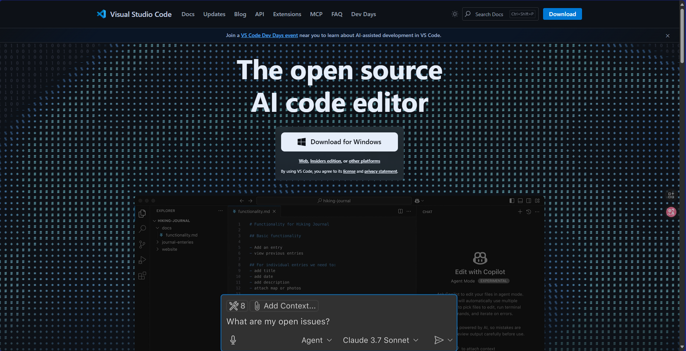

1. 点击 “Download for Windows” 按钮，下载适用于 Windows 的安装程序（通常为 .exe 文件）。

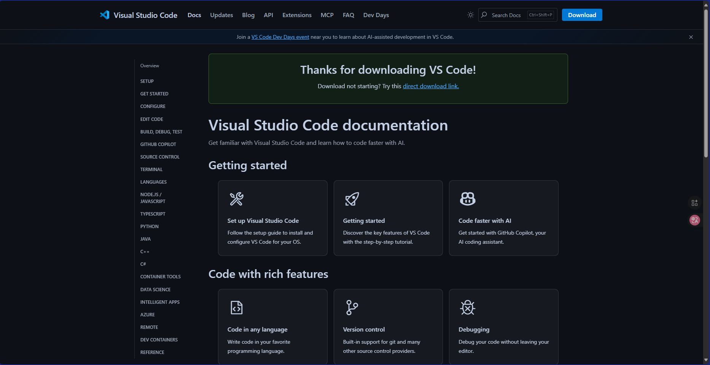

1. 运行安装程序，一路 next 点到底（可以更换安装目录，根据自己的需求决定），建议勾选以下选项以获得最佳体验：

- Add to PATH（允许从命令行启动 code）
- Register as editor for supported file types
- Add “Open with Code” to Windows Explorer context menus

1. 安装完成打开 VSCode 运行一下，确保安装正常
2. AI 时代，还有各种 VSCode 变体，他们有各自的 AI 功能，但是核心是不变，都支持下面的教程


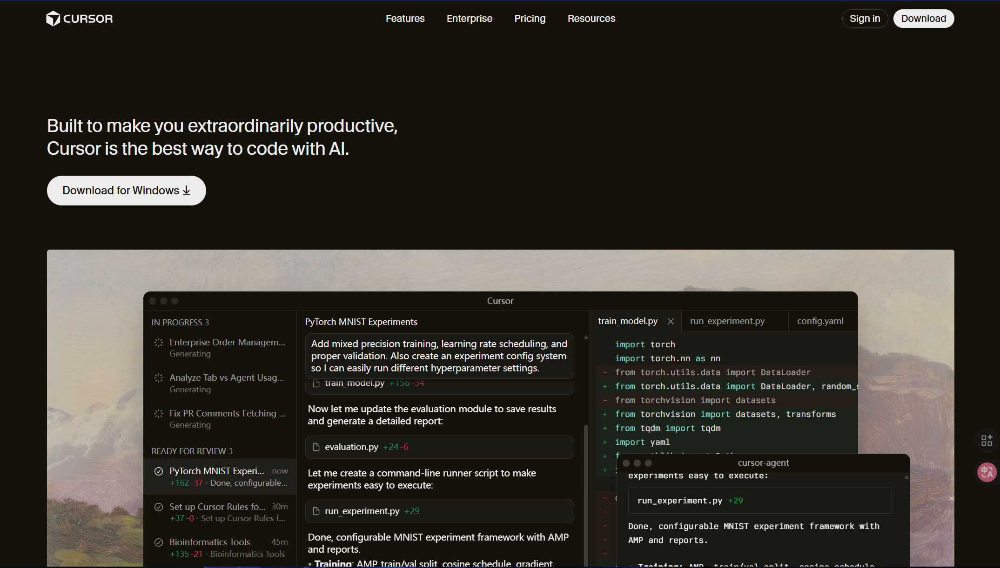


# 安装 MSYS2

MSYS2（Minimal SYStem 2）是一个基于 Cygwin 和 MinGW-w64 的 Windows 开发平台，提供类 Unix 的 shell 环境（如 Bash）、包管理器（Pacman）以及大量预编译的开发工具（如 GCC、CMake、Make、GDB 等）。

## 安装本体

1. 进入官网，到安装章节，点击适合自己电脑架构的安装包。通常情况下都是 x86_64 的那个。

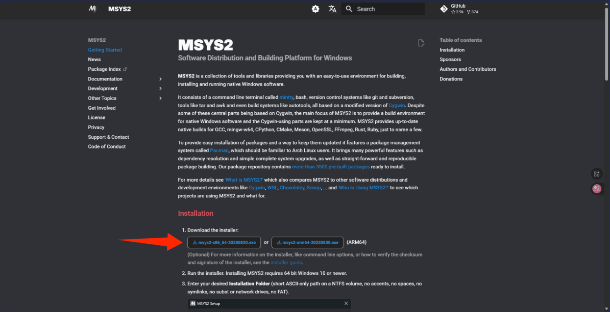

如果安装速度过慢，可以去清华源镜像站下载，一般选择最下面最新的 exe 安装包即可，

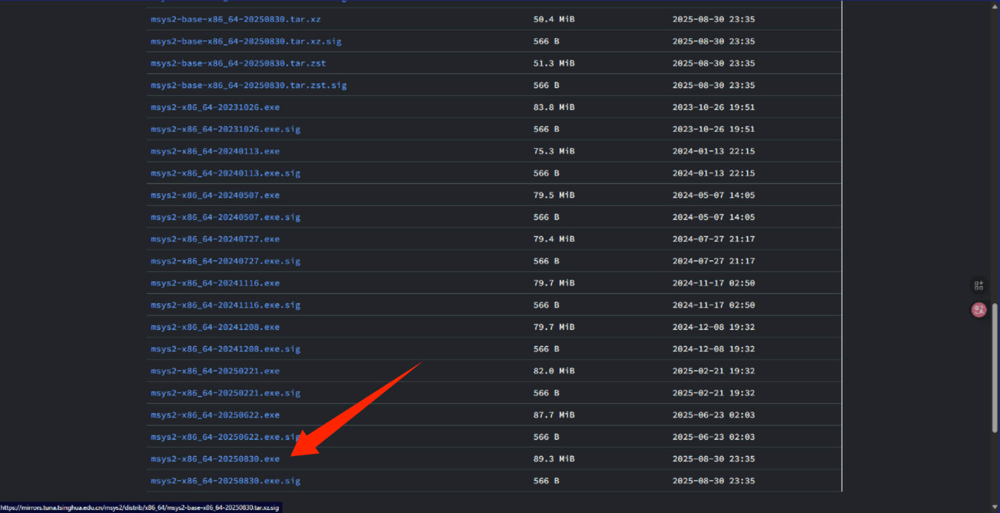

1. 运行安装程序，注意以下几点：

- 系统要求：64 位 Windows 10 或更新版本。
- 安装路径：必须选择 短路径、仅含 ASCII 字符、无空格、无中文、无符号链接、非网络盘或 FAT 分区。

✅ 推荐路径：`C:\msys64` 或者 `D:\msys64`

❌ 避免路径：`C:\Program Files\MSYS2` 或 `D:\开发工具\msys2`

1. 安装完成后，勾选 “Run MSYS2 now” 并点击 Finish，将自动打开一个默认的 UCRT64 终端窗口。

## 安装具体环境

MSYS2 提供多种编译环境，主要区别在于运行时库和目标 ABI：

<table>
<tr>
<td>环境<br/></td><td>运行时<br/></td><td>特点<br/></td></tr>
<tr>
<td>ucrt64<br/></td><td>UCRT（Windows 10+）<br/></td><td>官方推荐，现代标准<br/></td></tr>
<tr>
<td>mingw64<br/></td><td>MSVCRT（传统）<br/></td><td>兼容性好，社区广泛使用<br/></td></tr>
<tr>
<td>clang64<br/></td><td>LLVM/Clang 编译器<br/></td><td>适合 Clang 用户<br/></td></tr>
</table>

虽然 MSYS2 官方目前推荐 `ucrt64`，但 `mingw64` 仍是许多项目和教程的默认选择，尤其在需要与旧版 Windows 兼容或使用某些第三方库时。

1. 启动 MinGW64 终端

- 进入 MSYS2 安装目录（如 `C:\msys64`）。
- 双击运行 `mingw64.exe`（图标通常为蓝色），这将打开一个专用于 `mingw64` 环境的终端。

> - `msys2.exe`：用于构建 MSYS2 自身工具（不生成原生 Windows 程序）
> - `mingw64.exe` / `ucrt64.exe`：用于编译原生 Windows 应用

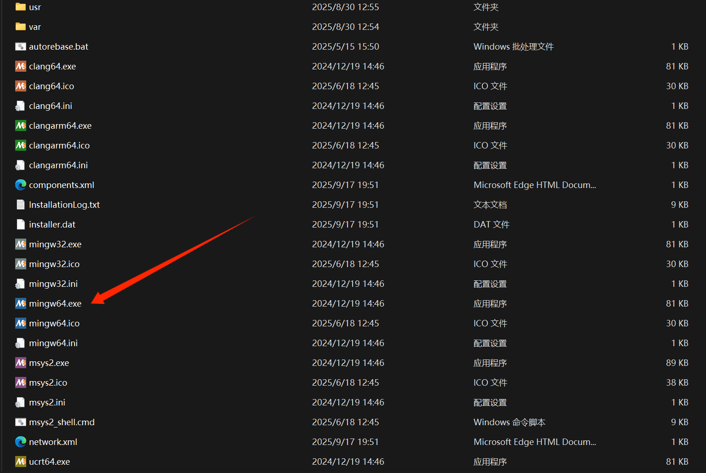

1. 初始化与更新系统（重要！）

由于众所周知的问题，在 MSYS2 的官方源在国内的访问速度比较慢，这个时候我们需要请出我们的镜像源，通过下面的命令一件替换

```shell
sed -i "s#https\?://mirror.msys2.org/#https://mirrors.tuna.tsinghua.edu.cn/msys2/#g" /etc/pacman.d/mirrorlist*
```

在 `mingw64` 终端中依次执行以下命令，确保系统和包数据库为最新：

```shell
pacman -Syu
```

> ⚠️ 如果提示“关闭终端并重新打开”，请照做，然后再次运行 `pacman -Syu` 直到无更新为止。

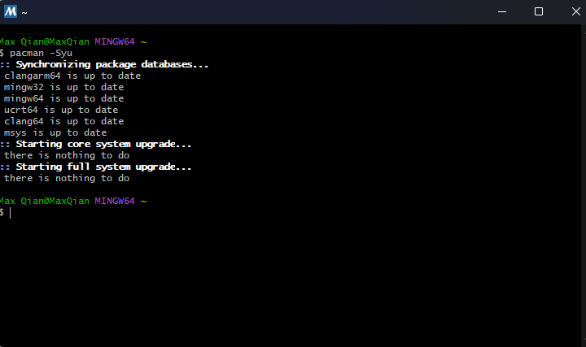

1. 安装 MinGW-w64 GCC 工具链

```shell
pacman -S mingw-w64-x86_64-toolchain
```

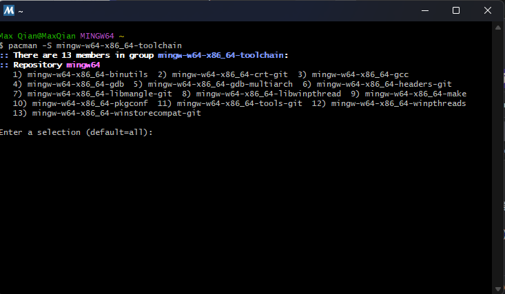

默认安装的 GCC，你也可以选择 Clang，在常规开发体验上并没有很大的区别

1. 验证安装。安装完成后，执行：

```shell
gcc --version
```

5. 在 Windows 终端中配置 MSYS2 环境的支持，可以获取超绝无敌好看的终端

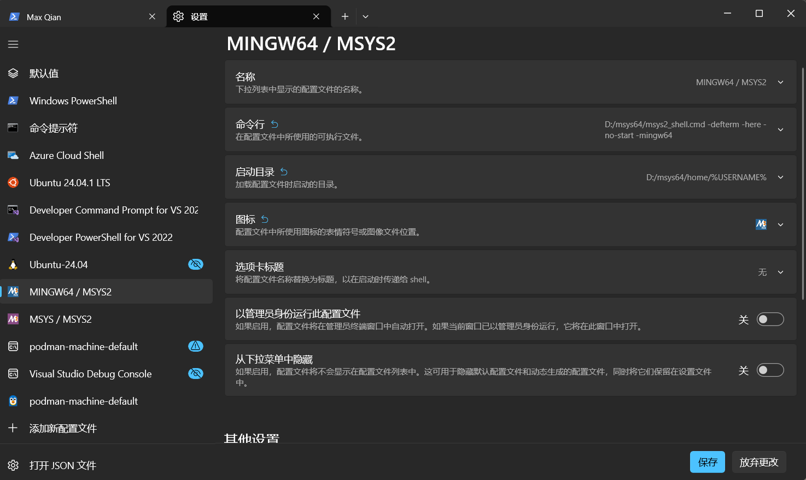

下面是几个关键点：

- 命令行 `D:/msys64/msys2_shell.cmd -defterm -here -no-start -mingw64`（替换实际目录和架构）
- 启动目录 `D:/msys64/home/%USERNAME%`
- 图标 `D:/msys64/mingw64.ico`

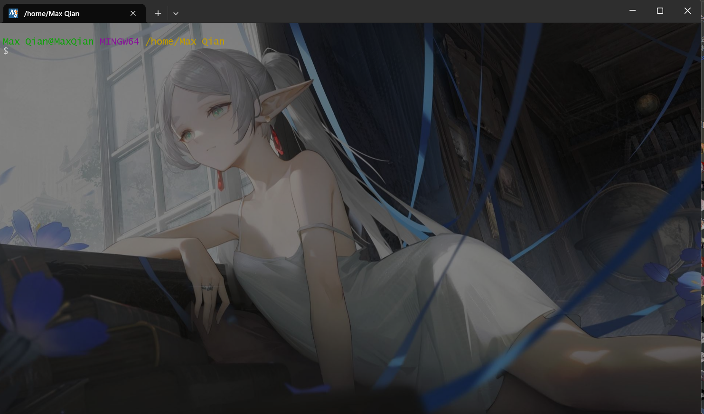

## 安装构建工具：CMake（推荐）或 XMake（可选）

在现代 C/C++ 开发中，CMake 已成为事实上的标准构建系统。尽管其语法存在一定争议（如命令式风格、作用域规则复杂等），但其跨平台能力、社区生态和 IDE 集成支持极为成熟，是绝大多数开源项目和工业级项目的首选。

### 通过 MSYS2 安装 CMake（推荐方式）

为确保工具链一致性（避免混用不同运行时库导致链接错误），建议直接使用 MSYS2 的 `mingw64` 仓库安装 CMake：

```shell
pacman -S mingw-w64-x86_64-cmake
```

### 从官网手动安装（备选）

如需使用最新版或特定版本，也可从 <u>CMake 官网 </u>下载 Windows 安装包（推荐 `.msi` 格式）。
但请注意：官方 Windows 版 CMake 默认使用 MSVC 工具链，若与 MSYS2 的 GCC 混用，可能引发路径、运行时或链接问题。建议仅在明确需要时使用。

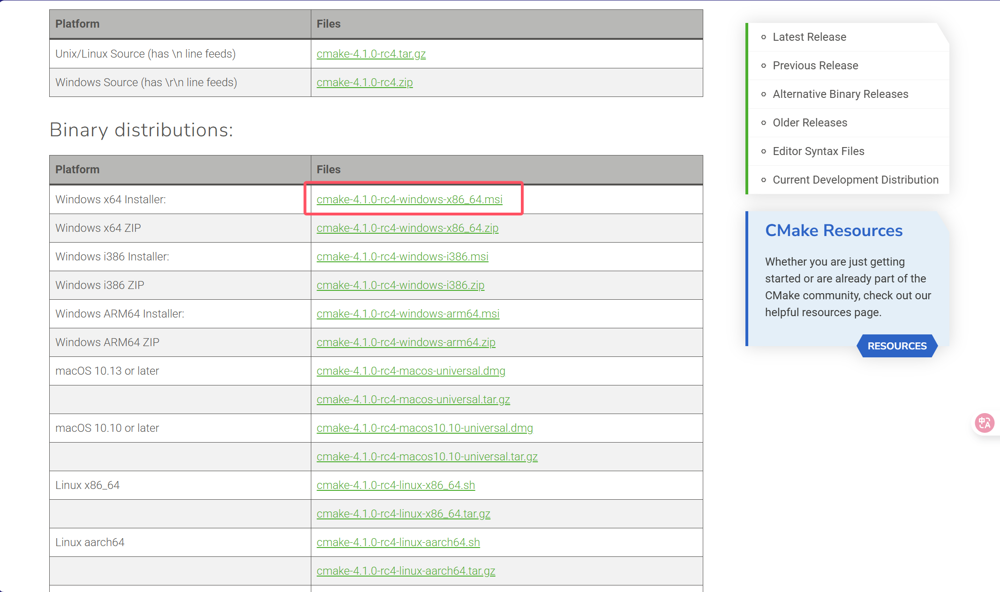

### 国产替代方案：XMake（进阶可选）

XMake 是一个现代化、轻量级的国产构建工具，采用 Lua 脚本语法，配置简洁，支持增量编译、远程编译、包管理等高级特性，在部分场景下体验优于 CMake。

安装方式（通过 MSYS2）：

```shell
pacman -S mingw-w64-x86_64-xmake
```

或访问官网了解更多信息：<u>[https://xmake.io/](https://xmake.io/)</u>

> 💡 建议：初学者优先掌握 CMake；熟悉构建系统后，可尝试 XMake 探索更高效的开发流程。

## 安装代码提示工具

现代 C++ 开发离不开智能代码补全、跳转、重构等功能。语言服务器（Language Server, LS） 是实现这些功能的核心。

### 安装 Clangd（当前最佳选择）

Clangd 基于 LLVM/Clang，提供精准的语义分析、快速索引和丰富的代码操作（如重命名、查找引用、自动修复等），被广泛认为是目前 C++ 最优秀的开源语言服务器。

在 `mingw64` 终端中安装：

```shell
pacman -S mingw-w64-x86_64-clang-tools-extra
```

该包包含 `clangd`、`clang-format`、`clang-tidy` 等实用工具。

### 关注国产新秀：Clice（实验阶段）

Clice 是一个由中国开发者发起的新型 C/C++ 语言服务器项目，目标是解决 Clangd 在 C++20 模块、模板推导、性能等方面的不足。

当前仍处于早期开发阶段，暂不建议用于生产环境，但欢迎关注其进展或参与贡献。

## （可选）将工具链添加到系统 PATH

为方便在任意终端（如 Windows Terminal、PowerShell、CMD）中直接调用 `gcc`、`cmake`、`clangd` 等命令，可将 MSYS2 的 `mingw64/bin` 目录加入系统环境变量。

### 操作步骤：

1. 打开 控制面板 > 系统和安全 > 系统 > 高级系统设置

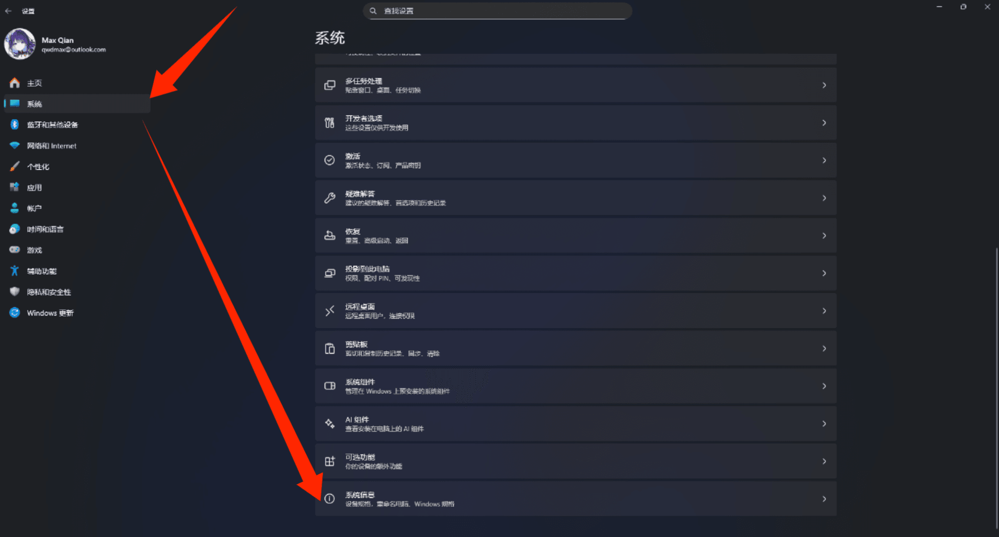
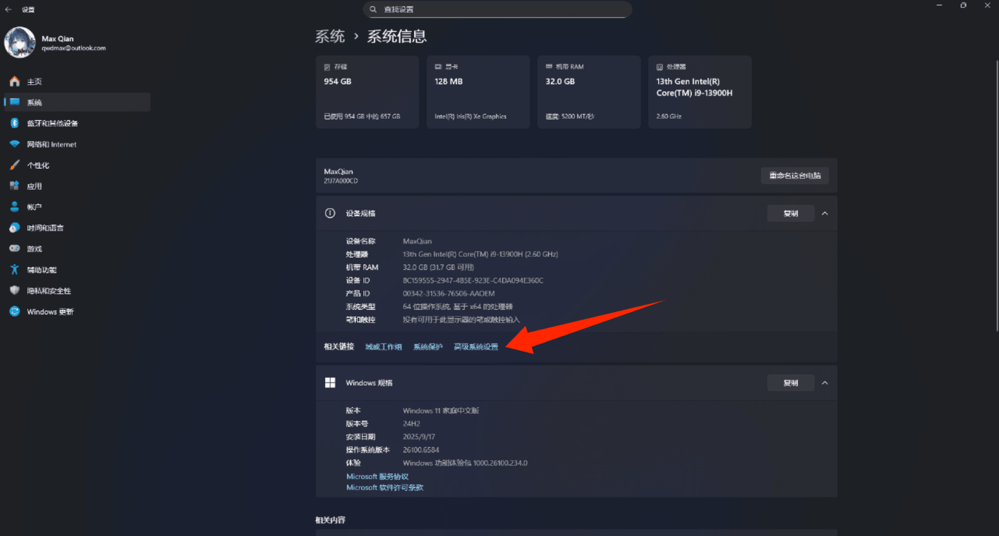

1. 点击 “环境变量”


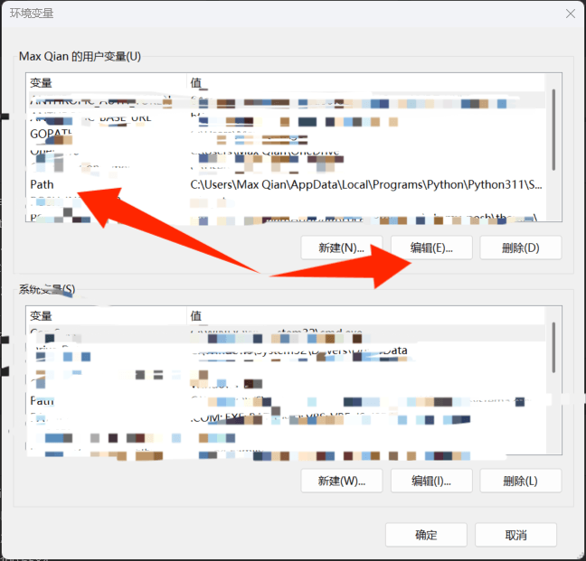

1. “系统变量” 区域找到 `Path`，点击 “编辑”
2. 点击 “新建”，添加路径（假设 MSYS2 安装在 `C:\msys64`）：
3. C:\msys64\mingw64\bin
4. 确认保存，重启终端或 VSCode 使更改生效。

> ⚠️ 注意事项：
>
> - 不要同时添加多个 MSYS2 环境（如 ucrt64、clang64）到 PATH，否则可能导致工具冲突。
> - 若仅在 VSCode 内使用，可通过 `terminal.integrated.env.windows` 或任务配置指定路径，避免全局污染。

## 配置 VSCode：推荐插件与关键设置

安装完工具链后，需对 VSCode 进行适当配置，以充分发挥 MSYS2 + Clangd + CMake 环境的开发体验。

### 推荐安装的扩展（Extensions）

在 VSCode 扩展市场（Extensions Marketplace）中搜索并安装以下插件：

<table>
<tr>
<td>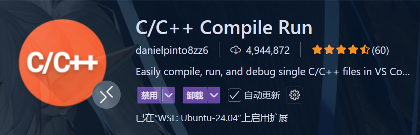<br/></td><td>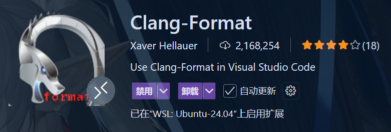<br/></td><td><br/></td></tr>
<tr>
<td>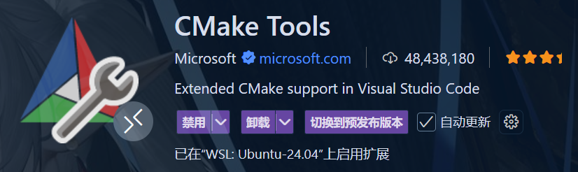<br/></td><td><br/></td><td>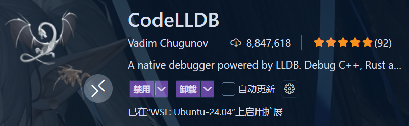<br/></td></tr>
<tr>
<td>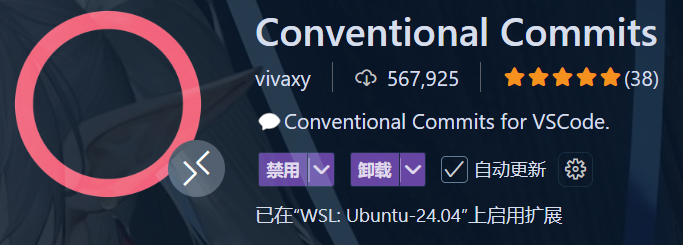<br/></td><td><br/></td><td><br/></td></tr>
<tr>
<td>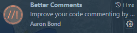<br/></td><td>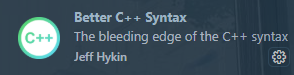<br/></td><td><br/></td></tr>
</table>

> 💡 安装后重启 VSCode 以确保所有扩展正确加载。

### 配置 Clangd：指定正确路径（关键步骤）

虽然 MSYS2 已将 `clangd` 安装到 `C:\msys64\mingw64\bin\clangd.exe`，但 VSCode 的 clangd 扩展可能无法自动找到它（尤其在未将路径加入系统 `PATH` 时）。

#### 配置方法：

1. 打开 VSCode 设置（`Ctrl+,`）
2. 搜索 `clangd path`
3. 找到 Clangd: Path 选项
4. 填入完整路径：

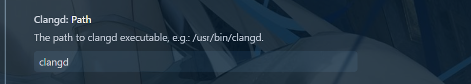

像下面就是 Ubuntu22.04 中安装的情况，请确保合理

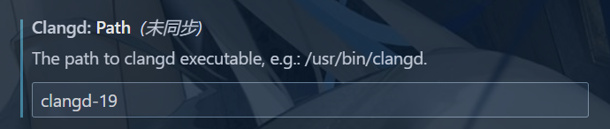

> ✅ 路径中的反斜杠 `\` 在 JSON 设置中需转义为 `\\`，但 VSCode UI 会自动处理。

#### 验证是否生效：

- 打开一个 `.cpp` 文件
- 查看右下角状态栏是否显示 “clangd: Ready”
- 尝试 `Ctrl+点击` 跳转函数定义，若成功则配置正确

> ⚠️ 注意：请禁用 Microsoft C/C++ 扩展的 IntelliSense 引擎，避免冲突

### 配置 Clang-Format：统一代码风格

Clang-Format 是 LLVM 提供的代码格式化工具，支持高度自定义，能自动对齐缩进、括号、空格等，极大提升代码可读性与团队一致性。

#### 基础使用

1. 安装扩展 Clang-Format
2. 默认快捷键：`Shift+Alt+F`（Windows）可格式化当前文件
3. 首次使用建议在项目根目录生成配置文件：

```shell
clang-format -style=llvm -dump-config > .clang-format
```

常用预设风格包括：

- `LLVM`
- `Google`
- `Chromium`
- `Microsoft`
- `Mozilla`

#### 自定义配置示例（`.clang-format` 片段）：

```yaml
BasedOnStyle: Google
IndentWidth: 4
ColumnLimit: 100
SortIncludes: true
```

> 📚 完整配置选项参考：<u>Clang-Format 官方文档 </u>

# 开始开发

完成上述所有步骤后，你的开发环境已准备就绪：

✅ 编译器：GCC（MinGW-w64）

✅ 构建系统：CMake（或 XMake）

✅ 智能感知：Clangd（语义级补全与导航）

✅ 代码格式：Clang-Format（一键美化）

✅ 编辑器：VSCode（轻量、AI 增强、高度可定制）

## 使用流程

1. 在 VSCode 中选择 “文件 > 打开文件夹”，加载你的 C/C++ 项目
2. 若项目含 `CMakeLists.txt`，CMake Tools 会自动检测并提示配置
3. 选择工具链（如 `mingw64`）、构建类型（Debug/Release）
4. 点击状态栏的 “Build” 按钮编译，“Debug” 按钮启动调试
5. 编码过程中享受 Clangd 的智能提示、错误检查与自动修复

🎉 现在，你可以高效、清爽地开始 C/C++ 开发了！

> 🔧 小贴士：
>
> - 首次构建项目时，CMake 可能需要几分钟生成缓存
> - 如遇路径或权限问题，请确保 MSYS2 安装路径不含空格或中文
> - 定期运行 `pacman -Syu` 更新工具链，保持环境最新
